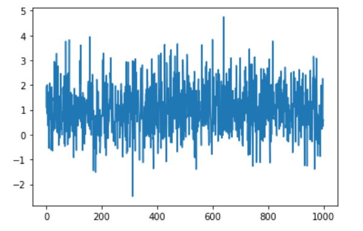
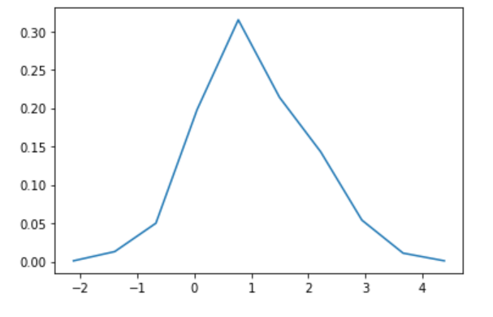
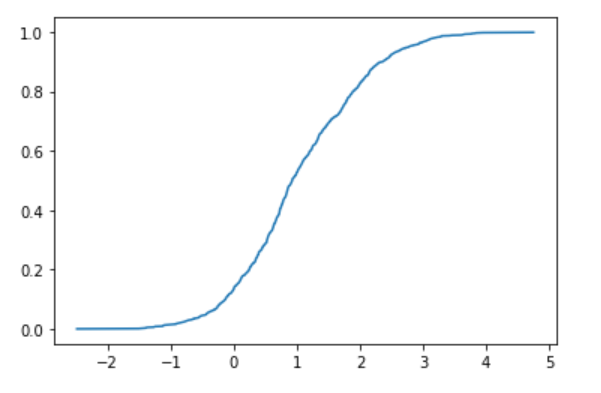

# 累積分布関数をソートで求める(Python版)

この記事はRubyで書いた[累積分布関数をソートで求める](https://qiita.com/kaityo256/items/690a463b6b865da80de6)をPythonで書き直して加筆したものです。

## はじめに

ある確率変数の確率密度関数(probability density function, PDF)を知りたい時、ナイーブにはヒストグラムを使うが、ビンの切り方に試行錯誤が必要だし、きれいなグラフを得るのにかなりの測定回数が必要になって面倒くさい。こんな時、確率密度関数ではなく累積分布関数(cumulative distribution function, CDF)を見る方がきれいだし、ソート一発で求まるので楽だ。以下では正規分布に従う乱数について、PDFで見た時とCDFで見た時の違いについて紹介する。動作確認はGoogle Colabで行った。

## ヒストグラムで確率密度関数を得る

まずはヒストグラムで確率密度関数を得る方法を見てみる。後で必要になるライブラリもまとめてimportしておく。

```py
import random
import matplotlib.pyplot as plt
import numpy as np
from math import pi, exp, sqrt
from scipy.optimize import curve_fit
from scipy.special import erf
```

平均1、分散1のガウス分布に従う乱数を1000個生成しよう。

```py
N = 1000
d = []
for _ in range(N):
  d.append(random.gauss(1, 1))
```

プロットしてみるとこんな感じ。

```py
plt.plot(d)
plt.show()
```




なんか1のまわりに揺らいでるっぽいですね。

ヒストグラムを作って確率密度関数を求めよう。`matplotlib.pyplot.hist`でも求まるのだが、値の受け取り方の趣味で`numpy.histogram`を使う。

```py
hy, bins = np.histogram(d)
hx = bins[:-1] + np.diff(bins)/2
hy = hy / N
plt.plot(hx,hy)
plt.show()
```



なんかガウス分布っぽいけれど、かなりカクカクしていますね。

さて、このヒストグラムがガウス分布であると仮定して、平均と標準偏差を求めてみよう。`scipy.optimize.curve_fit`を使う。

まずはフィッティングに使う関数を定義する。

```py
def mygauss(x, m, s):
  return 1.0/sqrt(2.0*pi*s**2) * np.exp(-(x-m)**2/(2.0*s**2))
```

ここで、`x`にはNumPy配列が渡されてくるので、`exp`ではなく`np.exp`を使わなければならないのに注意。この関数とデータを`scipy.optimize.curve_fit`に渡すと、推定値の配列と共分散行列を返してくれるので表示してみる。

```py
v, s =  curve_fit(mygauss, hx, hy)
print(f"mu = {v[0]} +- {sqrt(s[0][0])}")
print(f"sigma = {v[1]} +- {sqrt(s[1][1])}")
```

共分散行列の対角成分が分散なので、その平方根を誤差として表示させている。結果は毎回異なるが、例えばこんな感じになる。

```txt
mu = 0.9778044193329654 +- 0.16595607115412642
sigma = 1.259695311989267 +- 0.13571713273726863
```

真の値がどちらも1であるのに対して、平均の推定値が0.98+-0.17、標準偏差が1.3+-0.1と、大きく外してはいないけれどいまいちですね。

## ソートで累積分布関数を得る

累積分布関数$F(x)$とは、ある確率変数$X$の値が$x$より小さい確率、すなわち

$$
F(x) = P(X<x)
$$

である。今、$N$個の独立なデータが得られた時、これを小さい順にならべて$k$番目の値が$x$であったとする。すると、確率変数$X$が$x$より小さい確率は$k/N$と推定することができる。以上から、得られた$N$個の確率変数の配列をソートして、$k$番目のデータをx軸に、$k/N$をy軸にプロットすると累積分布関数が得られる。見てみよう。

```py
sx = sorted(d)
sy = [i/N for i in range(N)]
plt.plot(sx, sy)
plt.show()
```




わりと綺麗な誤差関数が得られた。先ほどと同様に、これを誤差関数だと思って平均と分散をフィッティングで求めよう。まずはフィッティング用の誤差関数の準備。世の中の誤差関数の定義が微妙なので1足して2で割ったり、引数を√2で割ったりしなければならないことに注意。

```py
def myerf(x, m, s):
  return (erf((x-m)/(sqrt(2.0)*s))+1.0)*0.5
```

フィッティングしてみよう。

```py
v, s =  curve_fit(myerf, sx, sy)
print(f"mu = {v[0]} +- {sqrt(s[0][0])}")
print(f"sigma = {v[1]} +- {sqrt(s[1][1])}")
```

結果はこんな感じ。

```txt
mu = 1.00378752698032 +- 0.0018097681998120645
sigma = 0.975197323266848 +- 0.0031393908850607445
```

平均が1.004 +- 0.002、標準偏差が0.974 +- 0.003と、全く同じデータを使っているのにも関わらず、かなり改善しましたね。

## まとめ

確率変数の分布を見るのに、ヒストグラムを使って確率密度関数を得る方法と、ソートして累積分布関数を見る方法を紹介した。ヒストグラムは、どのようにビンを切るかをいろいろ試行錯誤しなければならないが、ソートで累積分布関数を見るのにはパラメータが不要なので楽だ。確率密度関数が欲しい場合も、一度累積分布関数を求めてから移動平均して数値微分したほうがきれいなデータが得られる。

また、もとの分布のパラメータを推定するのも、累積分布関数を使った方が精度が高い。これは、直観的には興味ある領域(例えば平均値近辺)において、ヒストグラムを使う場合はビンに入る数のデータしか使えないが、累積分布関数の場合はおよそ$N/2$個のデータが使えるから・・・だと思うが、あまり自信がないので近くのプロに聞いてください。
