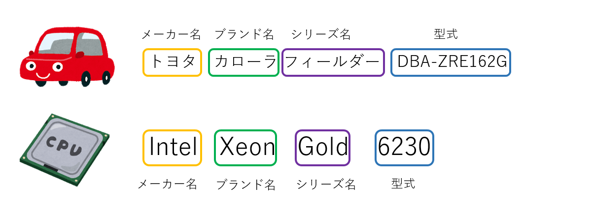
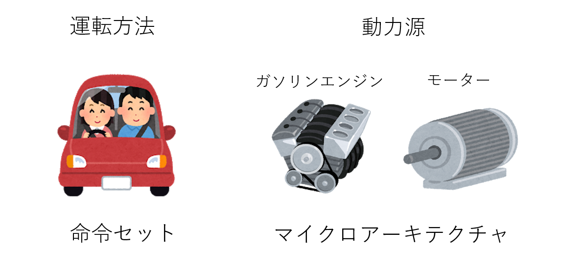

# CPUのキーワード(ブランド、命令セット、マイクロアーキテクチャ、拡張命令セット)の説明

## はじめに

いま、この記事を見ているのはパソコンだったりタブレットだったりスマホだったりするでしょうが、それらのデバイスにはCPUが入ってます。このCPU、様々な種類があり、ノートPCなら例えばIntel Core、スマホならARM Cortexなんかが入っているでしょう。このCPUですが、いろんな関連単語がネットニュースに飛び交います。例えばIntelのXeonやCore、Skylake、Kaby Lakeといった単語の関係や、AMDのZenとRyzenの関係など、よく目にするわりにその意味をちゃんとは知らない、という人は多いんじゃないでしょうか。

本稿では、わりとあいまいにされがちなCPUのベンダー、ブランド、命令セット、マイクロアーキテクチャといったキーワードについて簡単に説明してみようと思います。たとえ話の常として、どうしても正確性は犠牲になりますので、ガチ勢は「もどる」ボタンを押してください。

## CPUのベンダーとブランド

Linux、もしくはWindowsならWSLで

```sh
cat /proc/cpuinfo
```

を実行すると、例えばこんな表示がでてきます。

```txt
Intel(R) Xeon(R) Gold 6230
```

これらは、まず「Intel」メーカー名、「Xeon」がブランド名、「Xeon Gold」はXeonブランドのシリーズの一つ、「6230」が型番になります。車なら、例えば「トヨタ　カローラフィールダー　DBA-ZRE162G」でいうなら「トヨタ」がメーカー名、「カローラ」がブランド名、「カローラフィールダー」は「カローラ」ブランドのシリーズの一つ、「DBA-ZRE162G」が型式になります。




さて、車で「カローラ」という情報だけではエンジンや排気量がわからないように、CPUも「Xeon」という情報だけでは「サーバ向けだな」ということくらいしかわかりません。CPUの「使い勝手」や「性能」は、「命令セット」と「マイクロアーキテクチャ」が決めます。

## 命令セット(ISA)

車の「運転の仕方」は、マニュアルかオートマチックか、右ハンドルか左ハンドルかといったものに左右されます。同様に、CPUの「使い勝手」は、命令セットが決めます。命令セットは、文字通り「命令」のセットで、CPUにどんな指示を出すことができて、どんな結果になるかを定めたものです。よく聞く「x86」というのは命令セットの一種です。

命令セットは、CPUの操作を抽象化します。例えば、電気自動車とガソリン車では内部構造が全く異なりますが、ハンドルがあって、アクセル、ブレーキがあれば、ドライバーはとりあえず内部構造を気にせずに同じように運転することができます。同様に、同じ命令セットを持つCPUでは、原則として同じ機械語のプログラムがそのまま走ります。したがって、プログラマは「この命令が実際にどのような回路(ハードウェア)で動作するか」を気にする必要がありません。後で説明する、ハードウェアの仕様を定めた「マイクロアーキテクチャ」と対比して、「命令セットアーキテクチャ(Instruction Set Architecture, ISA)」と呼ばれます[^1]。

[^1]: 僕は「ISA」を「アイサ」と発音していますが、一般的かどうかは知りません。

これにより、例えば「同じ命令セットを持つCPUを、別のベンダーが作る」ことができます。これを互換CPUと言います。有名なのはIntelとAMDです。これらはどちらも「x86」と呼ばれる命令セットを採用しており、原則として同じバイナリがそのまま走ります。x86は、Intelが開発した16ビットのプロセッサであるIntel 8086からその歴史が始まっています。以後、型番が80186, 80286, 80386と続いたため、下二桁が86であることから「x86」と呼ばれるようになりました。「x86」にはいろんな呼称があったり、似た名前で別物があったりするのでややこしいです。

## マイクロアーキテクチャ

ハンドル、アクセルとブレーキ、ギアがあれば、初見の車でも運転することはできるでしょう。この時、エンジンがモーターであろうがガソリンエンジンであろうが気にする必要はありません。これは車とのインタフェースが抽象化されていると考えることができます。しかし、車を作るためには、ハンドルの動きをどのように伝えるか、エンジンをどうするかなどの具体的なハードウェアを決めなくてはなりません。




同様に、命令セットは、CPUの動作を抽象化したものでした。例えば

```nasm
addl  %edx, %eax
```

という命令があった時、命令セットは`%edx`というレジスタの値を`%eax`に足すという処理を規定します。しかし、それを具体的にどんな回路で実現するかは規定しません。この、命令セットをどのようなハードウェアで実現するかを定めたものがマイクロアーキテクチャです[^2]。原則として一つのマイクロアーキテクチャには一つの命令セットが対応しますが、逆に一つの命令セットに複数のマイクロアーキテクチャが対応することがあります。

[^2]: Microarchitecture. μarchと略されることがあり、僕は「マイクロアーキ」と呼ぶことが多いですが、本稿では「マイクロアーキテクチャ」で統一します。

同じ「トヨタのカローラ」でも、生産された年代によって搭載するエンジンが異なるように、同じ「IntelのXeon」でも、異なるマイクロアーキテクチャを実装しています。しかし、型番まで指定すればマイクロアーキテクチャがわかります。先ほどの「Intel(R) Xeon(R) Gold 6230」のマイクロアーキテクチャを調べてみましょう。

[Intelの製品仕様検索サイト](https://ark.intel.com/content/www/jp/ja/ark/search.html)に「Gold 6230」というキーワードで検索すると、[インテル® Xeon® Gold 6230 プロセッサー](https://ark.intel.com/content/www/jp/ja/ark/products/192437/intel-xeon-gold-6230-processor-27-5m-cache-2-10-ghz.html)のページがヒットします。もしくは普通に「Intel Xeon Gold 6230」で検索しても見つかると思います。このページの「基本仕様」の「開発コード名」のところに「製品の開発コード名 Cascade Lake」という表示があります。この「Cascade Lake」がマイクロアーキテクチャです。

同様に、手元のノートPCのCPU「[Intel(R) Core(TM) i7-8550U](https://ark.intel.com/content/www/jp/ja/ark/products/122589/intel-core-i7-8550u-processor-8m-cache-up-to-4-00-ghz.html)」を調べてみましょう。このCPUのマイクロアーキテクチャは「Kaby Lake R」です。Intelの場合、概ね一年ごとにマイクロアーキテクチャを更新します。しかし、それらは同じ命令セットを共有しているため、原則として同じコードがそのまま動きます。

ついでに、AMDとの対応で言うと、サーバ向けブランド名がEPYCで、デスクトップPC向けブランド名がRyzenです。それぞれIntelで言うところのXeonとCoreに対応していると思えば良いかと思います。EPYCとRyzenは、どちらも命令セットはx86を、マイクロアーキテクチャとしてはZenを採用しています。

## IA64, AMD64, Intel 64

x86は初登場時(8086)には16ビットでしたが、80386で32ビットになりました。このとき定義されたISAは「Intel Architecture 32」の略で「IA-32」と呼ばれます。

さて、32ビットから64ビットへと進む際、IntelはHPと協力してx86と互換性のない、全く新しいISAを採用し「IA-64」という名前を付けました。IA-64はIA-32と全く互換性はありません。それに対して、x86の互換CPUを作っていたAMDは、IA-32を素直に64ビットに拡張した命令セット「AMD64」を作りました。こちらはIA-32の互換性があります。そういう意味で、AMD64はx86の命令セットでありIA-32の直系の子孫ですが、IA-64はx86ではありません。

IntelはIA-64をIA-32の後継と位置付けていましたが、市場はAMD64の方を歓迎しました。結局IntelもAMD64の互換命令セット「Intel 64」を作ることになりました。なのでIntel 64はx86です。このあたりの主従逆転の歴史は面白いのですが、現場ではIA-64とIntel 64に振り回されて大変だった、という話を聞いたことがあります。AMD64とIntel 64を併せてx86-64と呼称することが多いです。

ちなみに、AMD64の命令セットを書いた共著者の一人が天才エンジニアと名高いJim Kellerです。Jim KellerはDECでAlpha 21164, 21264の開発に関わったのち、AMDでAthlon 64を開発、Intelと熾烈な市場争いをするAMDを支えました。Jim KellerがAMDを去った後に開発されたマイクロアーキテクチャ「Bulldozer」の市場ウケはいまいちでしたが、Jim KellerがまたAMDに戻ってきてから開発した「Zen」は(少なくとも筆者の周りでは)フィーバーを巻き起こしました。もちろん多くの人のサポートがあってのことだとは思いますが、こういう業界の歴史が一部の天才によって作られている、という側面が垣間見えます。

## 拡張命令セット

命令セット(ISA)は、CPUの動作に必要な基本的な命令を定めたものです。しかし、基本命令だけでは世の中のニーズに答えられない場合があります。そこで、基本の命令セットに加えて、追加の命令セットを定め、実装することがあります。それが拡張命令セットです。例えば先ほどのCascade Lakeマイクロアーキテクチャは基本のISAであるIntel64に加えてAVX2やAVX512fといった拡張命令セットが実装されており、利用可能になっています。遊戯王みたいなカードゲームでいうなら、Intel64(AMD64)が基本パック、AVX2が拡張パックという感じでしょうか。

どのCPUがどんな拡張命令セットを持っているかは、Linuxなら`cat /proc/cpuinfo`の出力の「flags」を見るとわかります。先ほどのIntel(R) Xeon(R) Gold 6230なら、こんなflagが立っています。

```txt
flags           : fpu vme de pse tsc msr pae mce cx8 apic sep mtrr pge mca cmov pat pse36 clflush dts acpi mmx fxsr sse sse2 ss ht tm pbe syscall nx pdpe1gb rdtscp lm constant_tsc art arch_perfmon pebs bts rep_good nopl xtopology nonstop_tsc aperfmperf eagerfpu pni pclmulqdq dtes64 monitor ds_cpl vmx smx est tm2 ssse3 sdbg fma cx16 xtpr pdcm pcid dca sse4_1 sse4_2 x2apic movbe popcnt tsc_deadline_timer aes xsave avx f16c rdrand lahf_lm abm 3dnowprefetch epb cat_l3 cdp_l3 invpcid_single intel_ppin intel_pt ssbd mba ibrs ibpb stibp ibrs_enhanced tpr_shadow vnmi flexpriority ept vpid fsgsbase tsc_adjust bmi1 hle avx2 smep bmi2 erms invpcid rtm cqm mpx rdt_a avx512f avx512dq rdseed adx smap clflushopt clwb avx512cd avx512bw avx512vl xsaveopt xsavec xgetbv1 cqm_llc cqm_occup_llc cqm_mbm_total cqm_mbm_local dtherm ida arat pln pts pku ospke avx512_vnni md_clear spec_ctrl intel_stibp flush_l1d arch_capabilities
```

大量の情報があるのですが、このうちSIMD命令についてちょっとだけ触れてみます。

SIMD (Single Instruction Multiple Data)は、簡単に言えば一度に複数の演算を実行する仕組みです。コンピュータとは計算機であり、メモリからデータを持ってきて四則演算をしてメモリに書き戻す、という動作を高速に繰り返しているに過ぎません。この時、メモリから持ってきたデータは「レジスタ」という領域に載せられることで計算をすることになります。レジスタが大きいほど大きな数が扱えるので、計算が早くなったり、大きなメモリを扱えるようになります。x86は、8086の16ビットから、32ビット、64ビットとレジスタが大きくなってきました。

さて、CPUは計算を「演算器」と呼ばれるハードウェアで行います。また、小数は「浮動小数点数(floating point number)」と呼ばれる仕組みで扱われます。遥か昔、x86には浮動小数を計算するハードウェアは搭載されていませんでした。「3x5」みたいな整数の計算と、「2.1x3.14」のような浮動小数の計算では全く異なるアルゴリズムが使われます。最初は浮動小数の計算を整数の計算を駆使して計算していたのですが、これが極めて遅かったため、外部に浮動小数の計算をするためのハードウェアを増設し、そこで計算することになりました。それが数値演算コプロセッサ、Intel 8087です。プロセッサが8086, 80186, 80286,...という型番でx86と呼ばれたように、数値演算コプロセッサも8087, 80287, 80387と続いたためにx87と呼ばれるようになりました。そのうち、外部のコプロセッサではなくCPUに統合されたため、x87は命令セットとして残ることになります。

一般に、64ビットマシンなら64ビット整数レジスタと64ビット浮動小数点数レジスタがそれぞれ用意されます。特に、数値計算で広く使われる「倍精度浮動小数(double)」は64ビットと規定されているため、64ビットレジスタを使って計算するのが自然です。ところが、Intel x87は80ビットの拡張倍精度浮動小数点数を使っており、いわゆるIEEE 754の倍精度実数とは異なります。

これは不便なので、x86でも64ビットの浮動小数点計算がしたい、というニーズがありました。それに対してIntelは、64ビットの浮動小数点数レジスタを用意するのではなく、既に実装されていた128ビットSIMDレジスタを使うことにしました(SSE2)。前述のようにSIMDは一度に複数の計算をする仕組みで、128ビットなら64ビットの計算を二つ同時に計算することができます。SIMD計算ではない「日常利用」には、このレジスタの下位64ビットを使う形で、x86に倍精度浮動小数点数の計算が実装されました。こんな歴史があるため、x86にはついに64ビット浮動小数点数レジスタは実装されませんでした。

いずれにせよ、SIMD命令は計算を早くする仕組みなので「基本パック」ではなく「拡張パック」という扱いになります。どのマイクロアーキテクチャがどの拡張命令セットを実装するかは実装者に任されているため、「どれが利用可能か」がわかるようにしなければなりません。それが先ほどのflagsです。IntelのSIMD命令はx87のレジスタを転用するMMXから始まり、SSE、AVXと進化して、AVX-512あたりでわけがわからなくなるのですが、そのあたりは識者による解説を待ちます[^SIMD]。

[^SIMD]: AVX-512は複数の命令セットの集合体で、すごくごちゃごちゃしています。誰か解説書いて。

繰り返しになりますが、拡張命令セットはどの命令をサポートするかは実装者に任されています。なので、同じ基本命令セットを採用した同時期に出たCPUでも、拡張命令セットの採用の有無は違うことがあります。例えばIntelはSkylakeにてAVX-512を実装しましたが、AMDはZenにおいて(AVX2まではサポートするが)AVX-512は実装しない、という戦略を取りました[^zen3]。

[^zen3]: 少なくともZen3まではAVX-512は実装されていません。

## 富岳とARMについて

Top500というスーパーコンピュータのランキングがあります。これは世界の主要なスパコンが、巨大な連立一次方程式を解く速度を競うものです。[本記事執筆時点(2020年9月11日)の1位](https://www.top500.org/lists/top500/list/2020/06/)は富士通と理研が開発した「富岳」というスパコンです。

この「富岳」の命令セットはARMです。ARMは消費電力に優れた設計で、スマホやタブレットなどに多く採用されています。ARMの基本命令セットはバージョンで管理され、記事執筆現在はARMv8が最新です。

ARMは長らく32ビットアーキテクチャとして発展してきましたが、ARMv8から64ビットアーキテクチャが定義されました。ARMv8は32ビットと64ビット両方のアーキテクチャを含み、64ビットに対応しているアーキテクチャはARMv8-A、32ビットにのみ対応しているアーキテクチャはARMv8-Rです。

64ビット対応となったARMは、ARM64もしくはAArch64と呼ばれますが、単にA64と言うことも多いです。64ビットと区別するために32ビットARMはARM32、もしくはAArch32、A32などと呼ばれます。

さて、ARMをスパコンに使うには高い浮動小数点演算能力が必要で、そのためには一般にSIMD命令が採用されることが多いです。ARMのSIMD命令拡張としては、これまでNEONが使われてきました。これは128ビットレジスタを使ったSIMD命令セットで、数値計算に使うには力不足です。

そこで新たにSVEという命令セットが定義されました。これはScalable Vector Extensionsの略で、大きな特徴は命令セットがハードウェアのSIMDレジスタ幅に依存しないことです。これまでSIMD拡張命令セットは、原則としてSIMD幅を規定していました。AVX2なら256ビット、AVX-512なら512ビット等です。一般に、SIMDレジスタを活用するようにプログラムを修正する作業を「SIMD化」と呼びますが、これはターゲットとするアーキテクチャのSIMD幅を決め打ちしていることが多く、SIMD幅が変わったらプログラムを書き直す必要があります。

SVEは名前に「Scalable」とついていることからわかるように、ハードウェアのSIMD幅を抽象化し、同じバイナリのままで、広くなったSIMD幅を活用することができます。実際のハードウェアのSIMDレジスタ幅は固定されていますが、将来レジスタ幅が広くなった時、理想的には同じバイナリのまま、プログラムが高速化されます。

で、この64ビットARMであるAArch64に、拡張命令セットSVEを実装した初めてのマイクロアーキテクチャが、富士通が開発したA64fxで、これが富岳に実装されています。IntelやAMDはCPUのブランド名とマイクロアーキテクチャ名は分けることが多いですが、富士通はCPUのブランド名とマイクロアーキテクチャ名を同じにしたようです。[^FX1000]

[^FX1000]: 富士通はx86以外のサーバのブランド名はFXをつけることが多いようで、A64fxを採用したサーバはPRIMEHPC FX1000というブランド名で販売されています。

さて、この「富岳」のマイクロアーキテクチャ「A64fx」ですが、詳細がGithubに公開されています。

[https://github.com/fujitsu/A64FX](https://github.com/fujitsu/A64FX)

実は、「富岳」の前のスパコンである「京」の命令セットはSPARCで、のアーキテクチャ「SPARC64 VIIIfx」の情報も富士通のサイトに公開されたりしていたのですが、今回のようにGitHubにまるっと公開されたのには驚きました。こういう日本を代表するメーカーが、スパコンの情報をGitHubに公開するのは非常に良いことだと思うので、もしそう思った人は是非星をつけてください[^fujitsu]。

[^fujitsu]: ちなみに僕は富士通のまわしもの(雇用関係があったりとか)ではありません。

まとめると、「富岳」のCPUは、ブランド名がA64fx、基本命令セットがAArch64、採用している拡張命令セットがSVE、AArch64とSVEを実装したマイクロアーキテクチャがA64fx、という感じになります。

例えばGCCで富岳向けにコンパイルをしたければ、

`-march=armv8-a+sve -O2`

みたいなオプションをつけます。先ほど、64ビットの命令セットはARMv8-Aと書きましたが、それが`armv8-a`に、そしてSIMD拡張命令セットとしてSVEを指定する指示として`+sve`がオプションに現れています。

## まとめ

いろいろ曖昧になりがちなCPUのブランド名、命令セット、マイクロアーキテクチャ、拡張命令セットについてまとめてみました。IntelとAMDというベンダーが同じ命令セット(x86-64)を異なるマイクロアーキテクチャで実装、それぞれのブランド名で販売しており、同時期に出たCPUでも拡張命令セットの採用は異なる、というのがわかるかと思います。

富士通と理研が開発したスパコン「富岳」は、命令セットとしてARMv8-Aを採用し、拡張命令セットとしてSVE実装したマイクロアーキテクチャ「A64fx」をCPUとして採用しています。

本稿がこれらCPUのキーワードの理解の助けになれば幸いです。
