# 大名行列をHOOIでTucker分解してみる

これまでの大名行列分解記事。

* [大名行列を特異値分解してみる](https://qiita.com/kaityo256/items/78b16c58228e131f8144)
* [大名行列をTucker分解してみる](https://qiita.com/kaityo256/items/2e3f45377a6b9760f3e0)

## はじめに

線形代数には、特異値分解(Singular Value Decomposition, SVD)という操作があり、行列の近似に使われています。詳しくは[大名行列を特異値分解してみる](https://qiita.com/kaityo256/items/78b16c58228e131f8144)」を参照してください。SVDによる行列の低ランク近似は、フロベニウスノルムの意味で最良近似になっています。さて、行列だけでなく、足がたくさんある高階のテンソルも近似したい、というニーズがあります。テンソルは、元のテンソルと同じ本数だが、次元が低い足を持つコアテンソルと、コアテンソルのそれぞれの足の次元を増やす復元行列の組み合わせで分解され、この分解をTucker分解と呼びます。テンソルをTucker分解した時、どのようにすれば最良近似となるかは不明瞭です。前記事「[大名行列をTucker分解してみる](https://qiita.com/kaityo256/items/2e3f45377a6b9760f3e0)」では、SVDを素直にテンソルに適用したHigher Order SVD (HOSVD)を使ってTucker分解してみましたが、これは最良近似になっていないことが知られています。本稿では、イテレーションにより近似精度を改善するHigher Order Orthogonal Iteration of tensors (HOOI)を適用し、HOSVDの結果と比べてみましょう。

## Tucker分解とは

以下、テンソルをグラフ表現しますので、馴染みのない方は[テンソルのグラフ表現](https://qiita.com/kaityo256/items/d8195fb9fd1e0bc49314)を参照してください。

Tucker分解は、太い足を持つテンソルを、細い足を持つコアテンソルと、細い足から太い足に戻す復元行列に分解するものです。

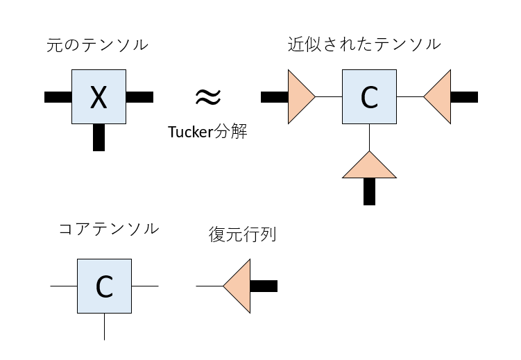

復元行列は直交行列になっており、転置を取ると「太い(次元が大きい)足」を「細い(次元が低い)足」に絞る圧縮行列になります。元のテンソルの足にそれぞれの圧縮行列をつけるとコアテンソルが得られます。

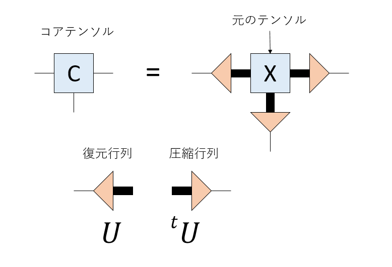

したがってTucker分解とは、「テンソルが与えられた時、各足に対応する復元/圧縮行列を、足の本数だけ求めなさい」という問題になります。

さて、元のテンソルの足に圧縮行列をかけたものがコアテンソルで、コアテンソルの足に復元行列をかけたものが近似テンソルです。まとめて描いて見るとこんな感じになります。

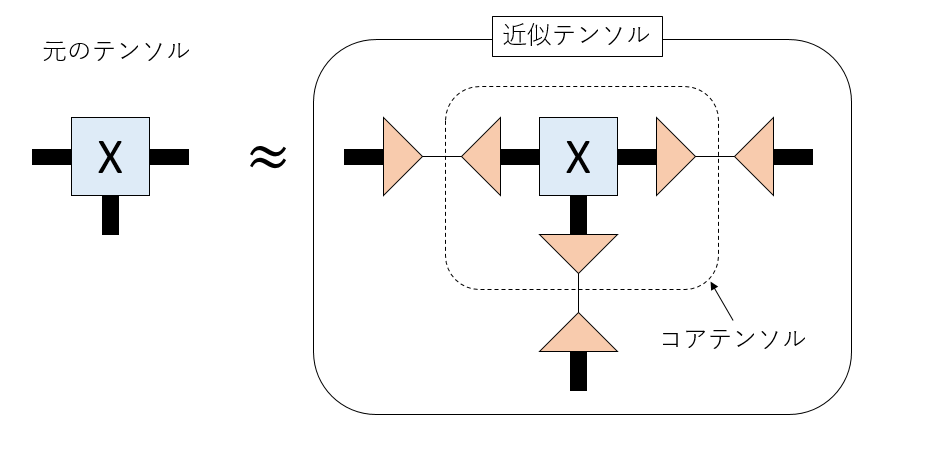

つまり、元のテンソルの太い足を、途中で細く絞ることで低ランク近似するのがTucker分解です。ペアになっている三角形はお互いに転置(随伴)なので、足の本数だけこの三角形を求めましょう、というのがTucker分解です。

さて、この観点で見ると、SVDによる行列の近似も「線を絞っている」ように見えます。適当な$D$次元エルミート行列$V$を考えましょう。エルミート行列の定義から、随伴行列$V^\dagger$との積は単位行列になります。

$$
V V^\dagger = I
$$

さて、$V$は正方行列ですが、これを左から$d (<D)$列だけ取った行列$\tilde{V}$を考えます。対応する随伴行列は、$V^\dagger$の上から$r$列だけ取った行列$\tilde{V}^\dagger$となります。$\tilde{V}$は、D行d列の行列になっており、「足の次元」をDからdに落とす圧縮行列になります。逆に$\tilde{V}^\dagger$は、足の次元をdからDに戻す復元行列の役割を果たします。

さて、行列$M$の特異値分解

$$
M = U \Sigma V^{\dagger}
$$

を考えます。この分解に現れた$V$を使って圧縮/復元行列$\tilde{V},\tilde{V}^\dagger$を作ると、元の行列をフロベニウスノルムの意味でもっとも良く低ランク近似することができます。これが特異値分解による行列近似の原理です。

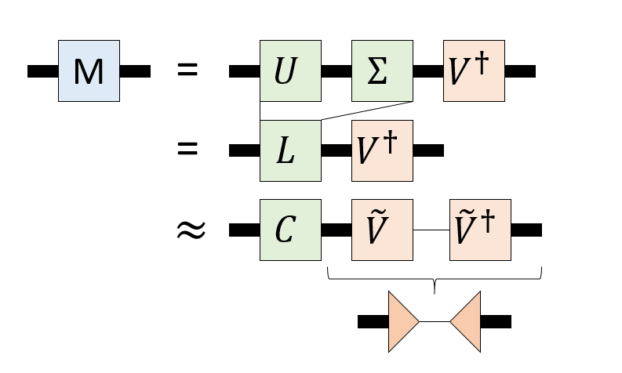

行列の特異値分解を見ると、分解して得られた行列を使って(上の図では右の足に対応する)圧縮行列、復元行列を作ることができています。これをそのまま素直にテンソルに適用するのがHOSVDです。

HOSVDでは、注目する足以外を全てまとめてしまい、行列として特異値分解します。すると、注目する足に対応する圧縮/復元行列が得られます。これを各足について行うと、それぞれの足について圧縮/復元行列が得られます。

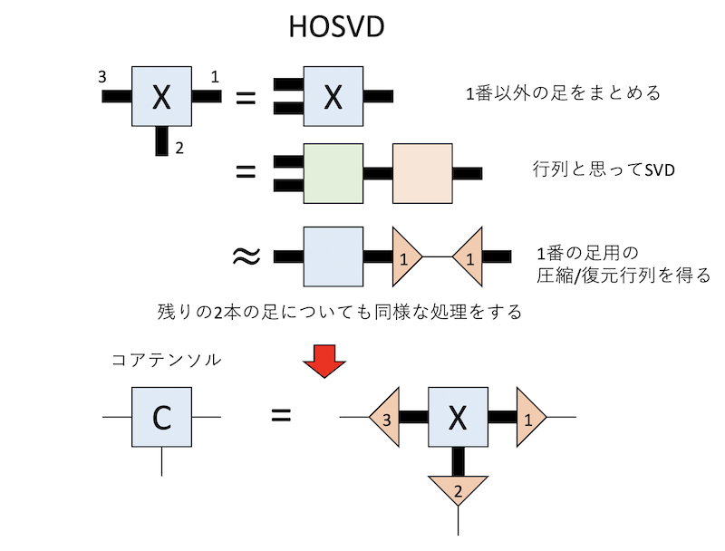

HOSVDのアルゴリズムは単純ですが、計算量が大きい、得られる分解が最良近似になっていないという問題があります。これを、イテレーションで解決するのがHOOI (Higher Order Orthogonal Iteration of tensors)です。まず、それぞれの足に適用する圧縮/復元行列の初期値を適当に用意します。値はランダムでかまいませんが、これらはIsometry(列ベクトルか行ベクトルが直交している)でなければなりません。そして、注目する足以外について圧縮行列で潰してしまい、残した足についてSVDすることで圧縮行列を更新します。次に、別の足について同じ処理をしますが、このときに他の足については更新された圧縮行列を使います。この手続を繰り返すことで圧縮行列を良くして行こうとするのがHOOIです。

具体的に見てみましょう。3本足のテンソルがあり、これをTucker分解したいとします。それぞれの足に1,2,3番と名前をつけましょう。最終的に欲しいのはそれぞれの足に対応する圧縮行列です。

まず、圧縮行列の初期値を適当に用意しておきます。ランダムな直交行列が必要になりますが、SciPyの`ortho_group.rvs`を使えば一発で作れます。i番目の足に対応する、kステップ目の圧縮行列を$V_i^{(k)}$としておきましょう。まず1番の足に注目し、2番と3番の足を$V_2^{(0)}$と$V_3^{(0)}$を使って潰しておきます。その状態で2番と3番の足をまとめて、1番だけ太い足とした行列とみなし、特異値分解します。すると、「2番と3番の足を現在持っている圧縮行列で潰した状態において」1番の足をもっとも精度良く潰す圧縮行列が得られます。これを「次のステップの1番の足の圧縮行列」とみなし、$V_1^{(1)}$とします。

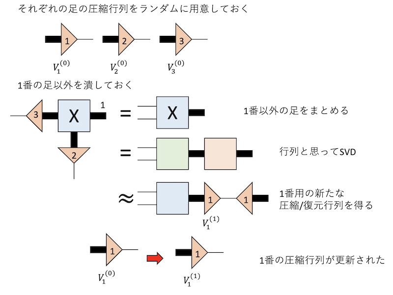

次は2番に注目して同じことをします。ただし、1番の足を潰すのに、先程更新された$V_1^{(1)}$を使います。こうして$V_2^{(1)}$が得られます。同様に$V_3^{(1)}$が得られたらHOOIのイテレーション(Iteration)の1ステップが完了です。以後、このステップをぐるぐる回して$V_i^{(k)}$を更新していきましょう、というのがHOOIです。

特異値分解による低ランク近似はフロベニウスノルムの意味で最良近似ですから、各ステップにおいて新しい圧縮行列を求める処理は、「他の足を潰した状態」を固定した状態で最小二乗法を適用していることになります。したがってHOOIは、「各ステップで他の足の潰し方を固定した状態で、フロベニウスノルムを最小にするように最小二乗法で注目する足の潰し方を得る」方法であるALS (Alternating Least Square)と等価になります[^1]。

[^1]: 僕は先にHOOIを知りましたが、後にTwitterでALSと等価であることが指摘されました。どちらが先かはよく知りません。

したがって、このイテレーションが収束したならば、得られたTucker分解は「元のテンソルをフロベニウスノルムの意味において最良近似する」ものなっていると言えます。ただし、僕は収束を証明できませんでしたし、一般に収束するかどうかは知られていないようです。

## 大名行列をHOOIする

前置きが長くなりましたが、さっそく大名行列をHOOIでTucker分解してみましょう。実際に分解するのは「大名行列」と描かれたカラー画像です。カラー画像は高さ(H)、幅(W)、色(C)の三本の足がある3階のテンソルとみなせますが、色の足は細いので、高さと幅の足だけ潰すことにしましょう。最終的にこんな分解を作ります。

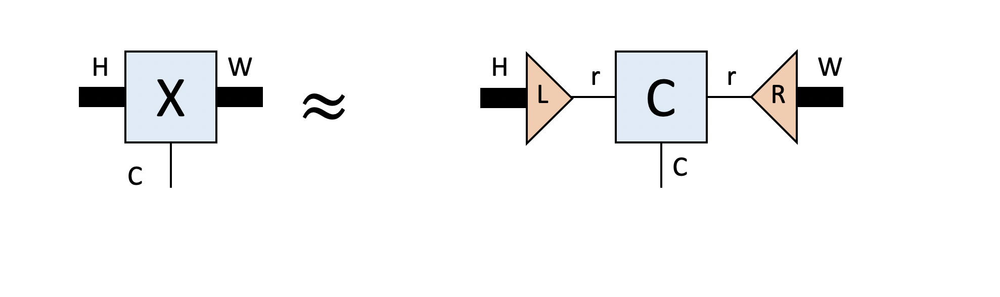

H、Wの次元を持つ足をrにつぶしています。色の足はそのままです。HとWの大きさが異なるので、本当はそれに比例させて潰した方が良いのでしょうが、面倒なので同じ次元に潰すことにします。左の足に対応する復元行列をL、右の足に対応する復元行列をRとします。それぞれ転置を取ると圧縮行列になります。

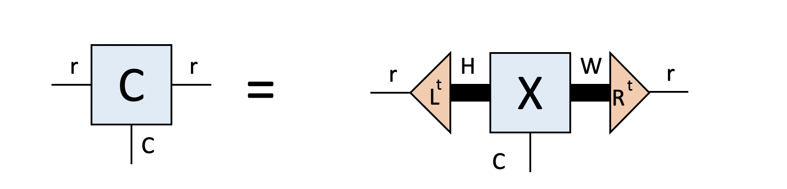

分解するカラー画像は、[前回の記事](https://qiita.com/kaityo256/items/2e3f45377a6b9760f3e0)と同様に作りましょう。

```py
from PIL import Image, ImageDraw, ImageFont
import numpy as np
from scipy import linalg
from IPython.display import display
from scipy.stats import ortho_group
import matplotlib.pyplot as plt

!apt-get -y install fonts-ipafont-gothic

fpath='/usr/share/fonts/opentype/ipafont-gothic/ipagp.ttf'
fontsize = 50
font = ImageFont.truetype(fpath, fontsize)

W = 200
H = fontsize
img  = Image.new('RGB', (W,H),color="black")
draw = ImageDraw.Draw(img)
draw.text((0,0), "大　　　", fill=(255,255,0), font=font)
draw.text((0,0), "　名　　", fill=(0,255,255), font=font)
draw.text((0,0), "　　行　", fill=(255,0,255), font=font)
draw.text((0,0), "　　　列", fill="white", font=font)
img
```

こんな画像が得られます。

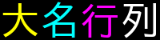

あとは以下のようにすれば画像に対応するテンソルを得ることができます。

```py
data = np.array(img.getdata()).reshape(H,W,3)
```

色の足は真ん中にあった方が都合が良いので、transposeしましょう。

```py
X = data.transpose(0,2,1)
```

このテンソルXが分解したいテンソルです。

さて、高さHの足に対応する復元行列をL、幅Wの足に対応する復元行列をRとします。初期値はランダムに作ります。

```sh
L = ortho_group.rvs(H)[:, :r]
R = ortho_group.rvs(W)[:r, :]
```

rは残したい次元です。

まず、Rを更新することにしましょう。手持ちのLをXにかけて足を潰し、特異値分解してから、上からr行だけ取ってきたものを新たなRとします。

```py
    LX = np.tensordot(L.transpose(), X, (1,0)).reshape(r*3, W)
    U,s,V = linalg.svd(LX)
    R = V[:r, :]
```

次に、更新されたRを使ってXをつぶし、特異値分解して得られた行列の左からr列だけ取ってきたものを新たなLとします[^2]。

[^2]: 右からとか上からとか行とか列とかの表現が正しいかちょっと自信ありません。ちゃんと自分で確認してください。

```py
    XR = np.tensordot(X, R.transpose(), (2,0)).reshape(H, 3*r)
    U,s,V = linalg.svd(XR)
    L = U[:, :r]
```

これでHOOIの1ステップ完了です。後はこれをぐるぐる回せば精度が上がっていきます。残すrに依存しますが、この画像のサイズなら5〜10ステップも回せば収束します。

収束後、Xの左右からLとRの転置をかければコアテンソルCが得られます。

```py
  LX = np.tensordot(L.transpose(), X, (1,0))
  C = np.tensordot(LX, R.transpose(), (2,0))
```

そんなに難しくないですね。以上の処理をまとめた関数はこんな感じになります。

```py
def tucker_hooi(X, r):
  L = ortho_group.rvs(H)[:, :r]
  R = ortho_group.rvs(W)[:r, :]
  X = X.transpose(0,2,1)
  for i in range(20):
    LX = np.tensordot(L.transpose(), X, (1,0)).reshape(r*3, W)
    U,s,V = linalg.svd(LX)
    R = V[:r, :]
    XR = np.tensordot(X, R.transpose(), (2,0)).reshape(H, 3*r)
    U,s,V = linalg.svd(XR)
    L = U[:, :r]
  LX = np.tensordot(L.transpose(), X, (1,0))
  C = np.tensordot(LX, R.transpose(), (2,0))
  return L, C, R
```

## HOSVDとHOOIの比較

得られたTucker分解(X 〜 LCR)から画像を復元する関数を作っておきましょう。

```py
def restore_image(L, C, R):
  LC = np.tensordot(L,C,(1,0))
  Y = np.tensordot(LC, R, (2,0))
  Y = Y.transpose((0,2,1))
  Y = np.clip(Y, 0, 255)
  Y = np.uint8(Y)
  return Image.fromarray(Y)
```

r=10として、HOSVDとHOOIで作った画像を比較してみます。まずHOSVD。

```py
L, C, R = tucker_hosvd(data, 10)
restore_image(L, C, R)
```


次がHOOI。

```py
L, C, R = tucker_hooi(data, 10)
restore_image(L, C, R)
```


うん、区別がつきませんね。残差を見てみましょう。元のテンソルと、復元行列L, Rをもらってフロベニウスノルムの差を返す関数を作ります。

```py
def residual(X, L, R):
  X = X.transpose(0,2,1)
  LX = np.tensordot(L.transpose(), X, (1,0))
  C = np.tensordot(LX, R.transpose(), (2,0))
  Y = restore(U, C, V)
  return np.square(X-Y).sum() / np.square(X).sum()
```

これを使って、残差のランク依存性を見てみましょう。

```py
fig, ax = plt.subplots()
r_hosvd = []
r_hooi = []
D = 10
for r in range(D,H):
  L, C, R = tucker_hosvd(data, r)
  r_hosvd.append(residual(data, L, C, R))
  L, C, R = tucker_hooi(data, r)
  r_hooi.append(residual(data, L, C, R))

x = list(range(D, H))
ax.set_xlabel('Rank')
ax.set_ylabel('Error')
ax.plot(x, r_hosvd,label="HOSVD")
ax.plot(x, r_hooi, label="HOOI")
ax.legend(loc=0)
```

結果はこんな感じです。

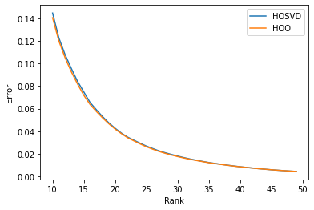

うん、ほとんど区別つかないですね。

HOSVDとHOOIの差も見てみましょう。

```py
diff = np.array(r_hosvd) - np.array(r_hooi)
fig, ax = plt.subplots()
ax.set_xlabel('Rank')
ax.set_ylabel('HOSVD - HOOI')
plt.plot(x, diff)
```

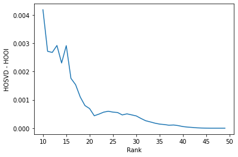

「元のテンソルとのノルムの差」の差をプロットしています。HOSVDの値からHOOIを引いているため、正の方向におおきいほどHOOIの方が精度が高いことになります。確かにHOOIの方が精度は高いのですが、エラーが0.14とかのオーダーの時に差が0.004とかなので、あまり気になるほどの差はありません。

## 計算量

HOSVDとHOOIは、今回試した範囲ではさほど精度に差はでませんでした。しかし、計算量はHOOIの方が軽かったりします。以下、簡単のために各足がDの次元を持つ3階のテンソルを、それぞれd次元に落とすTucker分解を考えてみましょう。

m行n列の特異値分解の計算量は$O(\mathrm{min}(mn^2, m^2n))$となります。HOSVDでは、元のテンソルを$D^2$行$D$列の行列とみなして特異値分解するので、計算量は$O(D^5)$です。

一方、HOOIの方は、元のテンソルを$d^2$行$D$列の行列として分解します。$D \gg d$なら、計算量は$O(D^2d)$です。$D$が大きいほど圧倒的に計算が楽になることがわかります。

## まとめ

カラーの「大名行列」のイメージを3本足のテンソルだと思ってHOOIをつかってTucker分解してみました。HOOIとHOSVDでは、HOOIの方が精度は若干高かったですが、そんなに差はありませんでした。計算量はHOOIの方が軽いはずですが、今回はちゃんと計測していません。そのあたりは誰かに任せます。

本稿がTucker分解の理解に悩む人の助けになれば幸いです。

## 参考文献

* [Tucker分解の導出と実装](http://yamaguchiyuto.hatenablog.com/entry/2016/11/30/080000) ここを見て、HOOIとALSが等価であることが理解できました。