# 大名行列をTucker分解してみる

## はじめに

線形代数には、特異値分解という操作があり、行列の近似に使われています。詳しくは前記事「[大名行列を特異値分解してみる](https://qiita.com/kaityo256/items/78b16c58228e131f8144)」を参照してください。

さて、行列はプログラムで言えば二次元配列のようなものです。二次元配列はインデックスを二つ指定すれば値を得ることができます。同様に行列も行と列の二つのインデックスを指定することで要素を指定することができます。行列を多次元配列に拡張したものがテンソルです。真面目にテンソルを議論するといろいろ面倒ですが、本稿では単に「多次元配列のこと」と思っておいて問題ありません。

さて、行列と同様に、テンソルも近似したいというニーズがあります。行列の場合は特異値分解が(フロベニウスノルムの意味で)最良近似でしたが、一般のテンソルをどのように近似すれば良いのかは良く分かっていません[^1]。テンソルを、小さなテンソル(コアテンソル)と、各モードに対応した行列の組にばらす分解をTucker分解と呼びます。前記事ではモノクロ画像をそのまま行列だと思って特異値分解しましたが、本稿ではカラー画像を三階のテンソルだと思ってTucker分解してみます。Tucker分解を得るアルゴリズムはいくつか提案されていますが、本稿では一番簡単なHigher Order SVD (HOSVD)という、特異値分解を素直に利用したアルゴリズムを紹介します。

[^1]: もしかしたら一般論があるのかもしれませんが、筆者は知りません。

コードは以下においておきます。

[https://github.com/kaityo256/daimyo_tucker](https://github.com/kaityo256/daimyo_tucker)

Google ColabでJupyter Notebookを開きたい場合は[こちら](https://colab.research.google.com/github/kaityo256/daimyo_tucker/blob/main/daimyo_tucker.ipynb)をクリックしてください。


## Tucker分解

Tucker分解について説明する前に、本稿で用いる用語や行列やテンソルのグラフ表現についてまとめておきます[^2]。行列やテンソルのインデックスを「足」と呼びます。行列は足を二本持っています。この行や列の数を足の「次元」と呼びます。多次元配列では「足の数」を次元と呼びますが、行列やテンソルは「インデックスの取りえる値の種類」を次元と呼ぶので注意してください。

[^2]: あまり詳しくないので、以下は業界標準ではない表記方法があるかもしれないのでご注意ください。

行列やテンソルを「線」が生えた「四角」で表現します。「線」が足です。行列は足が二本、三階のテンソルは足が三本生えています。それぞれの足の次元を明示したい時にはその近くに書くことにしましょう。

さて、グラフ表現で最も大事なのは、線を結ぶ操作です。行列は、同じ次元を持った足について和を取ることで新しい行列を作ることができます。例えば行列は、m行n列の行列とn行l列の行列の行列積を取ることができて、m行l列の行列ができます。これを四角と線で表現するとこんな感じになります。

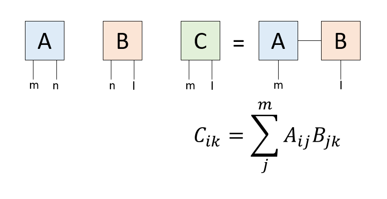


テンソルでも、同じ次元を持つ足について和を取ることで、その足を潰して新しいテンソルを作ることができます。グラフ表現では、行列と同様に足を結びます。その結果得られるテンソルは、残りの足の本数を階数とし、それぞれの足の次元を持つテンソルです。

さて、カラー画像のデータは、高さ、幅、色の3つのインデックスを持つ3次元配列で表現できます。これを3本の足を持つテンソルだと思って、特異値分解により近似してみましょう。一般にTucker分解では全ての足について近似しますが、今回は「色」の足の次元が3しかないので、「高さ」と「幅」の足だけ近似することにします。

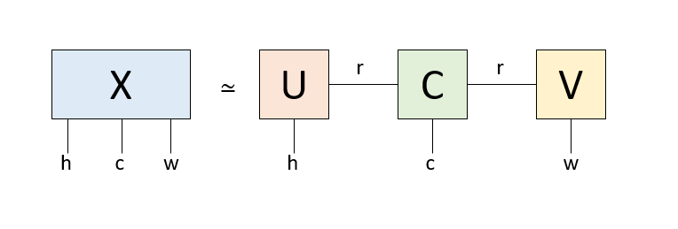

もともと高さh、幅w、色cの三つの足を持つテンソルを、テンソル一つと行列2つの積にバラしています。中央のテンソルは「コアテンソル」と呼ばれ、今回のケースでは色の足と、左右の行列に次元rでつながる足を持っています。左右の行列はそれぞれ高さhの足と次元rの足、幅wの足と次元rの足を持っており、rが「情報を伝える」足になっています。このrの次元を削減することで、情報を圧縮するのがTucker分解です。以下、それを試してみましょう。

## 大名行列のイメージを作る

まずは対象となる大名行列のイメージを作りましょう。前回はモノクロで作りましたが、今回はカラーイメージを作ります。近似による色の「にじみ」がわかりやすいように、4つの文字を、それぞれ黄色(R,G,0)、シアン(0,G,B)、マゼンタ(R,0,B)、白(R,G,B)で色をつけましょう。こんな感じでしょうか。途中でGoogle Colab用にフォントをインストールし、フォントのパスを指定していますが、他の環境を使う場合は適宜修正してください。

```py
from PIL import Image, ImageDraw, ImageFont
import numpy as np
from scipy import linalg
from IPython.display import display
!apt-get -y install fonts-ipafont-gothic
fpath='/usr/share/fonts/opentype/ipafont-gothic/ipagp.ttf'
fontsize = 50
font = ImageFont.truetype(fpath, fontsize)
LX = 200
LY = fontsize
img  = Image.new('RGB', (LX,LY),color="black")
draw = ImageDraw.Draw(img)
draw.text((0,0), "大　　　", fill=(255,255,0), font=font)
draw.text((0,0), "　名　　", fill=(0,255,255), font=font)
draw.text((0,0), "　　行　", fill=(255,0,255), font=font)
draw.text((0,0), "　　　列", fill="white", font=font)
img
```

実行するとこんなイメージが作られます。

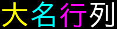

イメージからデータを取得しましょう。

```py
data = np.array(img.getdata()).reshape(LY,LX,3)
```

`data`は3次元配列であり、足が三本で、それぞれ高さLY、幅LX、色3つの次元を持つテンソルだと思うことができます。これを近似しましょう、というのが本稿の課題です。その前に、RGBプレーンそれぞれを見てみましょう。

```py
R = data[:,:,0]
G = data[:,:,1]
B = data[:,:,2]
display(Image.fromarray(np.uint8(R)))
display(Image.fromarray(np.uint8(G)))
display(Image.fromarray(np.uint8(B)))
```

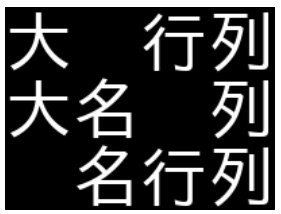

Rだけの世界、Gだけの世界、Bだけの世界を見ると、それぞれ文字が一文字ずつ欠けます。また、「列」は白なので欠けません。

## 特異値分解

まずは特異値分解をする関数を作っておきましょう。詳細は前記事を参照してください。行列を受け取り、指定のランクで近似した二つの行列を返す関数はこんな感じにかけるでしょう。

```py
def perform_svd(X, rank):
  U, s, V = linalg.svd(X)
  Ur = U[:, :rank]
  Sr = np.diag(np.sqrt(s[:rank]))
  Vr = V[:rank, :]
  A = Ur @ Sr
  B = Sr @ Vr
  return A, B
```

行列`X`を突っ込むと、二つの行列`A,B`が返ってきます。`A @ B`を計算すると、`rank`で低ランク近似された`X`を得ることができます。

## テンソルの近似

ではいよいよテンソルを近似しますが、せっかくなのでいろいろな近似方法を試してみましょう。

## 無理やり行列だと思って特異値分解

今回のテンソルは高さ50、幅200、色3のテンソルになっています。要素数は30000個です。これを、元の構造を全く無視して、200*150の行列だと思って特異値分解し、近似してみましょう。こんな関数になるでしょうか。

```py
def simple_image(X, rank):
  X = data.reshape((200,150))
  A, B = perform_svd(X, rank)
  Y = (A @ B).reshape(LY,LX,3)
  Y = np.clip(Y, 0, 255)
  Y = np.uint8(Y)
  print((A.size+B.size)/X.size)
  return Image.fromarray(Y)
```

実行結果はこんな感じです。

```py
display(simple_image(data, 50))
display(simple_image(data, 21))
display(simple_image(data, 8))
```

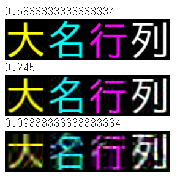


データの圧縮率も表示しています。上から58.3%、24.5%、9.3%です。これは、200*150の行列Xを二つの行列A,Bにバラした時、AとBの要素数の和を、Xの要素数で割ったものです。すごく乱暴な方法なわりには、それなりに元の構造が残っています。

## RGBプレーンを特異値分解

先の方法では、もともと高さ、幅、色という3つの構造を全く無視していました。次は元の構造を少し考慮してみましょう。カラーイメージを表現するテンソルを近似する方法として単純に思いつくのは、R,G,Bプレーンをそれぞれ「行列」だと思って特異値分解し、また合成する方法です。やってみましょう。

```py
def rgb_svd(X, rank):
  R = X[:,:,0]
  G = X[:,:,1]
  B = X[:,:,2]
  Rh, Rw = perform_svd(R, rank)
  Gh, Gw = perform_svd(G, rank)
  Bh, Bw = perform_svd(B, rank)
  return Rh, Rw, Gh, Gw, Bh, Bw
```

テンソル`X`をRGBプレーンを表す行列にばらし、それぞれRをRhとRw、GをGhとGw、BをBhとBwにバラして返しています。`Rh @ Rw`とするとRプレーンが復元されるので、同様にG、Bプレーンを復元すると、元のイメージが復元されます。イメージの復元はこんな感じになるでしょう。

```py
def rgb_image(X, rank):
  Rh, Rw, Gh, Gw, Bh, Bw = rgb_svd(X, rank)
  R = Rh @ Rw
  G = Gh @ Gw
  B = Bh @ Bw
  Y = np.asarray([R,G,B]).transpose(1,2,0)
  Y = np.clip(Y, 0, 255)
  Y = np.uint8(Y)
  print((Rh.size+Rw.size)*3/X.size)
  return Image.fromarray(Y)
```

実行してみましょう。

```py
display(rgb_image(data, 50))
display(rgb_image(data, 10))
display(rgb_image(data, 4))
```

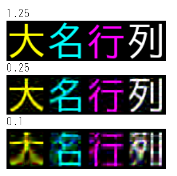

圧縮率は上から125%、25%、10%です。特異値分解は、残すランクの値が大きいと、元のデータより要素数が多くなることがあります。残り二つは先ほどの乱暴な方法と圧縮率を揃えてみました。構造を考慮しているので近似が良くなるかと思いましたが、意外に悪かったですね。

## Tucker分解

ではいよいよ本題のTucker分解をしてみましょう。Tucker分解の原理については[Tucker分解による画像の低ランク近似](https://qiita.com/kaityo256/items/0e8438c6c05897dadc2c)も参照してください。3本足のテンソル`X`を、コアテンソル`C`と、左右の行列`U`と`V`にばらす関数です。

```py
def tucker_decomposition(X, rank):
  X = X.transpose(0,2,1)
  XR = X.reshape(LY*3, LX)
  _, _, V = linalg.svd(XR)
  V = V[:rank,:]
  Vt = V.transpose(1,0)
  XL = X.reshape(LY, LX*3)
  U, _, _ = linalg.svd(XL)
  U = U[:,:rank]
  Ut = U.transpose(1,0)
  # Make a core tensor
  UX = np.tensordot(Ut, X, (1,0))
  C = np.tensordot(UX, Vt, (2, 0))
  return U, C, V
```

ばらした行列とテンソルからイメージを復元する関数はこんな感じになります。

```py
def tucker_image(X, rank):
  U, C, V = tucker_decomposition(X, rank)
  UC = np.tensordot(U,C,(1,0))
  Y = np.tensordot(UC, V, (2,0))
  Y = Y.transpose((0,2,1))
  Y = np.clip(Y, 0, 255)
  Y = np.uint8(Y)
  print((U.size+C.size+V.size)/X.size)
  return Image.fromarray(Y)
```

実行してみましょう。

```py
display(tucker_image(data, 50))
display(tucker_image(data, 23))
display(tucker_image(data, 10))
```

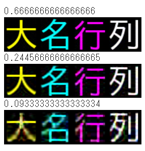

圧縮率は上から66.7%、24.5%、9.3%です。RGBそれぞれ特異値分解するよりは明らかに良いですが、乱暴な方法との比較は微妙かな、という感じでしょうか。

## まとめ

カラーの「大名行列」のイメージを3本足のテンソルだと思って、特異値分解を使って情報を圧縮してみました。RGBプレーンそれぞれを特異値分解するより、全体を無理やり特異値分解してしまう方が良さそうなのは意外でした。行列の場合と異なり、テンソルの近似は「どうするのが良いか」があまり自明ではありません。このコードを試してみて、「なるほどテンソルの低ランク近似は奥が深いなぁ」と思ってもらえれば幸いです。

## 補足資料

## Tucker分解とは

Tucker分解とは、テンソルを「コアテンソル」と呼ばれる小さなテンソルと、各足に接続する行列に分解することです。これが何をやっているかを理解するために、まずは特異値分解を用いた行列の近似について見てみましょう。

もともとm行n列の行列$X$があったとします。これを特異値分解して$X = U \Sigma V^\dagger$としましょう。ここで、$L = U \Sigma$、$R=V^\dagger$とすると、$X=LR$です。この変換は可逆ですから、何ら情報は失われていません。これをグラフ表現するとこんな感じです。


もともとm次元とn次元の足が二本だけあった行列ですが、中央にもう一本n次元の線が入りました。この線は「バーチャルボンド」と呼ばれ、「一方からもう一方へ情報を伝える線」だと解釈できます。このボンドの次元は$n$で、全ての情報を伝えています。さて、特異値のうちr個だけ使って、元の行列をm行r列の行列$\tilde{L}$と、r行m列の行列$\tilde{R}$の積で表現しましょう。グラフ表現するとこんな感じです。

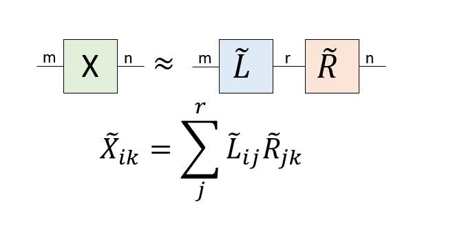

元の行列は次元mのボンドで全ての情報を伝えていましたが、その次元をrに絞ることで行列$X$が$\tilde{X}=\tilde{L}\tilde{R}$と近似されました。

元の行列は、片方の足からもう片方の足にバーチャルボンドが全ての情報を伝えていました。ところが、特異値の分解により、ランク$r$の低ランク近似をすると、次元$m$のボンドだったバーチャルボンドが次元$r$という細い線になりました。つまり、途中の情報を「絞る」ことで近似していると解釈できます。

さて、行列もテンソルですから、Tucker分解できます。Tucker分解は足ごとに異なる次元で近似できますが、簡単のためにm行n列の行列の二つの足をどちらも$r$で近似しましょう。こんな形になります。

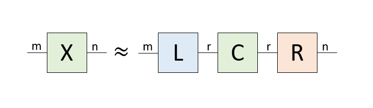

先程は、mn個のデータ(行列要素)がr(m+n)個になったのに対して、Tucker分解の場合はr(m+n+r)個になったため、データ数が増えてしまっています。これは2階のテンソルである行列をTucker分解しているためで、高階のテンソルをTucker分解すると非常にデータ数が非常に小さくなります。例えば、それぞれd次元の足を持つ4階のテンソルを、rで絞ったTucker分解だと、もともと$d^4$の要素数だったのが$4dr+r^4$まで落ちます。$d=10$、$r=5$なら8.25%までデータを圧縮することができます。

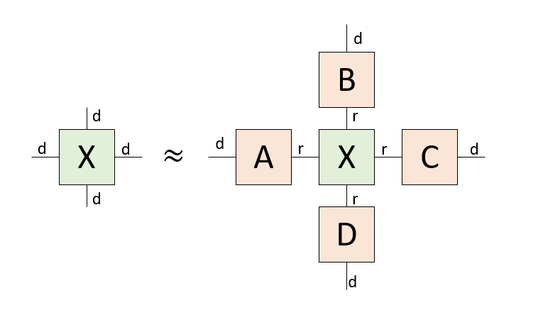

さて、Tucker分解は、もとのテンソルと同じ形をしたコアテンソルのそれぞれの足に行列をつけたような形をしています。コアテンソルの足は細く、コアテンソルの足にくっつく行列は、その足を太くします。このコアテンソルと行列をどのように求めるか？というのが問題となります。

## HOSVD

Tucker分解を得る簡単な方法の一つが、本稿で述べたHOSVD (Higher-order SVD)という手法です。HOSVDは高階テンソルを分解するための手法ですが、まずは行列に適用してみましょう。

まず、m行n列の行列$X$をSVDで分解すると、$X=U\Sigma V^\dagger$を得ます。$U\Sigma=L$とすると、$X=LV^\dagger$と分解できたことになります。さて、特異値分解の定義から$V$はユニタリ行列なので$V^\dagger V = I$です。したがって、$X=LV^\dagger$の両辺に左から$V$をかけると、$L=XV$を得ます。

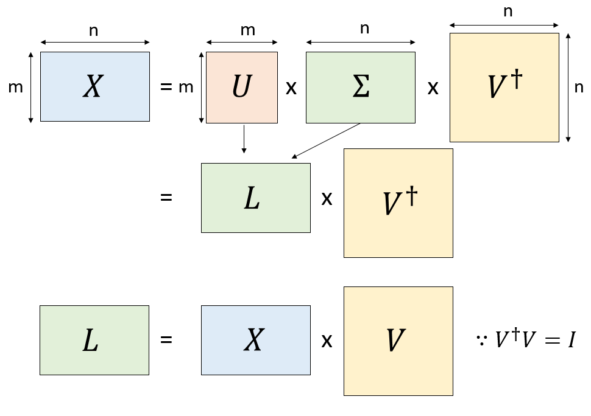

つまり、$X=L V^\dagger$と分解できる時、$V$は$X$から$L$を取り出す演算子であると理解できます。

さて、$X=L V^\dagger$ と分解した後にランク$r$で低ランク近似をするためには、$L$の左から$r$列だけ取り出した行列$\tilde{L}$と、$V^\dagger$の上から$r$行だけ取り出した行列$\tilde{V}^\dagger$の積として$\tilde{X}=\tilde{L} \tilde{V}^\dagger$を作るのでした。

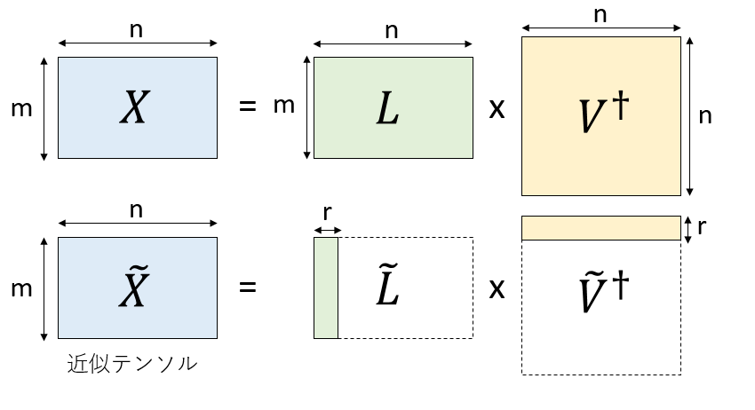

ここで、$L=XV$であったことと、$V^\dagger$がユニタリ行列であったことを考慮すると、$V$の左から$r$列をとった行列$\tilde{V}$を使って、$\tilde{L}=X\tilde{V}$として、$X$から$\tilde{L}$を取り出すことができることがわかります。

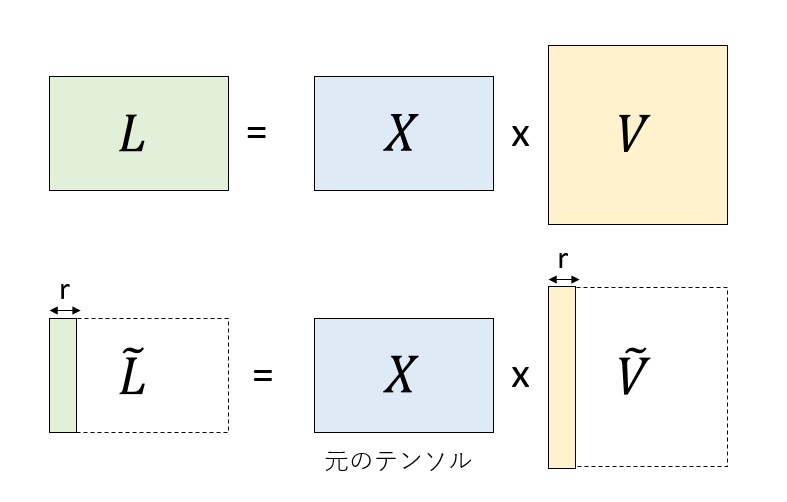

$\tilde{L}=X\tilde{V}$を使って$\tilde{X}=\tilde{L} \tilde{V}^\dagger$を書き直すと、$\tilde{X}=X \tilde{V} \tilde{V}^\dagger$となります。これを図示するとこんな感じです。

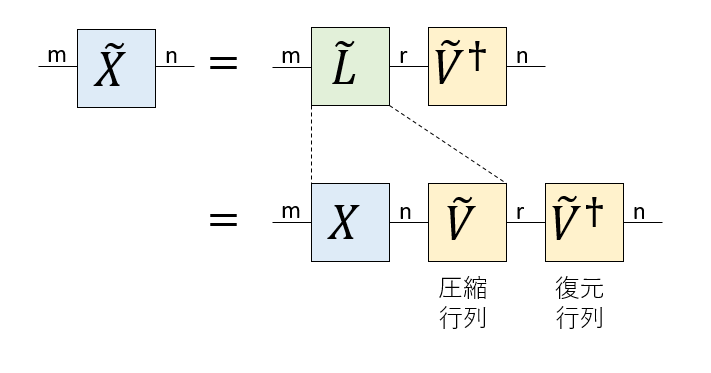


これを見ると、もともと$n$の次元を持っていた$X$の右の足を$\tilde{V}$を使って次元$r$に落とし、それを$\tilde{V}^\dagger$によりまた$n$の次元に戻しているように見えます。$\tilde{V}$が情報を圧縮し、$\tilde{V}^\dagger$が復元しているので、それぞれ圧縮行列、復元行列と呼びましょう。

さて、$\tilde{V}$は右の足の次元を落とす行列ですが、全く同様にして左の足の次元を落とす圧縮行列$\tilde{U}^\dagger$を考えることができます。作り方は$\tilde{V}$と同様です。元の行列$X$に、右から右の圧縮行列$\tilde{U}^\dagger$を、左から左の圧縮行列$\tilde{V}$をかけると、r行r列の小さな行列$C$になります。これがTucker分解におけるコアテンソルになります。

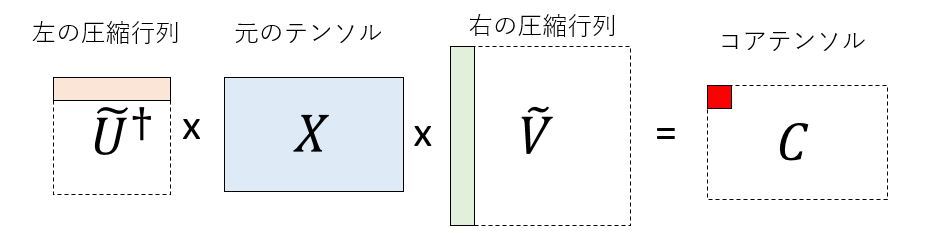

特異値分解の様子と、HOSVDの関係を描くとこんな感じになります。

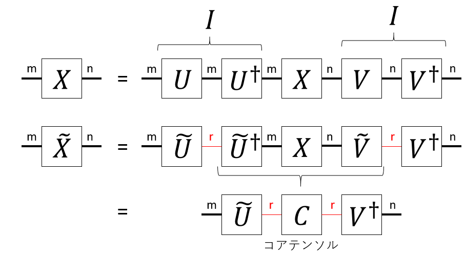

特異値分解で得られる$U$や$V^\dagger$はユニタリ行列ですから、$U U^\dagger = VV^\dagger=I$です。この$U U^\dagger$の間の線を細くすることで近似をするのがHOSVDです。コアテンソルは、それぞれの足に「圧縮行列」をかけることで得ることができます。元のテンソルを近似するには、コアテンソルのそれぞれの足に「復元行列」をかければ良いことがわかります。

## カラーイメージのTucker分解

Tucker分解は元のテンソルのそれぞれの足に圧縮行列をかけることでコアテンソルを作り、コアテンソルのそれぞれの足に復元行列をかけることで近似テンソルを作る手法です。本稿ではカラーイメージを高さ、幅、色の3つの足を持つテンソルとしてTucker分解していますが、色の足は次元が3しかないので、そこはそのままにして、高さの足と幅の足に対応する圧縮、復元行列を作っています。

まず、幅の足(次元w)に対応する圧縮行列を作りましょう。そのために高さの足(次元h)と、色の足(次元c)をまとめて、hc行w列の行列とみなします。プログラムでは、もともと足が(h, w, c)の順番に並んでいたのを、`transpose`により(h,c,w)の順番に変え、(h*c, w)の形に`reshape`していることに対応します。

この後、特異値分解により$X = L W^t$を得ます($W$は実行列なので随伴行列は転置になります)。先ほどと同様な議論から$L=XW$ですから、$X=X W W^\dagger$です。そして、$W W^\dagger$の間のボンドを「絞る」ことで低ランク近似をします。これにより、幅の足に作用する圧縮行列$\tilde{W}$を得ます。

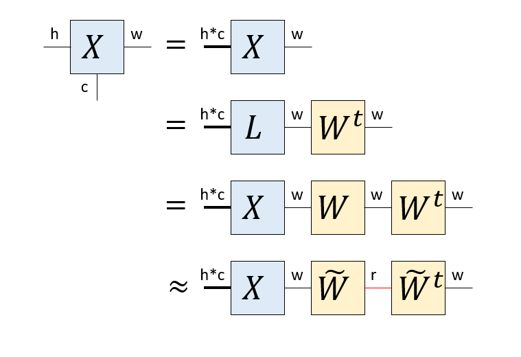


全く同様な手続きにより、高さの足に作用する圧縮行列$H^t$を得ます。これを元のテンソル$X$にかければコアテンソル$C$の出来上がりです。さらに、コアテンソルのそれぞれの足に復元行列をかければ近似テンソル$\tilde{X}$ができます。

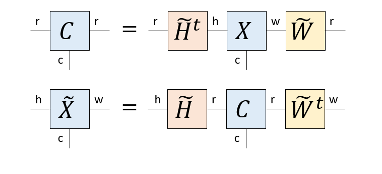

等式の両辺で「外に出ている足」の次元が一致していることを確認してください。圧縮行列と復元行列はお互いに転置の関係にあります。

まとめると、HOSVDとは

1. 注目する足以外を全てまとめる(transpose, reshape)
2. 注目する足とそれ以外の足の行列だと思って特異値分解する
3. 注目する足に対応する圧縮行列、復元行列を得る
4. 以上の処理を全ての足について行う
5. 元のテンソルの全ての足に圧縮行列をかけたものがコアテンソルになる
6. コアテンソルの全ての足に復元行列をかけたものが近似テンソルになる

という手法になります。情報圧縮の手段として見ると、保存するべき情報はコアテンソルと全ての復元行列のみです。絞る次元を固定すると、元のテンソルの足の本数(階数)が多いほど強力に圧縮できますが、復元した時にどのくらい良い近似になるかは元のテンソルの性質に依存します。
