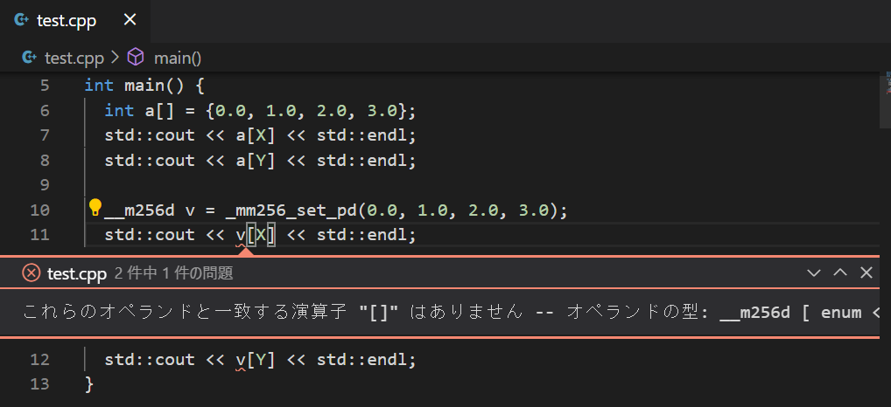
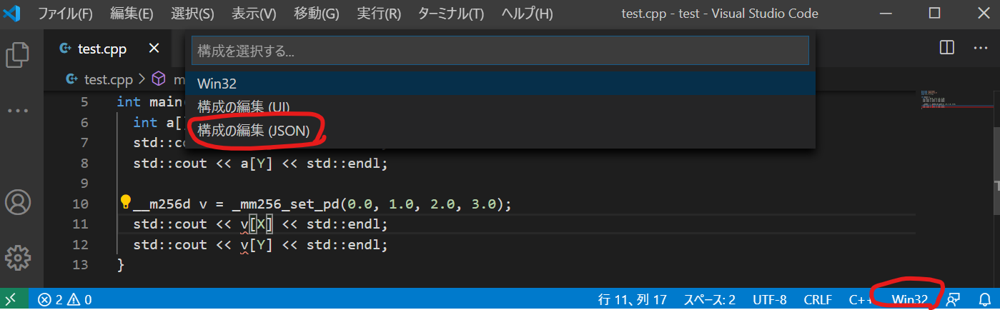
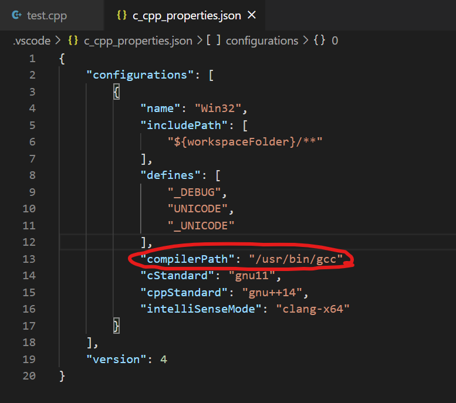
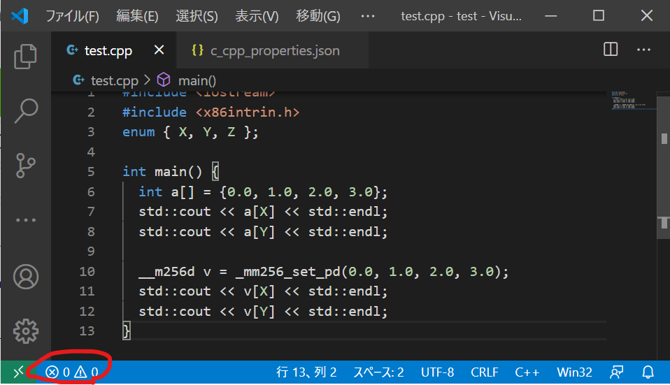

# WindowsのVSCodeで__m256d型のインデックスアクセスにenumを使うと怒られる

## TL;DR

* WindowsのC/C++拡張が入ったVSCodeで`_m256d`型の変数にenumでインデックスアクセスすると、「これらのオペランドと一致する演算子 "[]" はありません -- オペランドの型: __m256d [ enum <unnamed> ]」というエラーが表示される
* 解決するには、`.vscode/c_cpp_properties.json`の`compilerPath`をデフォルトの`/usr/bin/g++`から適切なもの、例えば`c:/MingW/bin/g++`に変える。

## 現象

こんなコードを書く。

```cpp
#include <iostream>
#include <x86intrin.h>
enum { X, Y, Z };

int main() {
  int a[] = {0.0, 1.0, 2.0, 3.0};
  std::cout << a[X] << std::endl;
  std::cout << a[Y] << std::endl;

  __m256d v = _mm256_set_pd(0.0, 1.0, 2.0, 3.0);
  std::cout << v[X] << std::endl;
  std::cout << v[Y] << std::endl;
}
```

`enum`で座標軸を表現し、それで`int a[]`や、`__m256d v`にインデックスアクセスをしている。

このうち、`int a[]`のインデックスにenumを使っても文句は言われないのだが、`__m256d v`のインデックスアクセスのところで「これらのオペランドと一致する演算子 "[]" はありません -- オペランドの型: __m256d [ enum <unnamed> ]」と文句を言われてしまう。



しかし、WSLやMinGWのg++でコンパイルしてもそんなことは言われず、いったい誰がこのエラーを吐いているのかよくわからない。enumに明示的にint型を指定したり、`X=0`などと値を代入してもダメだった。

## 回避方法

VSCodeの右下にあるWin32をクリックして現れるメニューの「構成の編集 (JSON)」を選ぶ。



すると、`.vscode/c_cpp_properties.json`が編集できるので、その`compilerPath`を、別のコンパイラ、例えば`c:/MingW/bin/g++`に変える。



すると、エラーが消える。



## まとめ

`__m256d`にenumでインデックスアクセスするという、極めてニッチなコードにVSCodeが怒る件について対応した。結局VSCodeがデフォルトで参照する`/usr/bin/gcc`や`usr/bin/g++`の実体が何かよくわからなかったのだが(cpptools?)、いずれにせよ別のコンパイラを指定することでエラーが消えた。何しろSIMD化とかするとこの手のコードが大量に発生するのだが、VSCodeが大量のエラーで真っ赤になるのが鬱陶しかったのでなおってよかった。
