# エラーバーの話

## はじめに

実験でも数値計算でも、観測に誤差が伴うものをグラフにする時にはエラーバー(誤差棒)をつけると思います。エラーバーのつけ方には流儀がありますが、とりあえず1シグマ、つまり「誤差の乗り方がガウス分布だと仮定した時の標準偏差」をエラーバーとすることが多いです。

で、エラーバーは1シグマなので、「真の値をそのエラーバーの中に含む確率」が68%です。つまり観測点の3つに1つは「真の値」がエラーバーの範囲外にあることになります。なお、ここでは「真の値」を「観測を十分な回数繰り返した時に収束する値」のこととします。

さて、発表を見ていて、たまに「ん？」と思うようなグラフを見かけます。以下では、そんな「ん？」なグラフの実例と、その原因について見てみようと思います。

## ケース1：正しい誤差棒

入力値$x$に対して、観測値$y$が$y=x$となる単純な系を考えましょう。ただし、観測するたびに誤差$\varepsilon$がのるものとします。これを素直にシミュレートすると、こんなスクリプトになるでしょうか。

```rb
def func(x)
  ysum = 0.0
  y2sum = 0.0
  n = 10
  n.times do
    y = x + (rand - 0.5) * 2.0
    ysum += y
    y2sum += y * y
  end
  ysum /= n.to_f
  y2sum /= n.to_f
  sigma = (y2sum - ysum ** 2) / (n - 1).to_f
  return ysum, Math.sqrt(sigma)
end

srand(1)

10.times do |i|
  x = i + 1
  y, e = func(x)
  puts "#{x} #{y} #{e}"
end
```

結果はこんな感じになります。

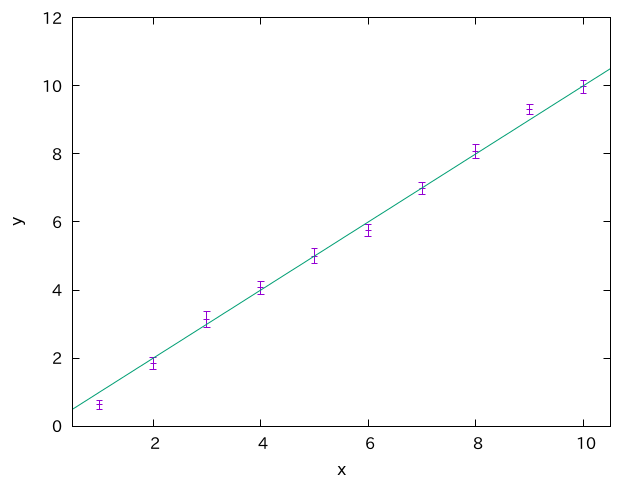

10点の観測点のうち、$y=x$の直線にエラーバーがかかっていない点が3点あります。この直線にエラーバーがかかる確率が68%なのですから、だいたい3つが外れることになります。こういうグラフを見ると、「あ、エラーバーがまっとうだな」と思うわけです。

## ケース2：標準偏差のサンプル依存性その1

学校等で、標準偏差は観測サンプル数$N$に対して$\sqrt{N}$で小さくなることを学んだと思います。それを確認してみましょう。

0から1の値を取る一様乱数を$N$回観測し、その平均値と標準偏差を$N$に対してプロットしてみましょう。

こんな感じのスクリプトになるでしょうか。

```rb
def func(n)
  s = 0.0
  s2 = 0.0
  n.times do
    r = rand
    s += r
    s2 += r * r
  end
  s /= n.to_f
  s2 /= n.to_f
  sigma = Math.sqrt((s2 - s ** 2) / (n - 1))
  return s, sigma
end

srand(1)

10.times do |i|
  n = 2 ** (i + 2)
  a, e = func(n)
  puts "#{n} #{a} #{e}"
end
```

まず、標準偏差の$N$依存性はこんな感じです。

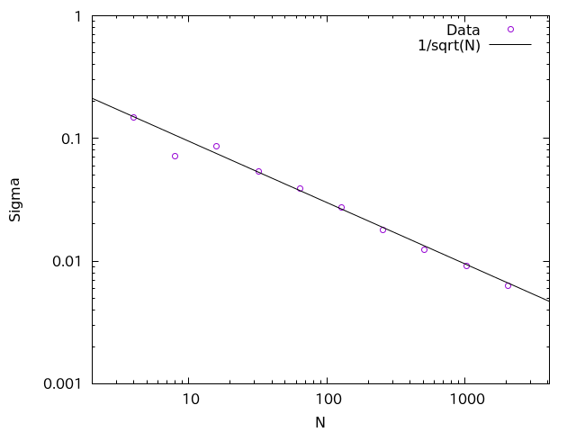

たしかに$N$を増やすに連れて、$1/\sqrt(N)$で小さくなっていくのがわかります。

次に、エラーバーを見てみましょう。

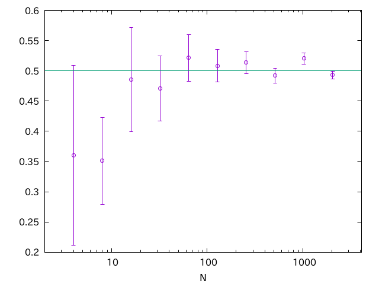

$N$が大きくなるにつれてエラーバーが小さくなりますが、やはりエラーバーが$0.5$にかからない観測点が3点あることがわかります。

## ケース3：標準偏差のサンプル依存性その2

「真の値をそのエラーバーの中に含む確率が68%」になるのは、ノイズが独立に入ること、つまり「観測点の間に相関が無い」時です。逆に、観測点の間に相関があるとおかしなことになります。

よくあるパターンの一つは、ある観測点が別の観測点のデータを共有してる場合です。

先ほどと同様に、標準偏差は観測サンプル数$N$に対して$\sqrt{N}$で小さくなることを見てみようと思います。前回は$N$を4から2048まで変えながら、全て独立に平均値と標準偏差を求めましたが、今回は2048回測定し、そのうち4回の平均、8回の平均、16回の平均・・・と、一度測定したデータを使って平均値と標準偏差を計算してみましょう。

この場合、$N$が小さい時のデータは、必ず$N$が大きいデータに含まれることになります。例えばN=8のデータのうち4つは、N=4の計算に使ったデータを共有します。

スクリプトはこんな感じです。

```rb
def func(n)
  s = 0.0
  s2 = 0.0
  n.times do
    r = rand
    s += r
    s2 += r * r
  end
  s /= n.to_f
  s2 /= n.to_f
  sigma = Math.sqrt((s2 - s ** 2) / (n - 1))
  return s, sigma
end

srand(1)

s = 0.0
s2 = 0.0
i = 0
10.times do |j|
  n = 2 ** (j + 2)
  while (i < n)
    i += 1
    r = rand
    s += r
    s2 += r * r
  end
  a = s / n.to_f
  a2 = s2 / n.to_f
  sigma = Math.sqrt((a2 - a ** 2) / (n - 1))
  puts "#{n} #{a} #{sigma}"
end
```

この場合でも、標準偏差が$1/\sqrt{N}$に比例するのは同じです。

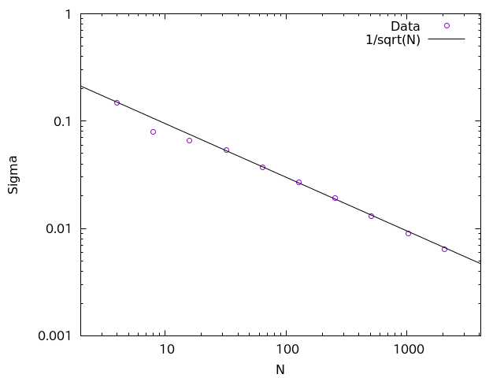

ただし、誤差棒がおかしくなります。

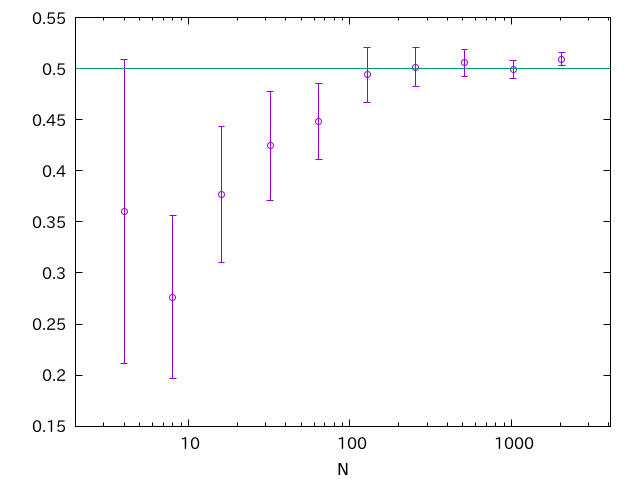

10点の観測点のうちエラーバーが0.5にかからない点が5点もあります。しかも、「同じ側」に連続でずれています。相関が無いのであれば、真の値の両側に均等にばらつくはずで、これを見たら「おかしい」と思わなければいけません。

## ケース4：観測に振動を含む場合

何か指数関数的に減衰する量を観測する場合を考えましょう。ノイズがひどいので、何度も観測してサンプル平均を取ることにします。

さて、何かが減衰する場合、単に指数関数で減衰するだけでなく、振動がのる場合があります。振動ののり方はいろいろありますが、単純に

$$
y = \exp(-a x) + b \sin(c x + \Delta) + \varepsilon
$$

という形の系を考えましょう。

右辺第二項が振動項です。$\Delta$は位相で、「一回の観測の間は一定だが、観測毎に異なる」ようなランダムな値とします。第三項の$\varepsilon$は観測誤差で、観測のたびに独立なノイズがのるものとします。

グラフにするとこんな感じになります(ノイズを含まない場合)。

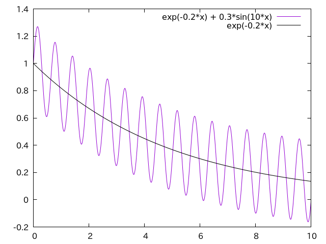

平均としては指数関数的減衰ですが、それに正弦波が乗っています。

「一回の観測の間は一定だが、観測の度に異なる位相」というのは、グラフにするとこんな感じです。


一回目の実験Exp. 1と、二回目の実験Exp. 2では、位相がずれています。振動数は同じなので、何度も観測して平均すると、平均値である指数関数減衰(黒線)に近づいていくことが期待されます。

このグラフを見たら「指数関数に振動が乗っている」ことがすぐにわかりますが、観測点の間隔が広い場合、これが振動なのかノイズなのか区別をつけることが難しくなります。例えば、先ほどのグラフ(紫の線)を間隔1でプロットしたものがこちらです。

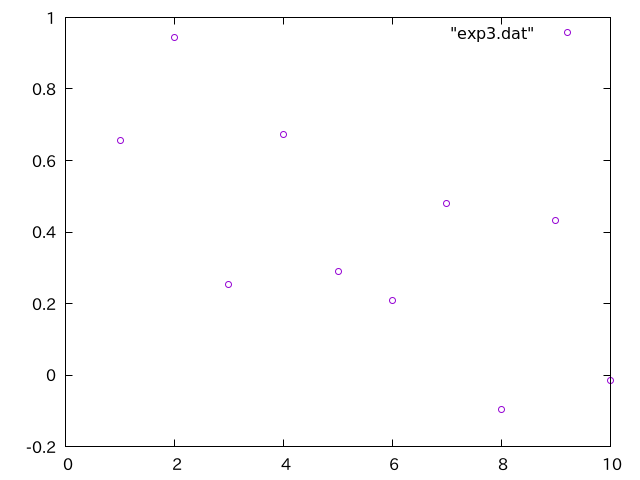

このグラフを見て「ノイズが乗っている」のか「振動が乗っている」のかを判断することは難しいでしょう。しかし、エラーバーをつけてみるとそれがわかる(少なくとも何かおかしなことが起きていることがわかる)場合があります。

この振動項の有無がエラーバーに与える影響を見るスクリプトはこんな感じでしょうか。

```rb
NDATA = 10
NSAMPLE = 20

srand(1)

def func(x, delta, a_sin)
  y = Math.exp(-x * 0.2) + (rand - 0.5) * 0.1
  y += a_sin * Math.sin(x * 10.0 + delta)
  y
end

def stat(d)
  n = d.size.to_f
  ave = d.sum / n
  ave2 = d.map { |i| i ** 2 }.sum / n
  sigma = Math.sqrt((ave2 - ave ** 2) / (n - 1.0))
  return ave, sigma
end

def run(filename, a_sin)
  data = Array.new(NDATA) { [] }

  NSAMPLE.times do
    delta = rand * 2 * Math::PI
    NDATA.times do |i|
      y = func(i+1, delta, a_sin)
      data[i].push y
    end
  end

  open(filename, "w") do |f|
    NDATA.times do |i|
      a, s = stat(data[i])
      f.puts "#{i+1} #{a} #{s}"
    end
  end
  puts filename
end

run("test6_a.dat", 0.0)
run("test6_b.dat", 0.3)
```

まず、振動項が無い場合はこんな感じになります。

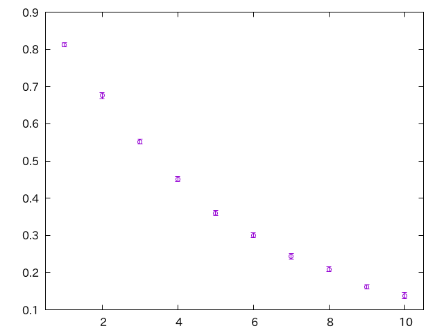

まぁこんな感じかな、というグラフですね。

次に、振動項がある場合です。

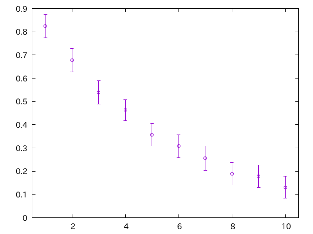

慣れた人が見れば「ん？」と思うはずです。期待値の振る舞いが綺麗なわりに、エラーバーが大きすぎます。

それを見るために、観測値に$exp(0.2x)$をかけてみましょう。

まずは振動項の無い場合です。

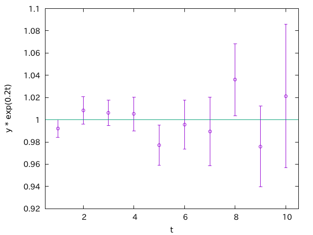

観測値は、真の値のまわりを揺らいでおり、エラーバーにかからない点が2点、ぎりぎりかかってるかどうかが1点で、まぁそんな感じかな、と思うグラフでｓ。

次に、振動項がある場合です。

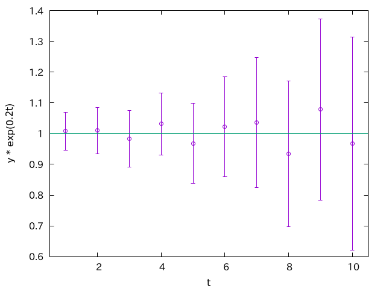

全ての点において、エラーバーががっつり「真の値」を含んでいます。これを見ればエラーバーが大きすぎることがわかるでしょう。

振動の位相は観測毎にランダムなので、平均をとれば振動がない場合と同じ期待値に収束します。しかし、振動の位相は同じ観測では固定なので、観測点同士が強く相関することになります。この場合は、振動の分散も拾ってしまうため、エラーバーが大きくでます。

振動の周期が観測間隔に比べて小さい場合、単なるノイズと区別をしづらいので注意が必要です。

## まとめ

見てて「ん？」と思うようなエラーバーのグラフを紹介してみました。とにかく「データがのる」と思われる曲線を描いてみて、そこにエラーバーがかからない観測点が3点に1つ無い場合、何かがおかしい可能性が高いです。ありがちなのは観測点同士に相関があることですが、分散を$N$ないし$N-1$で割り忘れている、なんて場合もあります(観測点数が少ない場合、意外に気づきにくいです)。

この記事が誰かの参考になれば幸いです。
