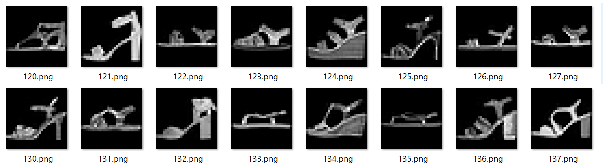
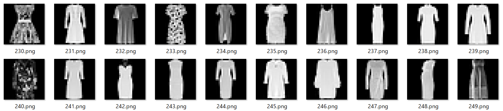
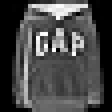
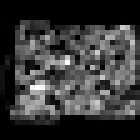
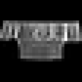

# Fashion-MNISTのデータを仕分けしてPNGファイルで保存

## はじめに

機械学習、してますか？＞挨拶

以前、[Chainerを使っていた](https://qiita.com/kaityo256/items/77bc0b40e3bb70d36f3d)のですが、なんやかんやあってPyTorchかKerasを使うことになりました。で、機械学習のチュートリアルといえば手書き数字のMNISTデータセットですが、[TensorFlow](https://www.tensorflow.org/tutorials/keras/classification)のチュートリアルでは少しひねってFashion-MNISTのデータを使っています。

このチュートリアルは非常にわかりやすいのですが、とりあえず「どんなデータを学習させているのか」をざっと見てみるのは有益でしょう。というわけで、Fashion-MNIST、つまり衣類の分類問題に使うデータをダウンロード、仕分けして見ましょう。

コードは以下に置いておきます。

[https://github.com/kaityo256/fashion_mnist_dump](https://github.com/kaityo256/fashion_mnist_dump)

## 使い方

実行するだけです。TensorFlowのVersion 2以降が必要だと思います。

```sh
python fashion_mnist_dump.py 
```

実行すると、以下のようなディレクトリを掘り、対応するラベルを持つデータが連番で保存されていきます。

```txt
test
├ Bag
├ Boot
├ Coat
├ Dress
├ Pullover
├ Sandal
├ Shirt
├ Sneaker
├ Top
└ Trouser

train
├ Bag
├ Boot
├ Coat
├ Dress
├ Pullover
├ Sandal
├ Shirt
├ Sneaker
├ Top
└ Trouser
```

ラベルが10種類。テストデータはラベルごとにそれぞれ1000枚ずつ合計1万枚、トレーニングデータは6000枚ずつ合計6万枚、全部で7万枚のデータです。

例えばテストデータの`Sandal`なら、



`Dress`なら



みたいに仕分けされて保存されます。

## スクリプト

スクリプトも短いので全部掲載します。

```py
import os

import IPython
from PIL import Image
import numpy as np
import tensorflow as tf
from tensorflow import keras

fashion_mnist = keras.datasets.fashion_mnist
train, test = fashion_mnist.load_data()

dirnames = ['Top', 'Trouser', 'Pullover', 'Dress',
            'Coat', 'Sandal', 'Shirt', 'Sneaker', 'Bag', 'Boot']


def save_img(filename, data):
    img = Image.new("L", (28, 28))
    pix = img.load()
    for i in range(28):
        for j in range(28):
            pix[i, j] = int(data[j][i])
    img2 = img.resize((28*5, 28*5))
    img2.save(filename)


def dump(data, dhead):
    for i in range(10):
        dname = "{}/{}".format(dhead, dirnames[i])
        if os.path.isdir(dname) is False:
            os.makedirs(dname)
    images, labels = data
    count = [0]*10
    for i in range(len(images)):
        index = labels[i]
        filename = "{}/{}/{}.png".format(dhead, dirnames[index], count[index])
        save_img(filename, images[i])
        count[index] += 1
        print(filename)


dump(test, "test")
dump(train, "train")
```

特に難しいことはないと思いますが、一応簡単に説明します。

まず、データのダウンロードです。

```py
fashion_mnist = keras.datasets.fashion_mnist
train, test = fashion_mnist.load_data()
```

`fashion_mnist.load_data()`は、トレーニングデータセットとテストデータセットを返します。

それぞれのデータセットは、イメージデータとラベルデータから構成されてます。それぞれNumPy配列です。

なので

```py
train_images, train_labels = train
```

などとすれば、イメージとラベルを取得することができます。

イメージは、テストデータは10000 x 28 x 28、トレーニングデータは60000 x 28 x 28のNumPy配列になっています。タイプは`uint8`、つまり0から255の整数なので、そのままグレースケールの輝度にすれば画像として保存できます。それをやってるのが以下の関数です。

```py
def save_img(filename, data):
    img = Image.new("L", (28, 28))
    pix = img.load()
    for i in range(28):
        for j in range(28):
            pix[i, j] = int(data[j][i])
    img2 = img.resize((28*5, 28*5))
    img2.save(filename)
```

`Image.new("L", (28, 28))`で28 x 28 ピクセルのグレースケールの画像を作成し、`img.load()`でピクセルデータを取得します。あとはそのデータにNumPy配列を突っ込むだけです(`int`にキャストしてやる必要があります)。

このままだとやや小さいので、`img.resize((28*5, 28*5))`で5倍に拡大して保存しています。

この`save_img`にファイル名とデータを入れて呼んでいるのが`dump(data, dhead)`関数です。

`data`はテストもしくはトレーニングデータ、`dhead`はテストかトレーニングかで、ディレクトリ名で区別させています。

特に難しいことはないですが、学習に使う時には、このデータを例えば-1.0から1.0までの実数データにして、かつ28x28の二次元データではなく784の一次元データにflattenしたりした方が使い勝手が良いでしょう(CNNなら二次元のままの方がいいかも)。

## まとめ

TensorFlow/Kerasを使ってFashion-MNISTのデータを取得し、仕分けしてファイルとして保存してみました。データをぼーっと見てると面白いです。例えば

「あ、Gapだ」と思ったり、


人間が見てもなんだかわからないものがあったり[^1]


なんかパンツのようなものと一緒に写っていたり


やっぱりなんだかわからないものがあったり・・・


[^1]: 正解(ラベル)はバッグだそうです。

ともあれ、機械学習系のライブラリは進展が早く、キャッチアップするのが大変ですね・・・
