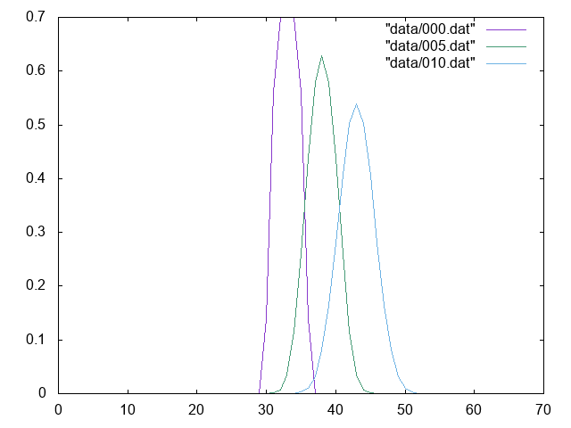
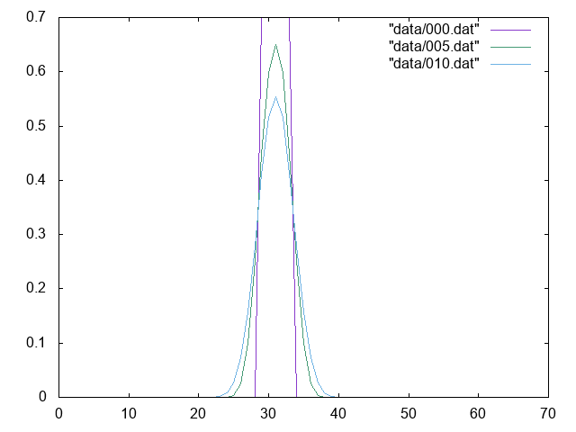

# 格子計算プログラム生成言語Formuraを使ってみる その2

## はじめに

格子計算プログラム生成言語[Formura](https://github.com/formura/formura)を使ってみる。

[その1](https://qiita.com/kaityo256/items/8b6c9ca1abeeef64f414)では、とりあえずFormuraのインストールと、Formuraが吐いたソースを読み込むmain関数を書いた。本稿では、簡単なシミュレーション例として一次元熱伝導方程式を解いてみる。前回と同じyamlとfmrを使い回すので、まだ読んでいない人は先に[その1](https://qiita.com/kaityo256/items/8b6c9ca1abeeef64f414)を参照してほしい。

* [その1](https://qiita.com/kaityo256/items/8b6c9ca1abeeef64f414) インストールとコンパイルまで
* [その2](https://qiita.com/kaityo256/items/7ff1fb39986414654824) 一次元熱伝導方程式  ←イマココ
* [その3](https://qiita.com/kaityo256/items/bfd327ecf4e79b8ab83d) 二次元熱伝導方程式
* [その4](https://qiita.com/kaityo256/items/2dd11363769cb5f29bc2) 反応拡散方程式(Gray-Scott系)

## 初期条件の作成

初期条件として、中央に非ゼロの部分、あとは全部ゼロ、といったステップ関数的な温度を与える。そのために、`gs.fmr`に、「中央かどうか？」を判定する関数`isCenter`を定義しよう。

```pascal
extern function :: fabs

isCenter = fun(i,w) (fabs(total_grid_x/2-i) < w)
```

Formuraは、外部関数としてC言語の関数を使える。ここでは`fabs`を使っている。関数は、ラムダ式のようなイメージで定義できる。これは位置のインデックス`i`と、幅`w`を受け取り、中央から±wの幅だけTrueを返すような関数だ。

ここで、`total_grid_x`は自動生成された予約語で、x軸の全体のグリッド数である。

この関数を使って、「中央だけ非ゼロの値を入れる」という初期化関数は以下のように書ける。

```pascal
begin function u = init()
  double [] :: u
  u[i] = if isCenter(i,3) then 0.7 else 0.0
end function
```

`u[i]`について、`isCenter(i,3)`がTrueなら0.7を、そうでなければ0.0を代入する式だ。これは添字`i`すべてについて実行される。

## 熱伝導方程式

## Formuraファイル

次に、熱伝導方程式(拡散方程式)を定義しよう。この時、拡散係数`Du`や時間刻み`dt`を定義したくなるであろう。Formuraはこのようなスカラー変数も宣言できる。

```pascal
double :: dt = 0.2
double :: Du = 0.05
```

熱伝導方程式の中心部分、ラプラシアンの計算を定義しよう。中央差分を取るだけなので簡単である。

```pascal
diff = fun(q) (q[i+1] + q[i-1] - 2.0*q[i])
```

ラプラシアンが定義できれば、時間発展は以下のように簡単にかける。

```pascal
begin function u2 = step(u)
  u2 = u + diff(u) * dt
end function
```

これが熱伝導方程式を表していることは容易に見て取れるであろう。関数`step`は、現在の状態変数ベクトルを受け取り、次の状態変数ベクトルを返す関数として定義する。Fortranの行列記述のように、添字を省略して記述できるし、状態変数ベクトルをそのまま先程定義した関数に入れて呼ぶことができる。

以上をすべてまとめると、Formuraファイル`gs.fmr`は以下のようになる。

```pascal
dimension :: 1
axes :: x

double :: dt = 0.2
double :: Du = 0.05

extern function :: fabs

isCenter = fun(i,w) (fabs(total_grid_x/2-i) < w)

diff = fun(q) (q[i+1] + q[i-1] - 2.0*q[i])

begin function u = init()
  double [] :: u
  u[i] = if isCenter(i,3) then 0.7 else 0.0
end function

begin function u2 = step(u)
  u2 = u + diff(u) * dt
end function
```

## main関数

次に、main関数で時間発展を記述する。といっても`Formura_Forward(&n)`という関数を呼ぶだけで一回タイプステップが進むので簡単である。

毎ステップ`dump`という状態をダンプする関数を呼ぶなら、

```cpp
int main(int argc, char **argv) {
  Formura_Navi n;
  Formura_Init(&argc, &argv, &n);
  for (int i = 0; i < 100; i++) {
    Formura_Forward(&n);
    dump(n);
  }
  Formura_Finalize();
}
```

とかける。

## 状態の保存

Formuraでは、状態の保存には注意が必要だ。

まず、ベクトルのサイズは`n.total_grid_x`で取得できる。また、状態ベクトル`u`は`formura_data.u[i]`として取得できる。以上から、呼ばれるたびに状態ベクトルを保存する関数`dump`を書くと、

```cpp
void dump(Formura_Navi &n) {
  char filename[256];
  static int index = 0;
  sprintf(filename, "data/%03d.dat", index);
  index++;
  std::cout << filename << std::endl;
  std::ofstream ofs(filename);
  for (int i = 0; i < n.total_grid_x; i++) {
    double v = formura_data.u[i];
    ofs << i << " ";
    ofs << v << std::endl;
  }
}
```

と書ける。しかし、このまま実行すると始点がずれてしまう。以下が実行結果だ。

```sh
$ formura gs.fmr
$ g++  main.cpp gs.c
$ mkdir data
$ ./a.out
data/000.dat
data/001.dat
(snip)
data/098.dat
data/099.dat
```



計算は正しくできていそうだが、場所がずれていることがわかるだろう。

これは実は、Formuraが毎回オフセットを変えて計算していることによる。このオフセットは`n.offset_x`で取得できるので、インデックスを以下のように補正してやれば良い。

```cpp
    int i2 = (i - n.offset_x + n.total_grid_x) % n.total_grid_x;
    double v = formura_data.u[i2];
```

以下が実行結果だ。



軸が正しく修正できたことがわかるであろう。

以上をまとめた`main.cpp`は以下のようになる。

```cpp
#include "gs.h"
#include <fstream>
#include <iostream>

void dump(Formura_Navi &n) {
  char filename[256];
  static int index = 0;
  sprintf(filename, "data/%03d.dat", index);
  index++;
  std::cout << filename << std::endl;
  std::ofstream ofs(filename);
  for (int i = 0; i < n.total_grid_x; i++) {
    int i2 = (i - n.offset_x + n.total_grid_x) % n.total_grid_x;
    double v = formura_data.u[i2];
    ofs << i << " ";
    ofs << v << std::endl;
  }
}

int main(int argc, char **argv) {
  Formura_Navi n;
  Formura_Init(&argc, &argv, &n);
  for (int i = 0; i < 100; i++) {
    Formura_Forward(&n);
    dump(n);
  }
  Formura_Finalize();
}
```

## まとめ

Formuraを使って、一次元熱伝導方程式を書いてみた。一度書いてしまえば`main.cpp`は使い回しができるので、後はFormuraファイル`*.fmr`を適当に修正するだけで自由に方程式を入れ替えることができる。

[その3](https://qiita.com/kaityo256/items/bfd327ecf4e79b8ab83d)へ続く。
