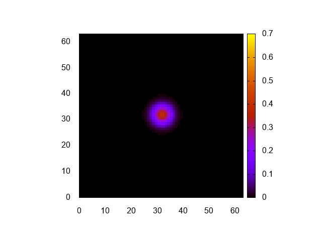

# 格子計算プログラム生成言語Formuraを使ってみる その3

## はじめに


格子計算プログラム生成言語[Formura](https://github.com/formura/formura)を使ってみる。

[その2](https://qiita.com/kaityo256/items/7ff1fb39986414654824)では、一次元熱伝導方程式を解いてみた。今回はそれをそのまま二次元化しよう。

* [その1](https://qiita.com/kaityo256/items/8b6c9ca1abeeef64f414) インストールとコンパイルまで
* [その2](https://qiita.com/kaityo256/items/7ff1fb39986414654824) 一次元熱伝導方程式
* [その3](https://qiita.com/kaityo256/items/bfd327ecf4e79b8ab83d) 二次元熱伝導方程式  ←イマココ
* [その4](https://qiita.com/kaityo256/items/2dd11363769cb5f29bc2) 反応拡散方程式(Gray-Scott系)

## YAMLファイル

YAMLファイルの修正は簡単だ。

一次元系で

```yaml
length_per_node: [64.0]
grid_per_node: [64]
```

と書いていたのを

```yaml
length_per_node: [64.0, 64.0]
grid_per_node: [64, 64]
```

と修正するだけである。

## Formuraファイル

まず、次元の宣言を1から2にして、軸に`y`も追加しよう。

```pascal
dimension :: 2
axes :: x,y
```

次に、`isCenter`と`diff`を二次元化しよう。そのまんまなので難しくないと思う。

```pascal
isCenter = fun(i,j,w) (fabs(total_grid_x/2-i) < w) && (fabs(total_grid_y/2-j) < w)

diff = fun(q) (q[i+1,j] + q[i-1,j] + q[i,j+1] + q[i,j-1] - 4.0*q[i,j])
```

合わせて、初期化関数`init`を修正する。

```pascal
begin function u = init()
  double [] :: u
  u[i,j] = if isCenter(i,j,3) then 0.7 else 0.0
end function
```

驚くべきことに、時間発展関数は一次元の場合から修正の必要がない。

```pascal
begin function u2 = step(u)
  u2 = u + diff(u) * dt
end function
```

まとめるとこんな感じ。

```pascal
dimension :: 2
axes :: x,y

double :: dt = 0.2
double :: Du = 0.05

extern function :: fabs

isCenter = fun(i,j,w) (fabs(total_grid_x/2-i) < w) && (fabs(total_grid_y/2-j) < w)

diff = fun(q) (q[i+1,j] + q[i-1,j] + q[i,j+1] + q[i,j-1] - 4.0*q[i,j])

begin function u = init()
  double [] :: u
  u[i,j] = if isCenter(i,j,3) then 0.7 else 0.0
end function

begin function u2 = step(u)
  u2 = u + diff(u) * dt
end function
```

## main関数

次に、Formuraが吐いたc言語を使う呼び出しファイルの修正である。こちらも、`main`関数は修正の必要がない。ファイルを吐く関数`dump`を二重ループに修正するだけである。

```cpp
void dump(Formura_Navi &n) {
  char filename[256];
  static int index = 0;
  sprintf(filename, "data/%03d.dat", index);
  index++;
  std::cout << filename << std::endl;
  std::ofstream ofs(filename);
  for (int ix = 0; ix < n.total_grid_x; ix++) {
    for (int iy = 0; iy < n.total_grid_y; iy++) {
      int ix2 = (ix - n.offset_x + n.total_grid_x) % n.total_grid_x;
      int iy2 = (iy - n.offset_y + n.total_grid_y) % n.total_grid_y;
      double v = formura_data.u[ix2][iy2];
      ofs << ix << " ";
      ofs << iy << " ";
      ofs << v << std::endl;
    }
    ofs << std::endl;
  }
}
```

ここで、オフセットの分場所がずれるので、それをそれぞれ、

```cpp
      int ix2 = (ix - n.offset_x + n.total_grid_x) % n.total_grid_x;
      int iy2 = (iy - n.offset_y + n.total_grid_y) % n.total_grid_y;
```

と補正するのは一次元と同様である。


以上をすべてまとめると以下のようになろう。

```cpp
#include "gs.h"
#include <fstream>
#include <iostream>

void dump(Formura_Navi &n) {
  char filename[256];
  static int index = 0;
  sprintf(filename, "data/%03d.dat", index);
  index++;
  std::cout << filename << std::endl;
  std::ofstream ofs(filename);
  for (int ix = 0; ix < n.total_grid_x; ix++) {
    for (int iy = 0; iy < n.total_grid_y; iy++) {
      int ix2 = (ix - n.offset_x + n.total_grid_x) % n.total_grid_x;
      int iy2 = (iy - n.offset_y + n.total_grid_y) % n.total_grid_y;
      double v = formura_data.u[ix2][iy2];
      ofs << ix << " ";
      ofs << iy << " ";
      ofs << v << std::endl;
    }
    ofs << std::endl;
  }
}

int main(int argc, char **argv) {
  Formura_Navi n;
  Formura_Init(&argc, &argv, &n);
  for (int i = 0; i < 100; i++) {
    Formura_Forward(&n);
    dump(n);
  }
  Formura_Finalize();
}
```

## 実行

ファイル生成、コンパイル、実行してみよう。

```sh
$ formura gs.fmr
$ g++  main.cpp gs.c
$ rm -rf data
$ mkdir data
$ ./a.out
data/000.dat
data/001.dat
(snip)
data/098.dat
data/099.dat
```

これをgnuplotに食わせて一気に変換しよう。

```gnuplot
set term png
set xra [0:63]
set yra [0:63]
set view map
set size square
unset key

set cbrange[0:0.7]
do for[i=0:99:1]{
  input = sprintf("data/%03d.dat",i)
  output = sprintf("data/%03d.png",i)
  print output
  set out output
  sp input w pm3d
}
```

実行結果はこんな感じ。




正しく計算できてるみたいですね。

せっかくなのでアニメGIFも置いておきましょうか。


## まとめ

一次元熱伝導方程式のファイルを修正して、Formuraに二次元熱伝導方程式を解かせてみた。ファイルを吐くところ以外、ほとんど修正の必要がなく、スムーズにできた。三次元への拡張も簡単であろう。

[その4](https://qiita.com/kaityo256/items/2dd11363769cb5f29bc2)へ続く。
