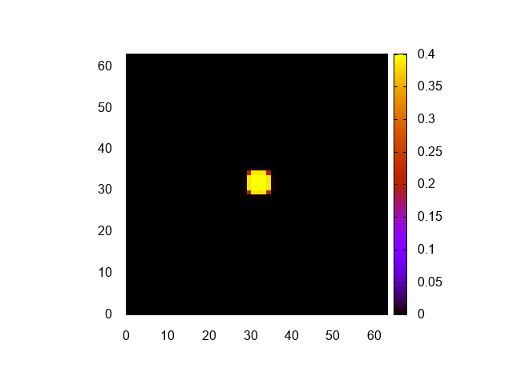
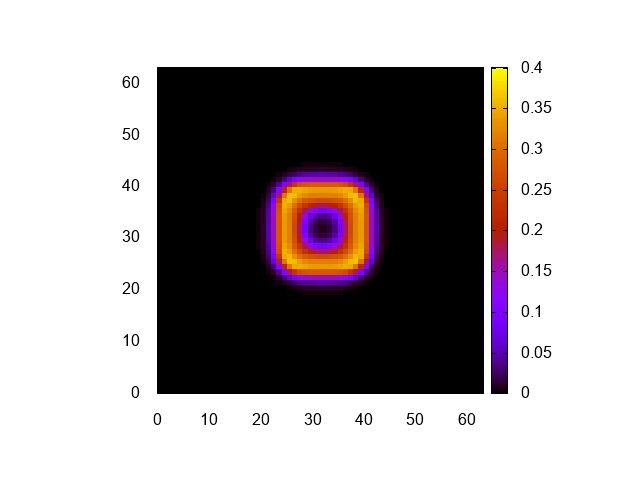
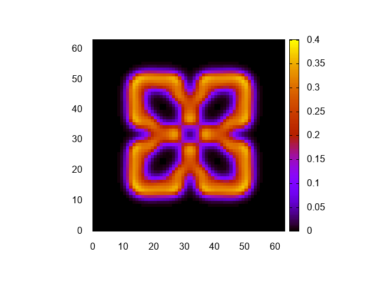
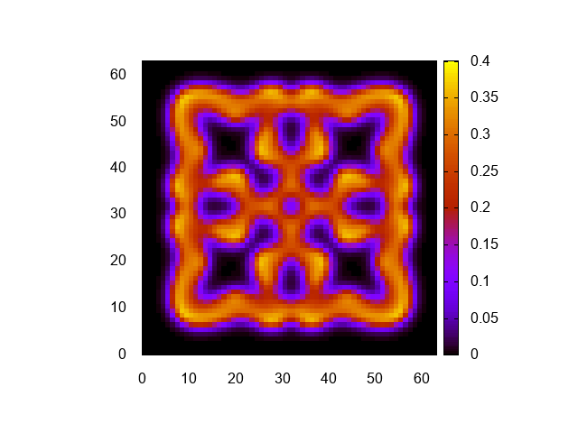

# 格子計算プログラム生成言語Formuraを使ってみる その4

## はじめに

格子計算プログラム生成言語[Formura](https://github.com/formura/formura)を使ってみる。

[その3](https://qiita.com/kaityo256/items/bfd327ecf4e79b8ab83d)では、二次元熱伝導方程式(拡散方程式)を解いてみた。拡散方程式まで来たら、ちょっと修正するだけで反応拡散方程式を解くことができる。さっそく試してみよう。

ソースは以下においてある。

[github.com/kaityo256/fmtest](https://github.com/kaityo256/fmtest)

* [その1](https://qiita.com/kaityo256/items/8b6c9ca1abeeef64f414) インストールとコンパイルまで
* [その2](https://qiita.com/kaityo256/items/7ff1fb39986414654824) 一次元熱伝導方程式
* [その3](https://qiita.com/kaityo256/items/bfd327ecf4e79b8ab83d) 二次元熱伝導方程式
* [その4](https://qiita.com/kaityo256/items/2dd11363769cb5f29bc2) 反応拡散方程式(Gray-Scott系)  ←イマココ

## Gray-Scott方程式

反応拡散方程式には様々なものがあるが、比較的式が簡単で結果が面白いGray-Scott系を使う。その方程式は以下の通りだ。

$$
\begin{aligned}
\frac{\partial u}{\partial t} &= D_u \Delta u - uv^2 + F(1-u) \\
\frac{\partial v}{\partial t} &= D_v \Delta v + uv^2 - (F+k)v
\end{aligned}
$$

ここで、$F$や$k$は定数、$D_u,D_v$は拡散係数だ。この系は$u$と$v$の二種類の量があるので、それをFormuraで扱う。


## fmrファイル

YAMLファイルの修正は不要だ。

まず、増えた分の定数を追加しておこう。

```pascal
double :: dt = 0.2
double :: Du = 0.05
double :: Dv = 0.1 # add
double :: F = 0.04 # add
double :: k = 0.06076 #add
```

書き忘れていたが、`#`以後はコメントとして扱われる。

初期化関数などで、二つの状態変数を扱う場合はタプルを使う。たとえば初期化関数は以下のようにかける。

```pascal
begin function (u,v) = init()
  double [] :: u,v
  u[i,j] = if isCenter(i,j,3) then 0.7 else 0.0
  v[i,j] = if isCenter(i,j,6) then 0.9 else 0.0
end function
```

拡散部分はそのままだ。力学系の部分は、以下のように定義しよう。

```pascal
calcU = fun(u,v) (u*u*v - (F+k)*u)
calcV = fun(u,v) (-u*u*v + F*(1.0-v))
```

それぞれ、反応拡散方程式の「反応」部分、つまり右側の式をそのままFormuraに落とし込んだだけだ。

時間発展部分を書くのも難しくないと思う。

```pascal
begin function (u2,v2) = step(u,v)
  du = Du*diff(u)
  dv = Dv*diff(v)
  du = du + calcU(u,v)
  dv = dv + calcV(u,v)
  u2 = u + du * dt
  v2 = v + dv * dt
end function
```

状態変数が二つある場合はタプルを使うこと、中間変数が使えることを知っていれば、上記を理解することは易しいであろう。

全体をまとめるとこんな感じになる。

```pascal
dimension :: 2
axes :: x,y

double :: dt = 0.2
double :: Du = 0.05
double :: Dv = 0.1 # add
double :: F = 0.04 # add
double :: k = 0.06076 #add

extern function :: fabs

isCenter = fun(i,j,w) (fabs(total_grid_x/2-i) < w) && (fabs(total_grid_y/2-j) < w)

diff = fun(q) (q[i+1,j] + q[i-1,j] + q[i,j+1] + q[i,j-1] - 4.0*q[i,j])

begin function (u,v) = init()
  double [] :: u,v
  u[i,j] = if isCenter(i,j,3) then 0.7 else 0.0
  v[i,j] = if isCenter(i,j,6) then 0.9 else 0.0
end function

calcU = fun(u,v) (u*u*v - (F+k)*u)
calcV = fun(u,v) (-u*u*v + F*(1.0-v))

begin function (u2,v2) = step(u,v)
  du = Du*diff(u)
  dv = Dv*diff(v)
  du = du + calcU(u,v)
  dv = dv + calcV(u,v)
  u2 = u + du * dt
  v2 = v + dv * dt
end function
```

「反応拡散方程式を差分化して解く」といった場合の最低限の記述になっていることがわかるかと思う。

## main関数

`main.cpp`の修正は不要だが、ループを10000回にして、100回に一度ダンプするように修正しよう。

```cpp
int main(int argc, char **argv) {
  Formura_Navi n;
  Formura_Init(&argc, &argv, &n);
  for (int i = 0; i < 10000; i++) {
    Formura_Forward(&n);
    if (i % 100 == 0) {
      dump(n);
    }
  }
  Formura_Finalize();
}
```

## 実行

あとはそのまま実行するだけである。

```sh
$ formura gs.fmr
$ g++  main.cpp gs.c
$ rm -rf data
$ mkdir data
$ ./a.out
data/000.dat
data/001.dat
(snip)
data/098.dat
data/099.dat
```

プロット用のgnuplotファイルも掲載しておこう。

```gnuplot
set term png
set xra [0:63]
set yra [0:63]
set view map
set size square
unset key

set cbrange[0:0.4]
do for[i=0:99:1]{
  input = sprintf("data/%03d.dat",i)
  output = sprintf("data/%03d.png",i)
  print output
  set out output
  sp input w pm3d
}
```

明るさ調整のため、cbrangeを修正しただけだ。可視化結果はこんな感じになる。






アニメーションGIFにするとこんな感じ。

```sh
convert -delay 10 -loop 0 *.png test.gif
```


## おわりに

最低限の記述で、規則格子における差分法コードを出力してくれる言語でありフレームワークでもある「Formura」を使ってみた。単にシミュレーションコードを吐くだけではなく、OpenMPやMPIによる並列化にも対応しており、「京」フルノードでの計算にも成功、Gordon Bell賞のファイナリストにも選ばれるなどしているが、並列化については扱わないので各自試されたい。

Formuraは、もともと村主崇行さんが中心となって開発したものだ。村主さんは「すごいHaskellたのしく学ぼう」の翻訳者でもあり、PFNの創立メンバーの一人でもあり、ICPC(国際的な競技プログラミング)でも活躍するなど、業界では広く知られた今後が期待される若き才能だった。その早逝が本当に悔やまれる。なお、Formuraは引き続き開発が続けられているようである。
