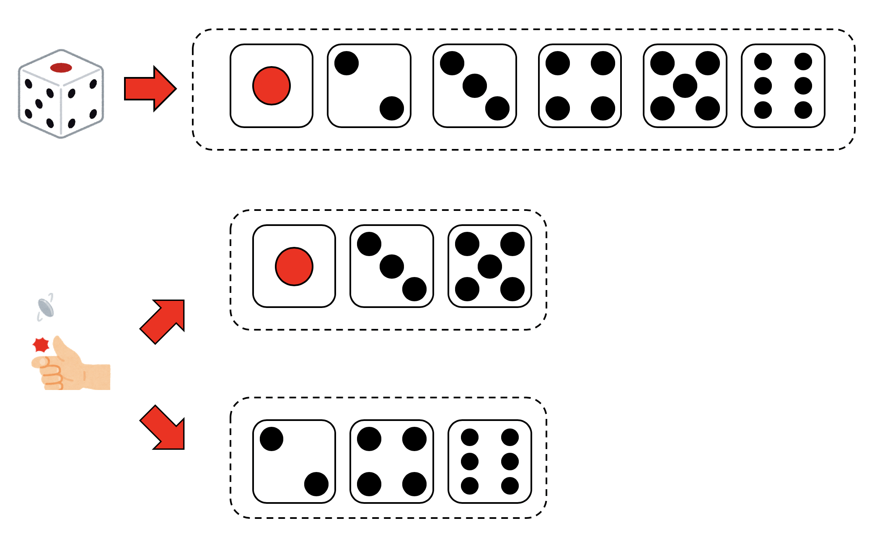
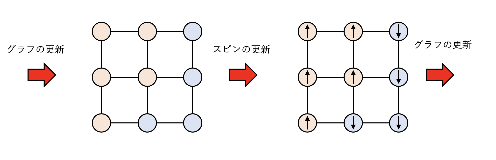
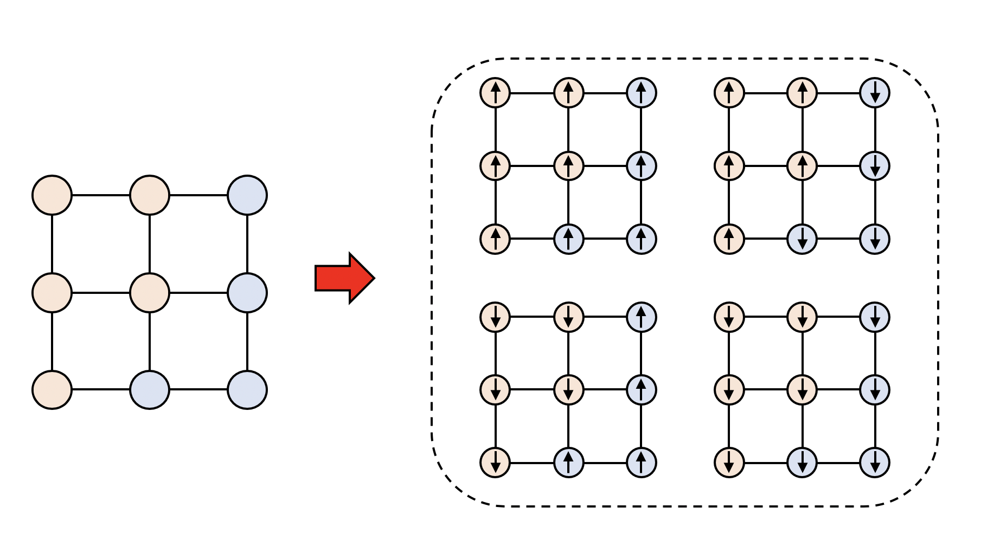
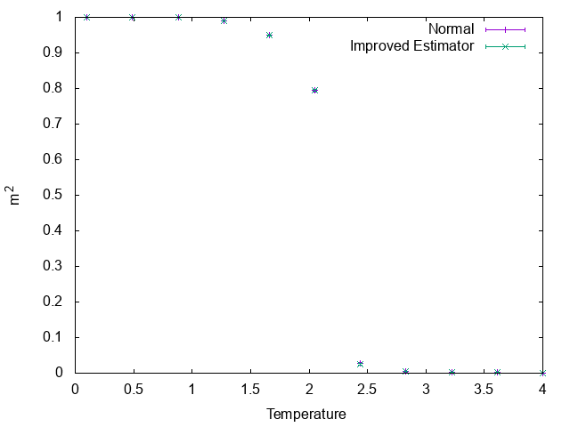
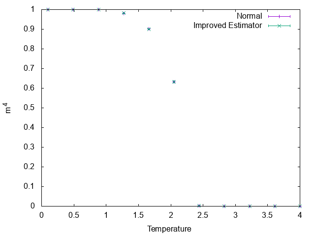
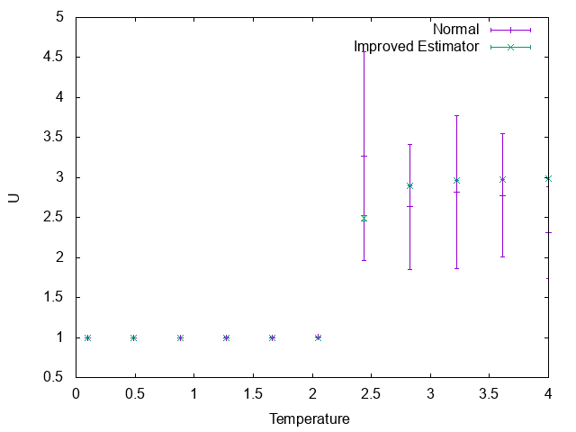

# スピン系のグラフ表現とImproved Estimator

# はじめに

スピン系をモンテカルロシミュレーションする時、Swendsen-Wang法やWolff法など、Fortuin-Kasteleyn表現を用いたクラスターアップデートアルゴリズムを使うと非常に効率良くサンプリングができます。さらに、Fortuin-Kasteleyn表現が得られている時、普通にサンプリングするよりも分散が小さくなるImproved Estimatorを構成できます。

本稿では、Ising模型の磁化やビンダー比のImproved Estimatorの導出と、どのくらい分散が小さくなるのかの説明をします。

コードは

[https://github.com/kaityo256/mc/tree/master/improved_estimator](https://github.com/kaityo256/mc/tree/master/improved_estimator)

に置いておきます。

# Improved Estimatorとは

## サイコロとコインの例

Improved Estimatorを一言で言うと「サンプリングをする際に部分和が厳密に取れると分散が下がる」というものです。数式で説明されることが多いですが、初見では理解しづらいことが多いので、サイコロを例に説明してみます。

サイコロを振ることを考えましょう。サイコロの出目は1から6までで、それぞれ等確率で出るものとします。すると、サイコロの出目は確率変数とみなすことができます。ここで、サイコロの目を$X_i$で表現しましょう。$X_i = \{1,2,3,4,5,6\}$です。サイコロを一度振った時に出る目の期待値は、

$$
\bar{X} = \sum_{i=1}^6 X_i w_i
$$

で計算できます。ただし$w_i$は、$i$の目が出る確率(重み)で、今回は$w_i = 1/6$です。

この期待値は厳密に計算できますが、モンテカルロ法でサンプリングすることにしましょう。サイコロを$N$回振って、$k$回目に出た目を$\hat{X}_k$としましょう。この時、サイコロの目の期待値は

$$
\left<\hat{X}\right> = \frac{1}{N} \sum_{k=1}^{N} \hat{X}_k
$$

と推定できます。さて、サンプリングを行うと、推定誤差が出てきます。その推定誤差を分散で評価してやりましょう。母分散は

$$
\begin{aligned}
Var\left[\hat{X}\right] &= \sum_{i=1}^6 (X_i - \bar{X})^2  w_i \\
&= \bar{X^2} - \bar{X}^2 \\
&= \frac{91}{6} - \frac{49}{4} \\
&= \frac{35}{12} \sim 2.917
\end{aligned}
$$

となります。

次に、サイコロの奇数の目がでる場合と偶数の目が出る場合を場合分けしてみましょう。偶数がでる確率と、奇数がでる確率は等しいので、サイコロの代わりにまず裏表が等しい確率で出るコインを投げることにします。

コインで表が出たら、その後で1,3,5が等確率で出る仮想的なサイコロを振り、裏が出たら2,4,6が等確率で出る仮想的なサイコロを振ることにします。これは、

$$
\bar{X} = \sum_{i=1}^6 X_i w_i
$$

という和を

$$
\bar{X} = \sum_{g =\{e,o\}} w(g) \sum_{i=1,2,3}X_i(g) w_i(g)
$$

という形の和に取り直したことに対応します。ただし、$g$は偶数$e$か奇数$o$かの事象を表し、$X_i(g)$は、偶奇が決まったあとのサイコロの出目を表します。具体的には$X_i(o) = {1,3,5}, X_i(e) = {2,4,6}$です。$w(g)$は、偶数、奇数のどちらかがでる確率で$1/2$、$w_i(g)$は、サイコロの偶奇が決まったあとの重みで$1/3$です。

さて、なぜかはわかりませんが、もとのサイコロでは期待値は厳密に計算できなかったけれど、こうして奇数と偶数に分けた場合はそれぞれの期待値が厳密に計算できるとしましょう。

これは、

$$
\bar{X}(g) = \sum_{i=1,2,3}X_i(g) w_i(g)
$$

を計算することに対応します。例えば偶数の場合は2,4,6がそれぞれ1/3の確率で出るので期待値は4、奇数の場合は3です。
これを使うと、最初の期待値はこう書けます。

$$
\bar{X} = \sum_{g =\{e,o\}} w(g) \bar{X}(g)
$$

ただし$\bar{X}(e) = 4, \bar{X}(o) = 3$で、$w(g)=1/2$です。これをサンプリングで評価しようと思うと、確率1/2で$4$か$3$が出るような確率変数$\hat{X}^\mathrm{I}$の期待値を調べる、つまりサイコロの代わりにコインを投げ、表なら$4$、裏なら$3$が出たと思って期待値を取れば良いことになります。

この場合の分散は

$$
\begin{aligned}
Var[\hat{X}^\mathrm{I}] &= \sum_{g=\{e,o\}}\left(
\hat{X}^\mathrm{I}_g - \bar{\hat{X}^\mathrm{I}}
 \right)^2 w(g) \\
&= 
\frac{1}{4}\times \frac{1}{2} + 
\frac{1}{4}\times \frac{1}{2}\\
&= \frac{1}{4} = 0.25
\end{aligned}
$$

となります。部分和を取る前の分散2.917に比べてかなり小さくなったことがわかります。

以上、ごちゃごちゃ書いてきましたが、要する「部分和が厳密に取れるなら、先にその部分和を取っておけば分散減るよね」ということしか言っていません。この「部分和を取った後の確率変数」をImproved Estimatorと言います。

## 数式での定義

一応真面目に数式でも説明しておきます。

状態$i$が確率$w_i$で実現するとします。状態$i$に対して値$X_i$が対応する時、この値の期待値は

$$
\bar{X} = \sum_i X_i w_i
$$

で定義されます。この和を厳密に取ることができない時、確率$w_i$に比例するように$X_i$の値を取るような確率変数$\hat{X}$を定義して

$$
\bar{X} \sim \left< \hat{X}\right>
$$

として$\bar{X}$を推定します。これをモンテカルロサンプリングと呼びます。

さて、先程の状態$i$が、いくつかのグループ$g$に重複なく分割できるとしましょう。すると、先程の和は以下のように書き直せます。

$$
\bar{X} = \sum_g w(g) \sum_{j \in g}X_j(g) w_j(g)
$$

ここで$w(g)$は$g$が実現する確率、$X_j(g)$はグループ$g$に属す状態$j$に対応する値で、$w_j(g)$は$g$が実現した、という条件付きで状態$j$が実現する確率です。

この右側の和が厳密に計算できる時、つまり

$$
\bar{X}(g) = \sum_{j \in g}X_j(g) w_j(g)
$$

が計算できる時、もとの和は

$$
\bar{X} = \sum_g w(g) \bar{X}(g)
$$

で計算できます。この和は厳密に計算できないので、サンプリングすることになります。この時、$w(g)$の確率で$\bar{X}(g)$の値を取るような確率変数についてモンテカルロサンプリングすれば良いことになります。

すでに部分和を取っているので、新しい確率変数での一回のサンプリングは、部分和を取る前のサンプリングよりも、多くのサンプル情報を含むことになり、その分だけ分散が減ります。これがImproved Estimatorです。

# Fortuin-Kasteleyn表現とImproved Estimator

Fortuin-Kasteleyn表現とは、スピン系の分配関数のスピン状態に関する和を、グラフの和と、グラフが与えられた時のスピンの和に分割するものです。Potts模型などにも適用可能ですが、以下、一番簡単なIsing模型で説明します。

詳細は[Swendsen-Wangアルゴリズムのサンプルコード](https://qiita.com/kaityo256/items/6539261993e282edc5aa)などを参照してください。

Swendsen-Wangでは、グラフの更新とスピンの更新を交互に繰り返していきます。ここで、グラフというのはスピンをクラスターに分割したもので、同じクラスターに属すスピンは同じ向きのスピンでなければなりません。グラフに分割されたら、それぞれのクラスターに、上向き、下向きのスピンをランダムに与えます。

さて、いまスピン状態が$\{\sigma_i\}$で与えられており、このスピン配位が実現する確率(ボルツマン重み)が$w(\{\sigma_i\})$で与えられるとしましょう。$\sigma_i$は1か-1のいずれかの値を取るものとします。磁化$m$をスピン状態の平均

$$
m = \frac{1}{N} \sum_i \sigma_i
$$

で定義します。$N$はスピン数です。対称性から$m$の期待値は0になってしまうため、その自乗である$m^2$を自発磁化として秩序変数に取ります。この自発磁化の期待値は

$$
\left< m^2 \right> = \sum_{\{\sigma_i\}}
\left(
\frac{1}{N} \sum_i \sigma_i
\right)^2 w(\{\sigma_i\})
$$

で計算することができます。

ここで、Fortuin-Kasteleyn表現をよく見ると、クラスター内のスピンがどんな向きであっても重みが同じ、すなわち、そのスピン配位の実現確率が等しいことがわかります。あるグラフ表現$g$が決まり、その中のクラスターに通し番号$k$を与えましょう。クラスター内のスピンは全て同じ向きなので、その代表スピンを$\tilde{\sigma}_k$とします。また、$k$番目のクラスターのサイズ(含まれるスピンの数)を$n_k$とします。すると、自発磁化の期待値を以下のように書き直せます。

$$
\left< m^2 \right> = 
\frac{1}{N^2}
\sum_g
w(g)
\sum_{\{\tilde{\sigma}_k\}}
\left(
\sum_k
n_k \tilde{\sigma}_k
\right)^2
$$

ここで、各クラスターの代表スピンの向きに関する和については、厳密に取ることができます。

例えば、以下のようなクラスター配位が得られたとします。クラスターは二つです。

クラスターの中のスピンは同じ向きでなければならないので、4通りの状態がありえます。

さて、クラスターは二つで、それぞれのサイズは$n_1 = 4, n_2 = 5$です。スピンに関する和を具体的に書き下すと、

$$
\begin{aligned}
\sum_{\{\tilde{\sigma}_k\}}
\left(
\sum_k
n_k \tilde{\sigma}_k
\right)^2
&= \sum_{\{\tilde{\sigma}_k\}}
\left(
\tilde{\sigma}_1 n_1
+ \tilde{\sigma}_2 n_2
\right)^2 \\
&= \sum_{\{\tilde{\sigma}_k\}}
\left(
\tilde{\sigma}_1^2 n_1^2
+ 2 \tilde{\sigma}_1 \tilde{\sigma}_2 n_1 n_2
+ \tilde{\sigma}_2^2 n_2^2
\right)^2 \\
\end{aligned}
$$

となります。ここで、$\{\tilde{\sigma}_k\}$に関する和とは、スピンのとり得る状態全てについて和を取りますが、$\tilde{\sigma}_i = \pm 1$なので、$\tilde{\sigma}_k^2=1$です。さらに、クロスターム

$$
\tilde{\sigma}_1 \tilde{\sigma}_2 n_1 n_2
$$

については、$\tilde{\sigma}_1$に関する和を取ると、係数に$\pm 1$がかかった項の和を取ることになるのでゼロになります。

以上から、

$$
\sum_{\{\tilde{\sigma}_k\}}
\left(
\sum_k
n_k \tilde{\sigma}_k
\right)^2
= \sum_k n_k^2
$$

と、クラスター内のスピン配位に関する和が厳密に取れてしまいました。これを使うと、

$$
\left< m^2 \right> =
\frac{1}{N^2}
\sum_g
w(g)
\sum_k
n_k^2
$$

となります。つまり、なにかグラフ表現が与えられたら、クラスターのサイズの自乗の和をとって$N^2$で割ればよい、ということです。これが自発磁化$m^2$に対するImproved Estimatorです。

同様に、奇数次の項が落ちることから、自発磁化の4次の項$m^4$のImproved Estimatorは

$$
\left< m^4 \right> =
\frac{1}{N^4}
\sum_g
w(g)
\left(
\sum_k
n_k^4
+ 6 \sum_{k<k'} n_k^2 n_k'^2
\right)
$$

と計算できます。4次の項は、二次の項のクロスタームが出てくることに注意しましょう。2次と4次のモーメントが求められたので、その比を取ればBinder比

$$
U = \frac{\left<m^4\right>}{\left<m^2\right>^2}
$$

のImproved Estimatorも得られることになります。

# 数値計算例

以上を試してみましょう。以下は$L=64$の正方格子上におけるIsing模型での計算例です。Swendseng-Wangで状態を更新し、$\left<m^2\right>$,$\left<m^4\right>$,$U=\left<m^4\right>/\left<m^2\right>^2$のそれぞれについて通常の計算方法とImproved Estimatorで計算したものをプロットしています。100回緩和させた後、100回平均し、平均の標準偏差をエラーバーとしてつけています。

まずは磁化の二次のモーメントについて。

値で見ると誤差はImproved Estimatorの方が小さいですが、グラフで見るとほとんど差はありません。

四次のモーメントも同様です。

しかし、その比であるビンダー比には大きな差が付きます。

特に高温において、Improved Estimatorの分散が小さいのに対し、通常の計算方法では大きなエラーバーがついています。$m^4$も$m^2$も、高温ではゼロとなるため、ビンダー比はゼロ割るゼロを計算しなければならず、サンプリング数を相当多く取らなければいけません。それが通常の方法で計算されたビンダー比の高温側のデータがばらついている理由です。

一方、Improved Estimatorは、部分和を取った和の数が大きいほど効果的です。クラスターアルゴリズムにおけるImproved Estimatorでは、クラスターにわけた後のスピンの状態について和を取るため、その状態数はクラスター総数を$n$として$n^2$となります。高温であればあるほどクラスターが小さくなるため、$n$が増え、結果として高温側ではサンプリング数をかなり稼ぐことができます。これがImproved Estimatorによる推定値の分散が小さい理由です。

# まとめ

Fortuin-Kasteleyn表現が得られたスピン系について、磁化やビンダー比のImproved Estimatorを導出、計算してみました。Fortuin-Kasteleyn表現が得られる系は限られているため常に使えるというわけではありませんが、使える場合にはImproved Estimatorは非常に有効に働くので覚えておくと良いでしょう。

# 謝辞

本稿の執筆には、物性研の本山さんにいただいたノートを参考にさせていただきました。なお、本稿の間違いは全て筆者の責任です。
