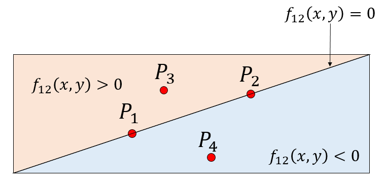
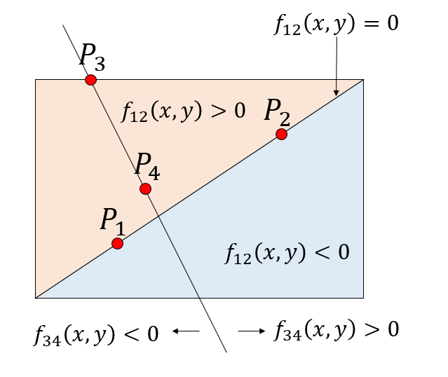
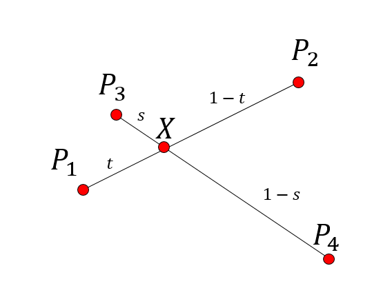

# はじめに

二つの折れ線グラフがある時、そのグラフの交点を知りたいことがあります。具体的には異なるサイズのBinder比の交点とか。

で、そのためには「二つの線分の交差判定」をするコードと「交差する二つの線分の交点」を求めるコードが必要になるのですが、なんかこれ、必要になる度に毎回書いている気がするので、ここにまとめておきます。

ネットにも似たようなコードが落ちているんですが、ライセンスが不明瞭だったりするので、自分の公開コードに埋め込みづらかったりするんですね。

というわけで、交差判定と交点を求めるアルゴリズムをちゃんと求めて、それをコードに落としてCC0で公開しました。

ググってこの記事にたどり着いた人は好きに使ってくださいまし。

なお、線分直上に点があったり、二つの線分が平行だったりといった条件は考慮していないので注意。また、やや冗長に書いているので、高速化が必要な場合は適宜修正してください。

## 二つの線分の交差判定

4つの点、$P_1$, $P_2$, $P_3$, $P_4$があるとしましょう。点$P_i$の座標を$(x_i, y_i)$とします。この時、線分$P_1 P_2$と$P_3 P_4$は交点を持つか、交点を持つならその交点の座標を知りたいとします。

まず、線分$P_1 P_2$を通る直線の式を求めましょう。この直線の傾き$a$は

$$
a = \frac{y_2 - y_1}{x_2 - x_1}
$$

です。これが点$(x_1, y_1)$を通るので、

$$
y - y_1 = a (x - x_1)
$$

が求める直線の式です。分母を払って整理すると

$$
(x_2 - x_1)(y - y_1) - (y_2 - y_1) (x-x_1) = 0
$$

となります。さて、この式の右辺を$f_{12}(x, y)$としましょう。点$P_3$と点$P_4$が、この直線を挟んで反対側にあるためには、$f_{12}(x_3, y_3)$と$f_{12}(x_4, y_4)$が異符号でなければなりません。

つまり、

$$
f_{12}(x_3, y_3) f_{12}(x_4, y_4) < 0
$$

が成り立つ必要があります。



同様に、線分$P_3 P_4$が作る直線の式を$f_{34}(x,y) = 0$とすると、

$$
f_{34}(x_1, y_1) f_{34}(x_2, y_2) < 0
$$

が成り立つ必要があります。もし線分が交差していない場合は、同符号になる組み合わせが出てきます。例えば以下は、線分$P_3 P_4$が作る直線は線分$P_1 P_2$と交点を持つのに対し、線分$P_1 P_2$が作る直線は線分$P_3 P_4$とは交点を持たない例です。点$P_3$と$P_4$が直線の同じ側にあるため、$f_{12}(x_3, y_3)$と$f_{12}(x_4, y_4)$が同符号になります。



さて、上記の判定アルゴリズムをそのままコードに落としましょう。まずは点を表す`Struct`を作るんですかね。

```rb
Point = Struct.new(:x, :y)
```

線分$P_1 P_2$が作る直線を$f_{12}(x, y) = 0$として、そこに点$P_3$を代入した時の値を返す関数を`f(p1, p2, p3)`として定義しましょう。

```rb
def f(p1, p2, p3)
  (p2.x - p1.x) * (p3.y - p1.y) - (p2.y - p1.y) * (p3.x - p1.x)
end
```

これを使うと、線分$P_1 P_2$と$P_3 P_4$が交差しているかの判定は以下のように書けます。

```rb
def intersect?(p1, p2, p3, p4)
  t1 = f(p1, p2, p3)
  t2 = f(p1, p2, p4)
  t3 = f(p3, p4, p1)
  t4 = f(p3, p4, p2)
  t1 * t2 < 0.0 and t3 * t4
end
```

## 二つの線分の交点

二つの線分$P_1 P_2$と$P_3 P_4$が交差していることがわかったとします。次に、交点を求めましょう。

線分$P_1 P_2$上の点$X$が、線分を$t$対$1-t$に分割しているとしましょう$(0 < t < 1)$。すると、点$X$の座標は

$$
t
\begin{pmatrix}
x_1 \\
y_1
\end{pmatrix}
+
(1-t)
\begin{pmatrix}
x_2 \\
y_2
\end{pmatrix}
$$

と書けます。また、$X$は線分$P_3 P_4$上の点でもあるので、パラメータ$s (0<s<1)$を用いて

$$
s
\begin{pmatrix}
x_3 \\
y_3
\end{pmatrix}
+ 
(1-s)
\begin{pmatrix}
x_4 \\
y_4
\end{pmatrix}
$$

とも書けます。



したがって、

$$
t
\begin{pmatrix}
x_1 \\
y_1
\end{pmatrix}
+
(1-t)
\begin{pmatrix}
x_2 \\
y_2
\end{pmatrix}
=
s
\begin{pmatrix}
x_3 \\
y_3
\end{pmatrix}
+ 
(1-s)
\begin{pmatrix}
x_4 \\
y_4
\end{pmatrix}
$$

です。これを$t, s$について整理すると、

$$
\begin{pmatrix}
x_1-x_2 \\
y_1-y_2
\end{pmatrix}
t
-
\begin{pmatrix}
x_3-x_4 \\
y_3-y_4
\end{pmatrix}
s
= 
\begin{pmatrix}
x_4-x_2 \\
y_4-y_2
\end{pmatrix}
$$

となります。これを、

$$
A
\begin{pmatrix}
t \\
s
\end{pmatrix}
=
b
$$

という連立一次方程式の形に書き直すと、

$$
\begin{pmatrix}
x_1-x_2 & x_4 - x_3 \\
y_1-y_2 & y_4 - y_3
\end{pmatrix}
\begin{pmatrix}
t \\
s
\end{pmatrix}
=
\begin{pmatrix}
x_4-x_2 \\
y_4-y_2
\end{pmatrix}
$$

です。$t, s$について解くと

$$
\begin{pmatrix}
t \\
s
\end{pmatrix}
=
\frac{1}{|A|}
\begin{pmatrix}
y_4-y_3 & x_3 - x_4 \\
y_2-y_1 & x_4 - x_3
\end{pmatrix}
\begin{pmatrix}
x_4-x_2 \\
y_4-y_2
\end{pmatrix}
$$

となります。ただし、$|A|$は$A$の行列式で、

$$
|A| = (x_1-x_2)(y_4-y_3) - (x_4-x_3)(y_1-y_2)
$$

です。以上から、

$$
t = \frac{(y_4-y_3)(x_4-x_2) + (x_3-x_4) (y_4-y_2)}{|A|}
$$

です。点$X$の座標は

$$
\begin{pmatrix}
t x_1 + (1-t) x_2 \\
t y_1 + (1-t) y_2 \\
\end{pmatrix}
$$

と求まりました。

上記をそのままコードに落としましょう。

