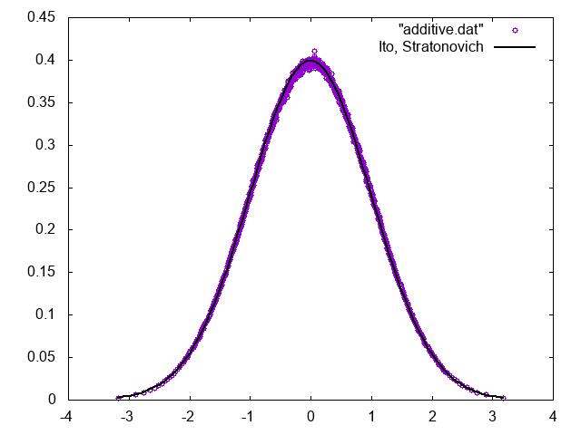
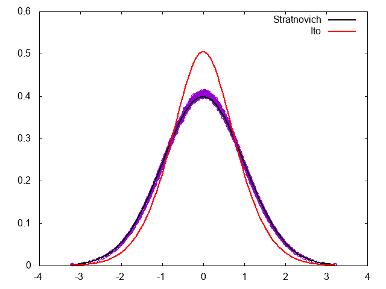

# Multiplicativeなノイズを持つLangevin方程式とIto/Stratonovich解釈

## はじめに

粒子が環境からランダムな力を受けるような運動を表現する運動方程式は、Langevin方程式と呼ばれる。例えば以下のようなものである。

$$
\dot{x}_t = -\gamma x_t + \sqrt{D} \hat{R}
$$

右辺第一項は摩擦項、第二項は揺動項を表し、$\hat{R}$は

$$
\left<\hat{R}(t)\hat{R}(t') \right> = 2\delta(t-t') 
$$

$$
\int_t^{t+h} \hat{R}(t) dt = w(0, 2h)
$$

を満たすような白色雑音である。ここで$w(0, 2h)$は平均0、分散$2h$であるようなガウス分布に従う乱数である。

運動方程式にランダム性を含むため、変数$x_t$は確率変数となる。時刻$t$において$x_t$が$x \leq x_t < x + dx$の範囲にある確率を$F(x,t)dx$とすると、この方程式に対応するFokker–Planck方程式 (FPE)は、

$$
\frac{\partial F}{\partial t} = -\frac{\partial}{\partial x}
\left(
    -\gamma xF - D\frac{\partial F}{\partial x}
\right)
$$

となり、定常状態は

$$
F_\mathrm{eq}(x) \propto  \exp(-\beta x^2/2)
$$

となる。ただし$\beta = \gamma /D$である(Einsteinの関係式)。

この例のように揺動力が変数に依存しない場合、加法過程(additive process)と呼ばれ、特に難しいことはない。

しかし揺動力の振幅が変数に依存する場合、その確率過程をどのように解釈するかに任意性が生じる。揺動力が変数に依存する場合を乗法過程(Multiplicative process)と言うが、その解釈は大きく分けてIto解釈とStratonovich解釈があり、どちらの解釈を採用したかにより対応するFPEが異なるため注意が必要となる。

本稿では、Langevin方程式の数値解法と、どんな数値解法を採用したらどちらの解釈をしたことになるのかをまとめる。以下、確率微分方程式でよく用いられるような表記(Wiener過程を$dW_t$で表現するなど)ではなく、Langevin方程式の形で表記するので注意されたい。

コードはここに置いておく。

[https://github.com/kaityo256/multiplicative_langevin](https://github.com/kaityo256/multiplicative_langevin)

## Ito解釈とStratonovich解釈

以下のようなLangevin方程式を考える。

$$
\dot{x}_t = f(x_t) + g(x_t) \hat{R}(t)
$$

先程の例と異なり、乱数$\hat{R}(t)$に、変数$x_t$に依存する項がかかっている。これを数値積分したい。時間刻みを$h$とし、両辺を$t$から$t+h$まで時間積分すると

$$
\int_t^{t+h} \dot{x}_t dt = \int_t^{t+h}f(x_t)dt + \int_t^{t+h}g(x_t) \hat{R}(t) dt
$$

左辺はそのまま積分できて、右辺第一項について$h$の一次まで取ると

$$
x_{t+h} - x_t = f(x_t)h + \int_t^{t+h}g(x_t) \hat{R}(t) dt
$$

残るは右辺第二項であるが、$\hat{R}(t)$はいたるところ微分不可能な関数なので、

$$
\int_t^{t+h}g(x_t) \hat{R}(t) dt
$$

をどう解釈するかが問題となる。

## Ito解釈

単純な解釈は、$t$から$t+h$まで$g(x_t)$が定数だと思って、それに$\hat{R}(t)$がかかっているとするものである。すると、$g(x_t)$を積分の外に出せるため、

$$
\begin{aligned}
\int_t^{t+h}g(x_t) \hat{R}(t) dt & \sim g(x_t) \int_t^{t+h} \hat{R}(t) dt \\
&=  g(x_t) w(0, 2h)
\end{aligned}
$$

となる。これをIto解釈と呼ぶ。Ito解釈に対応するFPEは

$$
\frac{\partial F}{\partial t} =
-\frac{\partial}{\partial x}
\left(
f(x) - \frac{\partial}{\partial x} g(x)^2
\right)F
$$

となる。$g(x)$の自乗が微分の右側に来ることに注意したい。

## Stratonovich解釈

先程、積分区間を始点$g(x_t)$で代表させた。これを積分区間の始点と終点の値の平均で代表させてみよう。すなわち、

$$
\begin{aligned}
\int_t^{t+h}g(x_t) \hat{R}(t) dt &\sim \frac{g(x_{t+h}) + g(x_t)}{2} \int_t^{t+h} \hat{R}(t) dt\\
&= \frac{g(x_{t+h}) + g(x_t)}{2}  w(0, 2h)
\end{aligned}
$$

とする。これをStratonovich解釈と呼ぶ。Stratonovich解釈に対応するFPEは

$$
\frac{\partial F}{\partial t} =
-\frac{\partial}{\partial x}
\left(
f(x) - g(x)\frac{\partial}{\partial x} g(x)
\right)F
$$

と、$g(x)$が微分の前後に分かれる形となる。

## 確率微分方程式の数値積分法

## Euler-Maruyama法

以下のようなLangevin方程式を数値積分したい。

$$
\dot{x}_t = f(x_t) + g(x_t) \hat{R}(t)
$$

時間刻みを$h$とし、時刻$t$から$t+h$まで形式的に積分し、右辺第一項を$h$の一次で評価すると、

$$
x_{t+h} - x_t = f(x_t)h + \int_t^{t+h}g(x_t) \hat{R}(t) dt
$$

となる。ここで、Ito解釈を採用すると、

$$
\int_t^{t+h}g(x_t) \hat{R}(t) dt =  g(x_t) w(0, 2h) + O(h^{3/2})
$$

となるので、最終的に、

$$
x_{t+h} = x_t + f(x_t) h + g(x_t) w(0, 2h)
$$

とすれば、次のステップの変数$x_{t+h}$を現在のステップの変数$x_t$で表現するスキームが構築できる。後はこれを繰り返せば任意の時刻の$x_t$を評価できる。この方法をEuler-Maruyama法と呼ぶ。すなわち、Euler-Maruyama法はLangevin方程式をIto解釈していることに対応する。

## Two-step法

先程、揺動力の評価にIto解釈を用いた。ここでStratonovich解釈を用いると、

$$
\int_t^{t+h}g(x_t) \hat{R}(t) dt =  \frac{g(x_t) + g(x_{t+h})}{2} w(0, 2h) + O(h^{3/2})
$$

と、次のステップの変数$x_{t+h}$の値が必要になり、このままでは陽解法が構築できない。そこで、まずIto解釈で$x_{t+h}$の近似値$x^I_{t+h}$を作り、$g(x_{t+h})$の代わりに$g(x^I_{t+h})$を用いることで数値積分法を構築しよう。

時間発展スキームは以下のように与えられる。

$$
\begin{aligned}
x^I_{t+h} &= x_t + f(x_t) h + g(x_t) w(0, 2h) \\
x_{t+h} &= x_t + f(x_t) h + \frac{g(x_t) + g(x^I_{t+h})}{2} w(0, 2h)
\end{aligned}
$$

これをTwo-step法と呼ぶ。ここで、二箇所に出てくる$w(0, 2h)$は、ガウス分布に従う確率変数であるが、二つとも「同じ値」を使わなければならない。つまり、サイコロを二回振ってはならない。Two-step法を用いると、Langevin方程式をStratonovich解釈していることになる。

## Milstein法

Two-step法のアルゴリズムは以下のように与えられる。

$$
\begin{aligned}
x^I_{t+h} &= x_t + f(x_t) h + g(x_t) w(0, 2h) \\
x_{t+h} &= x_t + f(x_t) h + \frac{g(x_t) + g(x^I_{t+h})}{2} w(0, 2h)
\end{aligned}
$$

ここで、$g(x)$が微分可能であることを仮定すると、$g(x^I_{t+h})$をテイラー展開することができる。

$$
\begin{aligned}
g(x^I_{t+h}) &= g\left[x_t + f(x_t) h + g(x_t) w(0, 2h) \right] \\
&= g(x_t) + g'(x_t)\left(f(x_t) h + g(x_t) w(0, 2h) \right) + O(h^{3/2})\\
&= g(x_t) + g'(x_t)g(x_t)w(0,2h) + O(h^{3/2})
\end{aligned}
$$

ここで、$w(0, 2h)$が$O(h^{1/2})$であることから、1次の項である$f(x_t)h$を高次の項として無視した。

これをTwo-step法に代入して$x^I_{t+h}$を消去すると、

$$
x_{t+h} = x_t + f(x_t) h + g(x_t)w(0,2h) + \frac{g'(x_t) g(x_t)}{2}w(0,2h)^2
$$

という一段の数値積分アルゴリズムを構築できる。ここで、二箇所に現れる$w(0,2h)$は、同じステップ内では同じ値にする必要がある。このアルゴリズムをMilstein法と呼ぶ。

なお、Milstein法はIto型、Stratonovich型の両方に構築できる。ここで示したことは、Stratonovich解釈で数値積分をするためのTwo-step法を変形して得られるスキームがMilstein法に対応する、という事実である。

ここで$g(x_t)$が定数の場合には、Euler-MaruyamaとMilsteinは等価なスキームを与えることに注意したい。

## 数値計算例

実際にLangevin方程式を数値的に問いてみて、どんな定常分布になるかを確認してみよう。

## 加法過程

まずは揺動項が変数に依存しない加法過程を考える。

$$
\dot{x}_t = -x_t + \hat{R}(t)
$$

対応するFPEは

$$
\frac{\partial F}{\partial t} = -\frac{\partial}{\partial x}
\left(
    -xF - \frac{\partial F }{\partial x}
\right)
$$

となり、定常分布は

$$
F_\mathrm{eq}(x) = \frac{\mathrm{e}^{-x^2/2}}{\sqrt{2 \pi}}
$$

で得られる。加法過程なのでIto解釈とStratonovich解釈は一致し、Euler-MaruyamaとMilsteinは等価となる。

時間発展スキームは

$$
x_{t+h} = x_t - x_t h + w(0, 2h)
$$

となり、対応するコードは、

```cpp
  std::mt19937 mt;
  const double h = 0.01;
  double x = 0.0;
  double t = 0.0;
  std::vector<double> data;
  std::normal_distribution<double> nd(0.0, sqrt(2.0 * h));
  for (int i = 0; i < N; i++) {
    double w = nd(mt);
    x += -x * h;
    x += w;
    t += h;
    data.push_back(x);
  }
```

のように書ける。ガウス分布について、スキームでは分散で書いているが、コードでは標準偏差が求められることに注意。定常分布は以下の通り、対応するFPEの定常状態であるガウス分布に一致する。




ちなみに、分布関数を描くには、まず累積分布関数を求めてから微分すると楽なので、覚えておくと良いことがあるかも。

参考：[累積分布関数をソートで求める](https://qiita.com/kaityo256/items/690a463b6b865da80de6)

## 乗法過程

次に、ノイズが変数に依存する乗法過程を考える。以下のLangevin方程式を解く。

$$
\dot{x} = -x^3 + x\hat{R}_1 + \hat{R}_2
$$

ここで、$\hat{R}_1, \hat{R}_2$は独立な白色雑音である。ここで、二つの揺動力をつけたのは、$\hat{R}_1$だけにしてしまうと、$x=0$の時に$\dot{x} = 0$になってしまい、変数の符号が変わらない(エルゴード性が満たされなくなる)ことを防ぐためである。

対応するFPEは、Ito解釈では


$$
\frac{\partial F}{\partial x} =
-\frac{\partial}{\partial x}\left(
-x^3 F -\frac{\partial}{\partial x} (x^2F) - \frac{\partial F}{\partial x}
\right
)
$$

定常状態は、

$$
F'_{eq} = -\frac{x^3+2x}{x^2+1} F_{eq}
$$

より、

$$
F_{eq}^\mathrm{I} = C^{-1} \frac{\mathrm{e}^{-x^2/2} }{\sqrt{1+x^2}}
$$

となる。ただし、$C$は規格化定数である。

一方、Stratonovich解釈を採用すると、対応するFPEは

$$
\frac{\partial f}{\partial x} =
-\frac{\partial}{\partial x}\left(
-x^3 F - x \frac{\partial}{\partial x} (xF) - \frac{\partial F}{\partial x}
\right
)
$$

定常状態は、

$$
-x^3 F_{eq} - x F_{eq} - (x^2+1)F'_{eq} = 0
$$

より、

$$
F_{eq}^\mathrm{S} = \frac{\mathrm{e}^{-x^2/2}}{\sqrt{2 \pi}}
$$

となる。

## Euler-Maruyama法

まず、Euler-Maruyama法を適用してみよう。Ito解釈をしていることになるため、定常状態は

$$
F_{eq}^\mathrm{I} = C^{-1} \frac{\mathrm{e}^{-x^2/2} }{\sqrt{1+x^2}}
$$

となるはずである。数値計算スキームは

$$
x_{t+h} = x_t - x^3 h + x_t w_1(0, 2h) + w_2(0,2h)
$$

となる。ただし、$w_1, w_2$はガウス分布に従う独立な確率変数である。例えばコードは以下のように書ける。

```cpp
  std::mt19937 mt1(1), mt2(2);
  const double h = 0.01;
  double x = 0.0;
  double t = 0.0;
  std::vector<double> data;
  std::normal_distribution<double> nd(0.0, sqrt(2.0 * h));
  for (int i = 0; i < N; i++) {
    double w1 = nd(mt1);
    double w2 = nd(mt2);
    x += -x * x * x * h;
    x += x * w1;
    x += w2;
    t += h;
    data.push_back(x);
  }
```

結果は以下の通り。


定常分布が、Stratonovich解釈ではなくIto解釈に対応するFPEの定常分布になっていることがわかる。

## Two-step法

次に、Two-step法で時間発展させてみよう。数値積分スキームは

$$
\begin{aligned}
x^I_{t+h} &= x_t - x^3 h + x_t w_1(0, 2h) + w_2(0,2h) \\
x_{t+h} &= x_t - x^3 h + \frac{x_t + x^I_{t+h}}{2}w_1(0, 2h) + w_2(0,2h)
\end{aligned}
$$

で与えられる。対応するコードは、

```cpp
  std::mt19937 mt1(1), mt2(2);
  const double h = 0.01;
  double x = 0.0;
  double t = 0.0;
  std::vector<double> data;
  std::normal_distribution<double> nd(0.0, sqrt(2.0 * h));
  for (int i = 0; i < N; i++) {
    double w1 = nd(mt1);
    double w2 = nd(mt2);
    double x_i = x + (-x * x * x) * h + x * w1 + w2;
    x = x + (-x * x * x) * h + (x + x_i) * 0.5 * w1 + w2;
    t += h;
    data.push_back(x);
  }
```

と書ける。

結果は以下の通り。


分布関数がStratonovich解釈に対応するFPEの定常分布になっていることがわかる。

## Milstein法

次に、Milstein法を試してみよう。Milstein法はIto/Stratonovich解釈のどちらにも使えるが、Two-step法から導かれるMilstein法はStratonovich解釈になるはずである。

数値積分スキームは以下の通り。

$$
x_{t+h} = x_t - x_t^3 h 
+ x_t w_1(0, 2h)
+ \frac{1}{2} x_t w_1(0, 2h)^2
+ w_2(0,2h)
$$

対応するコードは、例えば以下のようになる。

```cpp
  std::mt19937 mt1(1), mt2(2);
  const double h = 0.01;
  double x = 0.0;
  double t = 0.0;
  std::vector<double> data;
  std::normal_distribution<double> nd(0.0, sqrt(2.0 * h));
  for (int i = 0; i < N; i++) {
    double w1 = nd(mt1);
    double w2 = nd(mt2);
    x += (-x * x * x) * h;
    x += x * w1;
    x += 0.5 * x * w1 * w1;
    x += w2;
    t += h;
    data.push_back(x);
  }
```

結果は、想定どおりStratonovich解釈に対応するFPEの定常分布になる。




## Stratonovich+Euler-Maruyama法

Langevin方程式が

$$
\dot{x}_t = f(x_t) + g(x_t) \hat{R}(t)
$$

で与えられている場合、これをStratonovich解釈だと思って、Ito解釈に変形すると

$$
\dot{x}_t = f(x_t) + \frac{g'(x_t)g(x_t)}{2} +  g(x_t) \hat{R}(t)
$$

となる。

今回の例では、

$$
\dot{x} = -x^3 + x\hat{R}_1 + \hat{R}_2
$$

というLangevin方程式を

$$
\dot{x} = -x^3 + x + x\hat{R}_1 + \hat{R}_2
$$

と変形すれば、Stratonovich解釈からIto解釈に変形したことになる。このLangevin方程式をあらためてEuler-Maruyamaで解けば、もとのLangevin方程式をStratonovich解釈したことになるはずである。

積分スキームはこうなる。

$$
x_{t+h} = -(x_t^3 + x_t) h + x_t w_1(0, 2h) + w_2(0,2h)
$$

対応するコード例は以下の通り。

```cpp
  std::mt19937 mt1(1), mt2(2);
  const double h = 0.01;
  double x = 0.0;
  double t = 0.0;
  std::vector<double> data;
  std::normal_distribution<double> nd(0.0, sqrt(2.0 * h));
  for (int i = 0; i < N; i++) {
    double w1 = nd(mt1);
    double w2 = nd(mt2);
    x += -(x * x * x - x) * h;
    x += x * w1;
    x += w2;
    t += h;
    data.push_back(x);
  }
```

結果は、想定どおりStratonovich解釈した場合の定常分布に収束する。


## まとめ

乗法的なノイズを持つLangevin方程式を扱うと、「あれ？いまItoだっけ？Stratonovichだっけ？」とよく混乱するので整理してみた。本稿が誰かの役に立てば幸いである。

## 謝辞と参考文献

産総研の中村さんにEuler-Maruyama法を、慶応義塾大学の巽さんにTwo-step法を教えていただきました。確率微分方程式の数値積分法とIto/Stratonovich解釈については、以下の論文が一番わかりやすかったです。

* [Stochastic algorithms for discontinuous multiplicative white noise](https://journals.aps.org/pre/abstract/10.1103/PhysRevE.81.032104), R. Perez–Carrasco and J. M. Sancho, Phys. Rev. E 81, 032104, doi:[10.1103/PhysRevE.81.032104](https://doi.org/10.1103/PhysRevE.81.032104)
