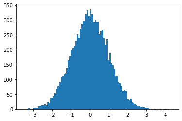
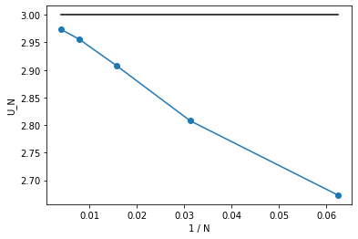
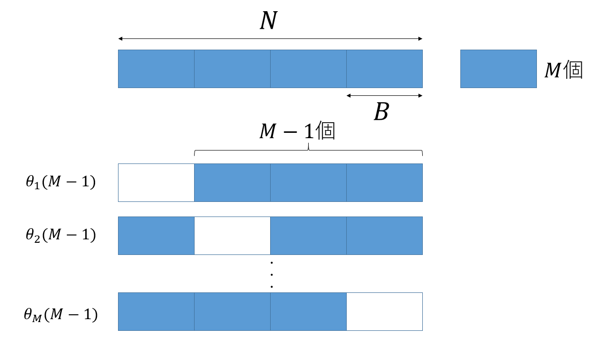

# Jackknife法とサンプル数バイアス

## はじめに

平均0、分散$\sigma^2$のガウス分布に従う確率変数$\hat{x}$を考えます。確率変数の2次と4次のモーメントはそれぞれ

$$
\left< \hat{x}^2 \right> = \sigma^2 
$$

$$
\left< \hat{x}^4 \right> = 3 \sigma^4
$$

です。したがって、以下のような量を考えると分散依存性が消えます。

$$
U \equiv \frac{\left< \hat{x}^4 \right>}{\left< \hat{x}^2 \right>^2} = 3
$$

これは尖度(kurtosis)と呼ばれ、ガウス分布で0とするような定義もありますが、本稿ではガウス分布で3となる上記の定義を用います。

実際に上記の量を計算して3になるか確認してみましょう。平均0、分散$\sigma^2$のガウス分布に従うN個の確率変数$\hat{x}_1, \hat{x}_2, \cdots, \hat{x}_N$を生成し、そこから

$$
\left< x^2 \right>_N = \frac{\sum_i x_i^2}{N}
$$

$$
\left< x^4 \right>_N = \frac{\sum_i x_i^4}{N}
$$

を計算します。そこから

$$
U_N = \frac{\left< x^4 \right>_N}{\left< x^2 \right>_N^2}
$$

を計算してみましょう。

まず、平均0、分散1の正規分布に従う乱数は`numpy.random.randn`で生成することができます。

```py
import numpy as np
import sympy
from matplotlib import pyplot as plt

x = np.random.randn(10000)
fig, ax = plt.subplots(facecolor='w')
n, bins, _ = ax.hist(x, bins=100)
```



ガウス分布になっていますね。では$N$個のデータを受け取って尖度を計算する関数`simple_estimator`を作って、$U_N$を計算します。$U_N$も確率変数になるので、それを`n_trials`回平均することで、$U_N$の期待値を計算し、$N$依存性を見てみましょう。

```py
def simple_estimator(r):
    r2 = r ** 2
    r4 = r ** 4
    return np.average(r4)/np.average(r2)**2

samples = np.array([16,32,64,128,256])
n_trials = 128**2
for n in samples:
    u = [simple_estimator(np.random.randn(n)) for _ in range(n_trials)]
    print(f"{n} {np.average(u)}")
```

結果はこんな感じになります。

```txt
16 2.665024406056554
32 2.8310461207614
64 2.9117517962292196
128 2.9536867076886937
256 2.974102994397855
```

明らかに$N$依存性が見えます。この依存性は何か、そしてどうやって回避するのかを検討するのが本稿の目的です。

## サンプル数によるバイアス

### サンプル数依存性の起源

まず、先ほどの$N$依存性をプロットしてましょう。$N$が大きいほど$3$に近づいているので、$U_N$を$1/N$に対してプロットしてみます。

```py
samples = np.array([16,32,64,128,256])
y = []
n_trials = 128**2
for n in samples:
    u = [simple_estimator(np.random.randn(n)) for _ in range(n_trials)]
    y.append(np.average(u))
x = 1.0/samples
y_theory = [3.0 for _ in x]
fig, ax = plt.subplots()
plt.xlabel("1 / N")
plt.ylabel("U_N")
ax.plot(x,y,"-o",label="Simple")
ax.plot(x,y_theory,"-", label="3", color="black")
plt.show()
```

結果は以下の通りです。



きれいに$1/N$の依存性が見えます。これがどこから来ているか調べるため、2次のモーメント$\left< x^2 \right>_N$と4次のモーメント$\left< x^4 \right>_N$の$N$依存性を見てみましょう。2次のモーメントは1、4次のモーメントは3になるはずです。

```py
samples = np.array([16,32,64,128,256])
n_trials = 128**2
y = []
for n in samples:
    r2 = []
    r4 = []
    for _ in range(n_trials):
        r = np.random.randn(n)
        r2.append(np.average(r**2))
        r4.append(np.average(r**4))
    print(f"{n} {np.average(r2)} {np.average(r4)}")
```

結果はこうなります。

```txt
16 1.0069638341496114 3.052695056865599
32 1.0009326403631478 3.0048770596574004
64 1.0011522697373576 3.0051207850152353
128 1.0009699343712042 3.000195653356738
256 1.000964117125373 3.008657909674001
```

2次のモーメントは1、4次のモーメントは3であり、特に$N$依存性は見えません。

さて、尖度の定義は

$$
U \equiv \frac{\left< \hat{x}^4 \right>}{\left< \hat{x}^2 \right>^2} = 3
$$

でしたから、$\left< \hat{x}^2 \right>$から$1/\left< \hat{x}^2 \right>^2$を計算する必要があります。こいつの$N$依存性を見てみましょう。

```py
samples = np.array([16,32,64,128,256])
n_trials = 128**2
y = []
for n in samples:
    r2_inv2 = []
    for _ in range(n_trials):
        r = np.random.randn(n)
        r2_inv2.append(1.0/np.average(r**2)**2)
    print(f"{n} {np.average(r2_inv2)}")
```

```txt
16 1.5399741991666933
32 1.21947965805206
64 1.0998402893078216
128 1.0501167786713717
256 1.0252452060315502
```

$N$依存性が出てきました。つまり、$\left< \hat{x}^2 \right>$はちゃんと計算できているが、$1/\left< \hat{x}^2 \right>^2$の計算で変なバイアスが入るということです。これは、確率変数の期待値にバイアスがなくても、確率変数の期待値の(非線形)関数にはバイアスが入るからです。

### 確率変数の期待値の関数

確率変数$\hat{r}$を考えます。期待値は$\left<\hat{r}\right> = \bar{r}$、分散は$\left<(\hat{r}-\mu_r)^2\right> = \sigma^2_r$であるとしましょう。

この変数の期待値$\bar{r}$の関数$f(\bar{r})$を計算したいとします。いま、真の期待値$\bar{r}$は知らないので、この確率変数を$N$個($\hat{r}_1, \hat{r}_1, \cdots, \hat{r}_N$)観測して、その平均を期待値の推定値としましょう。

$$
\bar{r}_N \equiv \frac{1}{N} \sum_i \hat{r}_i
$$

こうして得られた期待値の推定値から、期待値の関数$f(\bar{r}_N)$が計算できます。この時、真の値$f(\bar{r})$との差を

$$
\Delta_N = \left<f(\bar{r}_N) - f(\bar{r}) \right>
$$

で定義しましょう。$\bar{r}_N$の定義から、

$$
\begin{aligned}
\bar{r}_N & = \frac{1}{N} \sum_i \hat{r}_i \\
&= \bar{r} + \underbrace{\frac{1}{N} \sum_i (\hat{r}_i - \bar{r})}_{\varepsilon} \\
&= \bar{r} + \varepsilon
\end{aligned}
$$

となります。ただし$\varepsilon$は真の平均からのずれの平均です。$\varepsilon$が小さいと思って$f(\bar{r}_N)$をテイラー展開すると、

$$
f(\bar{r}_N) - f(\bar{r}) = f'(\bar{r}) \epsilon + \frac{1}{2}f''(\bar{r})\epsilon^2 + O(\varepsilon^3)
$$

となります。この量の期待値を取るのですが、まず、明らかに$\left< \varepsilon \right>= 0$です。

次に$\left< \varepsilon^2 \right>$ですが、

$$
\begin{aligned}
\left< \varepsilon^2 \right> &= \left< \left(\frac{1}{N} \sum_i (\hat{r}_i - \bar{r})\right)^2 \right> \\
&= \frac{\sum_i\sum_j (\hat{r_i} - \bar{r})(\hat{r_j} - \bar{r})}{N^2} \\
&= \frac{\sum_i (\hat{r_i} - \bar{r})^2}{N^2} \\
&= \frac{\sigma^2_r}{N}
\end{aligned}
$$

となります。以上から、真の値からのバイアス$\Delta_N$は

$$
\Delta_N = \frac{f''(\bar{r})\sigma_r^2}{2N} + O(1/N^2)
$$

となり、これが先ほど見た$1/N$依存性です。

直観的には、もともと左右対称の分布を持つ確率変数$\hat{r}$に対して、非線形関数$f$を通すことで分布が歪むのがサンプル数に起因するバイアスが出てくる原因と理解できます。

### 尖度の場合

さて、バイアスの$N$依存性が求まったので、実際に尖度の計算で確認してみましょう。

今、確率変数$\hat{r_i}$にあたるのは、平均0、分散$\sigma^2$のガウス分布に従う確率変数$\hat{x}_i$の自乗、つまり$\hat{r_i} = \hat{x}_i^2$です。したがって、$\bar{r} = \sigma^2$です。$\hat{r}_i$の分散は

$$
\begin{aligned}
\left< (\hat{r}_i - \bar{r})^2 \right> &= \left< \hat{r}_i^2 \right> - \left< \hat{r}_i \right>^2 \\
&= \left< \hat{x}_i^4 \right> - \left< \hat{x}_i^2 \right>^2 \\
&= 3 \sigma^4 - \sigma^4 \\
&= 2 \sigma^2
\end{aligned}
$$

です。いま、$1/\left< x^2 \right>_N$のバイアスを考えたいので$f(r) = 1/r^2$です。なので、

$$
f''(\bar{r}) = \frac{6}{\bar{r}^4}
$$

です。

これらを先ほど求めたバイアスに代入すると、

$$
\Delta_N = \frac{6}{N\sigma^4} + O(1/N^2)
$$

となります。確かめてみましょう。

```py
samples = np.array([16,32,64,128,256])
n_trials = 128**2
y = []
var = 1.0
for n in samples:
    r2_inv2 = []
    for _ in range(n_trials):
        r = np.random.randn(n)
        r2_inv2.append(1.0/np.average(r**2)**2)
    print(f"{n} {np.average(r2_inv2)} {var**-2 + 6.0/n/var**2}")
```

結果は以下の通りです。

```txt
16 1.5230564202615229 1.375
32 1.2212774912873294 1.1875
64 1.1007142526829008 1.09375
128 1.0438091495295474 1.046875
256 1.0261846279126134 1.0234375
```

サンプル数$N$が大きくなるにつれて、バイアスも考慮した理論値に近づいていることがわかります。

いま、分散が$1$の場合でしたが、念のために分散が別の値を取る時も確認しておきましょう。一般の平均や分散を持つガウス分布に従う乱数は`numpy.random.normal`で作ることができます。

```py
samples = np.array([16,32,64,128,256])
n_trials = 128**2
y = []
var = 2.0
for n in samples:
    r2_inv2 = []
    for _ in range(n_trials):
        r = np.random.normal(loc=0.0, scale=np.sqrt(var), size = n)
        r2_inv2.append(1.0/np.average(r**2)**2)
    print(f"{n} {np.average(r2_inv2)} {var**-2 + 6.0/n/var**2}")
```

結果は以下の通りです。

```txt
16 0.3789599570753983 0.34375
32 0.3068478643660296 0.296875
64 0.27515116352287705 0.2734375
128 0.2625408567464121 0.26171875
256 0.2560667526445651 0.255859375
```

サンプル数依存性を正しく推定できています。

## Jackknife法

### Jackknife Resampling

さて、一般に期待値の非線形関数を計算しようとすると、サンプル数$N$に対して$1/N$のバイアスが乗ることがわかりました。$N$が十分に大きければバイアスを小さくできますが、$N$に対してリニアにしか減らないので面倒です。

そこで、$N$依存性を調べて、$N$無限大に外挿することを考えます。先ほど見たように、かなりきれいに$1/N$依存性が見えるので、$1/N$に対してプロットして線形フィットして$1/N \rightarrow 0$に外挿すれば良いことになりますが、これをいちいちやるのも面倒です。そこで、二点だけを使って外挿することを考えましょう。

今、データが$N$個あるとします。これを全て使って推定した値を$\theta(N)$としましょう。$\theta(N)$には、以下のような$N$依存性があります.

$$
\theta(N) = \theta(\infty) + a/N 
$$

さて、$N$個のうち、$B$個だけを使わず、$N-B$個しかデータが無いと思って$\theta(N-B)$を推定します。すると、

$$
\theta(N-B) = \theta(\infty) + a/(N-B) 
$$

です。この二つから比例係数$a$を消去すると、

$$
\theta(\infty) = \frac{N\theta(N) - (N-B)\theta(N-B)}{B}
$$

となります。

ただ、せっかく$N$個のデータがあるのに、$B$個のデータを全く使わないのはもったいないです。そこで、データを$M( = N/B)$個のブロックにわけ、それぞれ$B$個のデータを使わずに計算した値を$M$個作り、その平均を取ることで$\theta(N-B)$を推定しましょう。

$M$個のブロック全てを使った推定値を$\theta(M)$とし、$i$番目のブロックを使わずに作った推定値を$\theta_i(M-1)$とします。



そして、

$$
\theta(M-1) = \sum_i \frac{\theta_i(M-1)}{M}
$$

とすれば、全てのデータを使いつつ、かつサンプル数の少ない場合の推定値を得ることができます。

ブロックに分けた場合の$M$依存性も

$$
\theta(M) - \theta(\infty) \sim 1/M 
$$

であるため、先ほどと同様な議論により、

$$
\theta(\infty) = M \theta(M) - (M-1) \theta(M-1)
$$

として、データの無限大外挿ができることになります。これが[Jackknife法](https://en.wikipedia.org/wiki/Jackknife_resampling)と呼ばれる手法です。

### Jackknife法の実装

Jackknife法を実装してみましょう。$N$個のデータを$B$個ずつのブロック(ビン)に分ける必要がありますが、ここでは適当に$N$の因数のうち$\sqrt{N}$に一番近いものをビンサイズとします。

```py
def jackknife_estimator(r):
    divs = np.array(sympy.divisors(n))
    idx = np.abs(divs-np.sqrt(len(r))).argmin()
    bin_size = divs[idx]
    r2 = r ** 2
    r4 = r ** 4
    u_all = np.average(r4)/np.average(r2)**2
    r2 = [np.average(r2[i:i+bin_size]) for i in range(0, len(r), bin_size)]
    r4 = [np.average(r4[i:i+bin_size]) for i in range(0, len(r), bin_size)]
    u_jn = []
    m = len(r) // bin_size
    for i in range(m):
        r2_i = np.average(np.delete(r2,i))
        r4_i = np.average(np.delete(r4,i))
        u_jn.append(r4_i/r2_i**2)
    return m*u_all - (m-1)*np.average(u_jn)
```

実行してみましょう。

```py
samples = np.array([16,32,64,128,256])
n_trials = 128**2
for n in samples:
    u = [jackknife_estimator(np.random.randn(n)) for _ in range(n_trials)]
    print(f"{n} {np.average(u)}")
```

```txt
16 2.9620721493242543
32 2.977947785672
64 2.9937291906193657
128 2.9961565664465897
256 3.004119961488022
```

1. データをBつずつM個のビンに分け
2. そのうちM-1個を使って計算したものをM個作り
3. その平均を計算し
4. バイアスを除いた値を推定する

ということをやっているだけですが、$N=16$という非常に少ないデータ数でもかなり精度良く推定が出来ており、効率的に$1/N$バイアスを除くことができています。

なお、`resampling`といライブラリを使うと同じことができます。

```py
!pip install resample
import resample

def jackknife_estimator_resample(r):
    divs = np.array(sympy.divisors(n))
    idx = np.abs(divs-np.sqrt(len(r))).argmin()
    bin_size = divs[idx]
    m = len(r) // bin_size
    sample = np.zeros((m, 2))
    sample[:, 0] = [np.average(r[i:i+bin_size]**2) for i in range(0, len(r), bin_size)]
    sample[:, 1] = [np.average(r[i:i+bin_size]**4) for i in range(0, len(r), bin_size)]
    def f(vals):
        return np.average(vals[:, 1]) / np.average(vals[:, 0])**2
    return resample.jackknife.bias_corrected(f, sample)  

samples = np.array([16,32,64,128,256])
n_trials = 128**2
for n in samples:
    u = [jackknife_estimator_resample(np.random.randn(n)) for _ in range(n_trials)]
    print(f"{n} {np.average(u)}")
```

結果は同様ですが、ナイーブな実装よりは速いようです。

## まとめ

確率変数の期待値の関数を求めたい場合、関数が非線形だと、サンプル数$N$に対して$1/N$のバイアスがのってきます。このバイアスを異なるサンプル数の推定値を二つ作ることで取り除く手法がJackknife法です。

Jackknife法は原理が簡単なわりにとても便利なのですが、僕にはその「気持ち」の理解に苦しみました。本稿が同様に理解に苦しんでいる人の助けになれば幸いです。

## 謝辞

Jackknife法やサンプル数バイアスについては[smorita](https://github.com/smorita)さんや、[yomichi](https://github.com/yomichi)さんに教わりました。特にコードはsmoritaさんの書いたコードを参考させていただきました。なお、本稿に間違いなどありましたら全て筆者の責任です。
