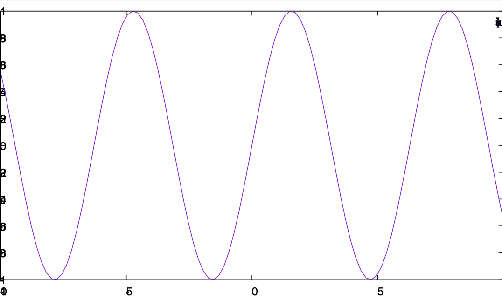
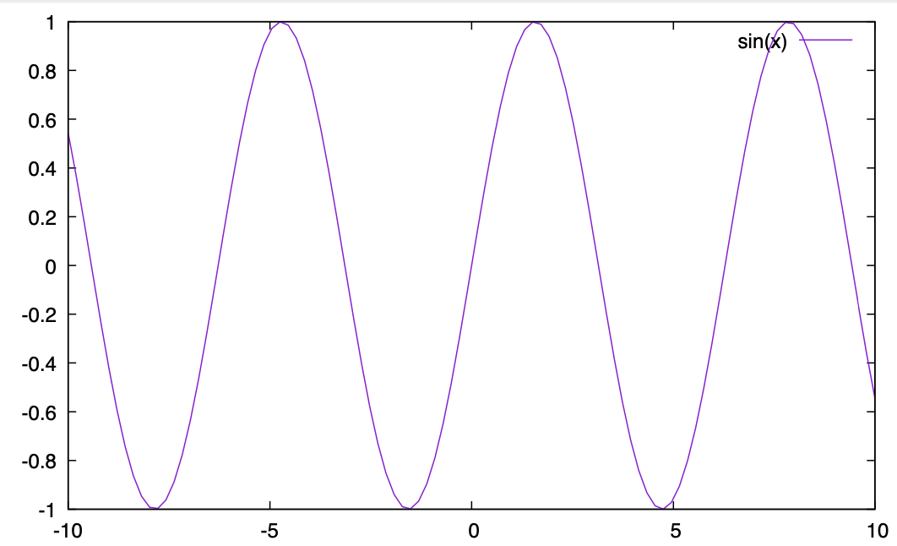

# MacのgnuplotでPDFの文字がおかしくなる問題

## TL;DR

Macのgnuplotでは、pangoのバグ(?)に由来して、terminalにpdfやpngcairo等を指定すると文字がおかしくなる問題があったが、最新版(gnuplot 5.4、pango 1.48.0)では解決している。

## 現象

いつからかよくわからないが、Macのgnuplotではterminalとして`pdf`や`pngcairo`などを指定すると、文字がおかしくなる。これは、Cairoが裏で呼でいるPangoの問題。

```sh
$ brew info pango
pango: stable 1.46.1 (bottled), HEAD

$ gnuplot --versio
gnuplot 5.2 patchlevel 8
```

と、pango 1.46.1、gnuplot 5.2の状態で、以下のファイルを食わせてみる。

```txt
set term pdf
set out "test.pdf"
p sin(x)
```

```sh
gnuplot test.plt
```

するとこうなってしまう。



例えば「-5」が、 ~~5~~のように重なってしまっているのがわかると思う。これはcairoの問題なので、出力に`pngcairo`を指定しても同じことがおきる。

これを、

```sh
brew uninstall pango gnuplot
brew upgrade
brew install gnuplot
```

等としてpangoとgnuplotをアップデートし、gnuplotが 5.4、pangoが1.48.0になった状態でもう一度実行すると、



ちゃんとなおってめでたい。

## 補足

おそらく多くの人の環境で

```sh
brew uninstall pango gnuplot
brew upgrade
brew install gnuplot
```

でいけると思うのだが、僕の環境ではgnuplotの再インストールに失敗した。もしかしたら似たようなエラーが出る人がいるかもしれないので、作業ログを残しておく。

<details><summary> 作業ログのまとめ</summary><div>

gnuplot再インストール時に、

```sh
$ brew uninstall gnuplot
$ brew install gnuplot
(snip)
==> Pouring python@3.9-3.9.1.big_sur.bottle.tar.gz
Error: An unexpected error occurred during the `brew link` step
The formula built, but is not symlinked into /usr/local
Permission denied @ dir_s_mkdir - /usr/local/Frameworks
Error: Permission denied @ dir_s_mkdir - /usr/local/Frameworks
```

と言われてこけた。そこでbrew doctorを実行して、その指示に従いながら問題を修正していった。

コマンドラインツールの再インストール。

```sh
sudo rm -rf /Library/Developer/CommandLineTools 
sudo xcode-select --instal
```

コマンドラインツールのアップデート

```sh
softwareupdate --all --install --force
```

brewのアップデート。

```sh
git -C "/usr/local/Homebrew/Library/Taps/homebrew/homebrew-core" fetch --unshallow
git -C "/usr/local/Homebrew/Library/Taps/homebrew/homebrew-cask" fetch --unshallow
```

brew doctorの指示に従って、不要なものの削除。特に僕はpangoをなんとかしようとして手で入れたので、それを削除。

brew doctorに言われたこと。

```txt
Warning: Unbrewed dylibs were found in /usr/local/lib.
Warning: Unbrewed header files were found in /usr/local/include.
```

削除。

```sh
```sh
rm -rf /usr/local/include/pango-1.0 
sudo rm -rf /usr/local/include/pango-1.0  
rm /usr/local/lib/pkgconfig/pango.pc  
rm /usr/local/lib/pkgconfig/pangocairo.pc 
rm /usr/local/lib/pkgconfig/pangoft2.pc
```

brew doctorに「gdk-pixbufとlibrsvgを入れろ」と言われたので入れる。

```sh
brew install gdk-pixbuf librsvg
```

Qtへのパスを通せと言われたので通す(僕はzshで、ローカルの設定は.zshrc.mineに保存しているけど、適宜自分の設定で読み替えてｋください)。

```sh
echo 'export PATH="/usr/local/opt/qt/bin:$PATH"' >> ~/.zshrc.mine 
```

以上の設定をした上で、

```sh
brew info pango
brew info gnuplot
gnuplot --version
```

で、それぞれpangoが1.48.0、gnuplotが5.4になった状態で再度PDFを作ったらうまくいった。僕の環境では、brew infoとgnuplot --versionが異なるバージョンを指していた(自分でgnuplotをビルド、インストールしたっぽい)のでややこしいことが起きたが、普通に使っている人は大丈夫だと思う。

</div></details>
