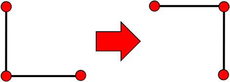

# うんざりするほど正解パスが長い迷路の作り方

## 概要

迷路を自動作成すると、正解パスがあまり複雑にならないことが多い。そこで、迷路の全領域にわたって無駄に歩かされる迷路を作りたい。

最終的にはこんな迷路を作る。

## 正解パスの作成

とりあえず、最初に正解パスを作る。正解パスが与えられたら、それが正解パスとなるような迷路は[クラスタリングアルゴリズム](http://apollon.issp.u-tokyo.ac.jp/~watanabe/tips/maze.html)を使えば良い。

で、まずこんな正解パスを与え、始点と終点を固定したまま、これを変形していくことにする。

変形の仕方は以下の二種類。

まずは90度に曲がっている箇所をひっくり返すフリップ。

２つ目は、辺をひっぱって伸ばすストレッチ。

上の例では元が一直線になっているが、曲がっていても可能であれば伸ばすようにしている。

上記の操作をランダムに繰り返せばいずれ正解パスが迷路をうめつくすだろう、そう思ってやってみると・・・

こんな感じに、最初に与えたパスが太っていく感じになる。確かに最終的には迷路をうめつくすのだが、正解パスが左右にうねうねしながら左下から右上にすすんでいく形になり、あまり「迷路全体を歩かされている感」が出ない。

## フラクタルの概念を導入

そこで、まずより粗いスケールで全体を埋め尽くし、少しずつ格子を細かくしていくことにする。こんな感じ。

で、できた「埋め尽くしたパス」を、二段階細かくした上で、上記のフリップ、ストレッチを繰り返すことで最終的な迷路を作ると、最初に示したような迷路ができる。

## 迷路作成プログラム

迷路作成プログラムを[Github/painful_maze](https://github.com/kaityo256/painful_maze)に上げておいたので、興味のある方は試されたい。

## できる迷路の性質

この迷路の性質は、「正解パスが通る道の長さが迷路全体に占める割合」で表現される。この割合が100%なら、全く分岐がなく、正解パスが(もはやそう呼べないが)迷路をうめつくす。割合が小さくなれば、正解パスは短くなるが、分岐は増える。

フラクタルの概念を取り入れているため、作ることができる迷路が2のべき乗になる。さらに、最後に4倍にしてから迷路を複雑化させているため、正解パスの割合の最小は25%になる。また、適当に伸ばしているので、割合の最大値はせいぜい95%程度で、100%の迷路は作ることができない。

## おまけ

[Github/painful_maze](https://github.com/kaityo256/painful_maze)では、正解パスを作る過程を表示する機能をつけてある。興味のある人は

    $ make uneune.gif
    $ make fracune.gif

を試されたい。パスがうねうね伸びていく過程をアニメーションgifで出力する(要ImageMagickのconvert)。
