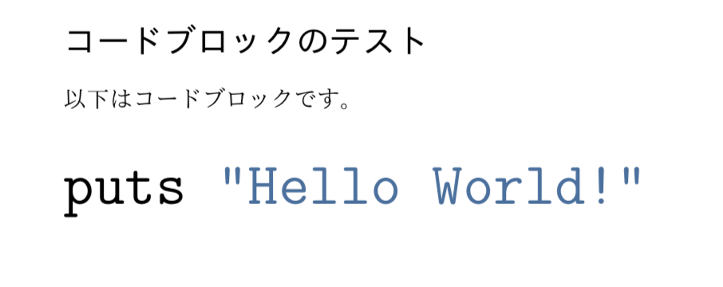
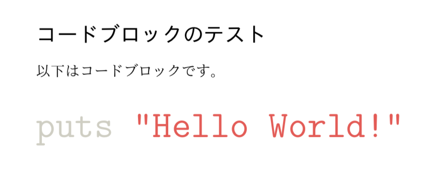
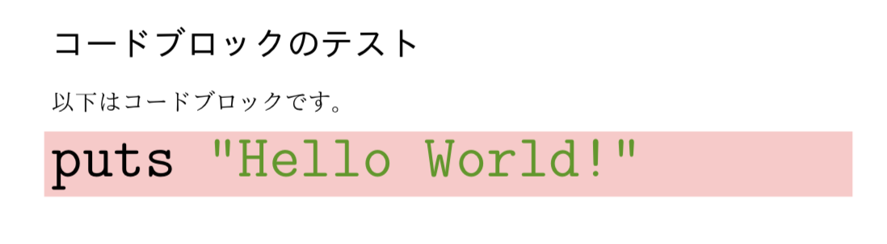

# PandocでLaTeX経由でPDFを出力する際にコードブロックのフォントサイズをいじる

## TL;DR

* 適当な名前、例えば`mytemplate.tex`というファイルに以下の内容を書く

コードブロックに背景色をつけない場合

```tex
\newenvironment{Shaded}{\Huge}{}
```

コードブロックに背景色をつける場合

```tex
\renewenvironment{Shaded}{\begin{snugshade}\Huge}{\end{snugshade}}
```

* 先程指定したファイルを`-H`オプションで指定する。例えば

```sh
pandoc test.md -o test.pdf --latex-engine=lualatex -V documentclass=ltjarticle -H mytemplate.tex
```

などとする。`\Huge`を`\small`とかにすればフォントサイズを好きにできる。

## 解説

もうTL;DRだけで話は尽きているんだけれども、一応何が起きているか解説します。

こんなマークダウンファイルを作ります。

    # コードブロックのテスト
    
    以下はコードブロックです。
    
    ```rb
    puts "Hello World!"
    ```

これをこんな感じでPDFにします。

```sh
pandoc test.md -o test.pdf --latex-engine=lualatex -V documentclass=ltjarticle
```

出来上がったPDFがこちらです。


で、このコードブロックのフォントサイズを変えるために、pandocが吐くソースコードを見てみます。

```sh
$ pandoc test.md -s -o test.tex --latex-engine=lualatex -V documentclass=ltjarticle
```

すると、コードブロックはこんな感じになっています。

```tex
以下はコードブロックです。

\begin{Shaded}
\begin{Highlighting}[]
\NormalTok{puts }\StringTok{"Hello World!"}
\end{Highlighting}
\end{Shaded}
```

この`Shaded`環境は、上の方に定義されています。

```tex
\newenvironment{Shaded}{}{}
```

これは背景色をつける環境なので、デフォルトでは何もしません。ここにフォントサイズを変更する命令を突っ込みます。

```tex
\newenvironment{Shaded}{\Huge}{}
```

で、コンパイルします。

```sh
$ lualatex test.tex 
```

できたPDFがこちらです。



無事にコードブロック内のフォントサイズが大きくなりました。

で、いちいちLaTeXソースを吐いてそれを修正するのは面倒なので、修正命令をファイルに書いておいて、後から命令を読み込ませることにします。一度`\newenvironment`されたものを再定義する必要があるので、`\renewenvironment`を使う必要があります。

```tex
\newenvironment{Shaded}{\Huge}{}
```

これを`-H`オプションで読み込ませれば、マークダウンからPDFに一気に変換しつつ、フォントサイズも変更できます。

```sh
$ pandoc test.md -o test.pdf --latex-engine=lualatex -V documentclass=ltjarticle -H mytemplate.tex
```

## 背景色について

先程の方法を使うと、コードブロックに背景色がある場合に、背景色が消えてしまいます。

例えば、ハイライトスキームとしてbreezeDarkを使うと、背景色は黒くなります。

```sh
$ pandoc test.md -o test.pdf --latex-engine=lualatex -V documentclass=ltjarticle --highlight-style=breezeDark
```


しかし、先程作ったテンプレートを読み込むと文字色はbreezeDarkのままですが、背景色が消えてしまいます。



これは、背景色がある場合の`Shaded`環境がこのように定義されているからです。

```tex
\newenvironment{Shaded}{\begin{snugshade}}{\end{snugshade}}
```

この`snugshade`環境が背景色をつけるので、その直後にフォントサイズ変更命令を突っ込みます。

```tex
\renewenvironment{Shaded}{\begin{snugshade}\Huge}{\end{snugshade}}
```


背景色付きでフォントサイズが変化しました。

## 背景色の修正

ちなみに背景色は`\definecolor`で上書きできます。

```tex
\renewenvironment{Shaded}{\begin{snugshade}\Huge}{\end{snugshade}}
\definecolor{shadecolor}{RGB}{255,200,200}
```




## まとめ

PandocでLaTeX経由でPDFを作る時に、コードブロックのフォントサイズをいじる方法をまとめました。若干アドホックですが、元のマークダウンファイルに手を入れないで修正できるのでまぁ良いんじゃないでしょうか。

## 参考

StackOverflowの[How to set the font size for code blocks in pandoc markdown?](https://stackoverflow.com/questions/27000906/how-to-set-the-font-size-for-code-blocks-in-pandoc-markdown)についた[回答](https://stackoverflow.com/a/27159300)
