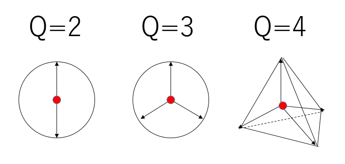
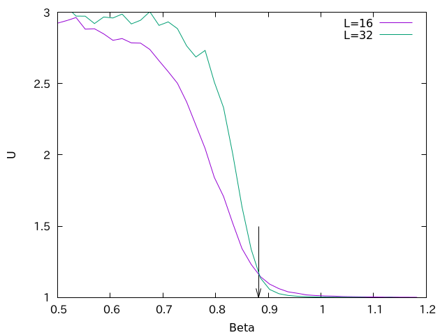
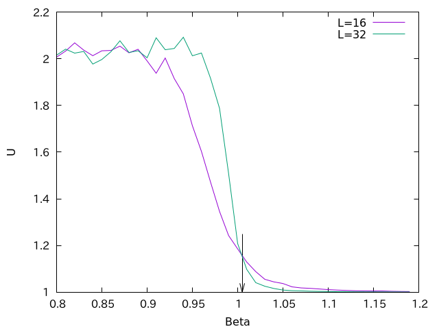

# Potts模型のモンテカルロシミュレーションコード

# はじめに

二次元古典Potts模型をSwendsen-Wangアルゴリズムで更新するモンテカルロ法コードのサンプルを書きました。

コードは以下に置いておきます。

[https://github.com/kaityo256/mc/tree/master/potts_2d](https://github.com/kaityo256/mc/tree/master/potts_2d)

# Potts模型とは

Q状態強磁性Potts模型とは、スピンが$Q$種類の状態を取ることができ、隣り合うスピンが同じ状態の時にエネルギーが下がるような模型です。ハミルトニアンを書くとこんな感じになります。

$$
H = -J \sum_{i<j} \delta_{\sigma_i, \sigma_j}
$$

Potts模型はIsing模型を素直に拡張した模型になっています。Q個の等価な基底状態があり、低温でそのどれかが選ばれる、といった時にQ状態Potts模型と同じ普遍性を持ったりします。

そういう意味でわりと見かける模型で、かつモンテカルロ法も簡単なのですが、実装しようとすると詰まる部分が結構あったりします。本稿では、僕が論文を読んでわかりづらかったところに留意しつつ、正方格子上における古典Potts模型をSwendsen-Wangアルゴリズムで更新するモンテカルロ法コードを説明してみます。

# プログラム

## Swendsen-Wangアルゴリズム

スピン系の更新にはMetropolis法などが使われますが、Potts模型はSwendsen-Wangアルゴリズムという、非常に効率の良い方法が使えます。これはスピンをクラスターに分けてクラスターごとにまとめてひっくり返す手法で、クラスターアルゴリズムとか、クラスターアップデート等と呼ばれます。

Swendsen-Wangアルゴリズムは、逆温度を$\beta$として、

1. 隣接するスピンが同じ状態の時、$p = 1 - \exp(-\beta)$でつなぐ
2. お互いにつながっているスピンをクラスターに分ける
3. クラスターごとに新しいスピン状態をランダムに与える

という手続きを繰り返すものです。詳細は[Swendsen-Wangアルゴリズムのサンプルコード](https://qiita.com/kaityo256/items/6539261993e282edc5aa)も参照してください。

このうち、クラスターに分けるところと、スピンをクラスターごとにひっくり返すところが以外に詰まりポイントです。

## 変数のセットアップ

ではプログラムを書いていきましょう。まずは必要なものをインクルードします。

```c++
#include <algorithm>
#include <array>
#include <iostream>
#include <random>
#include <vector>
```

次に、システムサイズ、スピン数、状態数も定義しておきましょう。手抜きでグローバル変数にします。

```c++
int L; // System Size
int N; // Number of Spins
int Q; // Number of States
```

次は変数の定義です。

```c++
std::vector<int> spins, newspins;
std::vector<std::array<int, 2>> neighbor;
std::vector<int> parent;
```

スピンはとりあえず`std::vector`で定義しましょう。スピン状態は`spins`、後でひっくり返す時に使うので`newspins`も定義しておきます。

あと、隣接スピン番号を`neighbor`で定義しておきましょう。二次元配列ですが、右と下しか必要ないので`neighbor[N][2]`という形にしておきます。

あと、クラスター番号を管理するUnion-Find木のために`parent`という配列も定義しておきます。

## 初期化

次に初期化をしましょう。

```c++
int pos2index(int ix, int iy) {
  ix = (ix + L) % L;
  iy = (iy + L) % L;
  return ix + iy * L;
}

void init(int size) {
  L = size;
  N = L * L;
  spins.resize(N);
  newspins.resize(N);
  neighbor.resize(N);
  parent.resize(N);
  // Initialize Neighbors
  for (int iy = 0; iy < L; iy++) {
    for (int ix = 0; ix < L; ix++) {
      int i = pos2index(ix, iy);
      neighbor[i][0] = pos2index(ix + 1, iy);
      neighbor[i][1] = pos2index(ix, iy + 1);
    }
  }
}
```

サイズの与えて、`std::vector`の`resize`をします。ついでに、スピンの「右」と「下」のスピンのインデックスも計算しておきます。周期境界条件もここで取り込んでおきましょう。そのために、場所からスピンインデックスを返す関数`pos2index`を書いておきました。

## Union-Find

クラスタリングするためにUnion-Findアルゴリズムを使います。そのためにUnionとFindを書いておきましょう。ちなみに、C++ではunionが予約語なので、同僚さんが代わりに`unite`を使っていてなるほど、と思いました。

```c++
int find(int i) {
  while (i != parent[i]) {
    i = parent[i];
  }
  return i;
}

void unite(int i, int j) {
  i = find(i);
  j = find(j);
  parent[j] = i;
}
```

Union-Findアルゴリズムについては[Union-Find木のサンプルコード](https://qiita.com/kaityo256/items/5a3b03ff465778c23f6a)も参考にしてください。

## スピンの接続

UnionとFindがあれば、スピンの接続はそれを呼ぶだけなので簡単です。

```c++
void connect(int i, int j, double p, std::mt19937 &mt) {
  std::uniform_real_distribution<> ud(0.0, 1.0);
  if (spins[i] != spins[j]) return;
  if (ud(mt) > p) return;
  unite(i, j);
}
```

関数`connec`は、スピン`i`とスピン`j`が同じ状態なら確率`p`でつなぐものです。

## モンテカルロステップ

関数`connect`を使うと、スピン状態の更新(MCステップ)の実装は簡単です。

1. まずスピンをつなぎ、
2. 次にスピンをひっくり返す

という手続きを取ります。そのまま実装するとこんな感じになるでしょう。

```c++
void one_step(double beta, std::mt19937 &mt) {
  std::uniform_int_distribution<> ud(0, Q - 1);
  // Initialize Union-Find tree
  for (int i = 0; i < N; i++) {
    parent[i] = i;
  }
  // Connect
  const double p = 1.0 - exp(-beta);
  for (int i = 0; i < N; i++) {
    connect(i, neighbor[i][0], p, mt);
    connect(i, neighbor[i][1], p, mt);
  }
  // Flip
  for (int i = 0; i < N; i++) {
    newspins[i] = ud(mt);
  }
  for (int i = 0; i < N; i++) {
    spins[i] = newspins[find(i)];
  }
}
```

最初に、Union-Find木の初期化をしています。

次に、全てのスピンについて、「右」と「下」のスピンとの接続チェックをします。

こうして、スピンがクラスターに分かれた後、クラスター毎に新しいスピン状態を与える必要があります。

いろいろ方法はあると思いますが、簡単なのは`N`個ランダムに0からQ-1の状態を用意しておき(`newspins`)、各スピンのクラスター番号に対応するスピン状態(`newspins[find(i)]`)にすれば、同じクラスターに属すスピンは同じ状態になり、かつ異なるクラスターに属すスピンはランダムになります。

## 秩序変数

Q状態Potts模型の秩序変数定義はいくつかありますが、単純なのはQ-1次元のベクトルと思って、平均ベクトルの長さを取るものです。



この図の矢印を$\vec{v}_0, \vec{v}_2,\cdots$としましょう。これらはQ=3の時には、正三角形の中心から頂点へ、Q=4の時には正四面体の中心から頂点に向けたベクトルで、長さは1です。

平均ベクトル$\vec{m}$は、

$$
\vec{m} = \sum_{q=0}^{Q-1} m_q \vec{v}_q
$$

で定義されます。$m_q$は、状態$q$を取るスピンの割合です。

$$
m_q = \frac{1}{N} \sum_i \delta_{\sigma_i, q}
$$

ここから$m^2$を計算すると、

$$
m^2 = \sum_{q=0}^{Q-1} m_q^2 
+ 2 \sum_{i<j} m_i m_j \vec{v}_i \cdot \vec{v}_j
$$

ここで、異なる向きのベクトルの内積は

$$
\vec{v}_i \cdot \vec{v}_j = \frac{-1}{Q-1}
$$

なので、最終的に、

$$
m^2 = \sum_{q=0}^{Q-1} m_q^2 
- \frac{2}{Q-1}\sum_{i<j} n_i n_j 
$$

となります。

以上をそのまま実装すると、

```c++
double magnetization(void) {
  std::vector<double> m(Q, 0.0);
  for (int i = 0; i < N; i++) {
    m[spins[i]] += 1;
  }
  for (int i = 0; i < Q; i++) {
    m[i] /= static_cast<double>(N);
  }
  double m2 = 0.0;
  for (int i = 0; i < Q; i++) {
    m2 += m[i] * m[i];
  }
  for (int i = 0; i < Q - 1; i++) {
    for (int j = i + 1; j < Q; j++) {
      m2 -= 2.0 * m[i] * m[j] / (Q - 1);
    }
  }
  return m2;
}
```

です。これで秩序変数の二次のモーメント$m^2$が計算できます。

## ビンダー比

相転移を調べるには、ビンダー比と呼ばれる量を計算すると便利です。ビンダー比は、以下のように定義されます。

$$
U = \frac{\left<m^4\right>}{\left<m^2\right>^2}
$$

ビンダー比は、臨界点直上においてシステムサイズ依存性を持ちません。そこで、この量の温度依存性を調べ、異なるシステムサイズについてプロットすると一点で交わり、それが臨界点になります。

指定の逆温度において、最初に適当に緩和させ、$\left<m^2\right>$と$\left<m^4\right>$を測定し、最後にビンダー比を出力するコードはこんな感じになります。

```c++
void mc(double beta) {
  std::mt19937 mt;
  for (int i = 0; i < thermalize_loop; i++) {
    one_step(beta, mt);
  }
  double sm2 = 0.0;
  double sm4 = 0.0;
  for (int i = 0; i < observe_loop; i++) {
    one_step(beta, mt);
    double m2 = magnetization();
    sm2 += m2;
    sm4 += m2 * m2;
  }
  sm2 /= static_cast<double>(observe_loop);
  sm4 /= static_cast<double>(observe_loop);
  double u = sm4 / sm2 / sm2;
  std::cout << beta << " " << sm2 << " " << u << std::endl;
}
```

# 結果

正方格子上におけるQ状態Potts模型の臨界点$\beta_c$は

$$
\beta_c = \log(1+\sqrt{Q})
$$

で定義されます。Q=2、すなわちIsing模型の場合のビンダー比の温度依存性はこんな感じになります。



確かに臨界点上で異なるシステムサイズのビンダー比が交差しています。

Q=3の時も同様です。



# まとめ

正方格子上のPotts模型のモンテカルロシミュレーションコードについて説明してみました。100行ちょっとのコードなので、慣れるとすぐに書けるのですが、論文だけ読んで実装すると戸惑う点が結構あります。個人的には、秩序変数の定義と、スピンをクラスターごとまとめてフリップするところで詰まりました。

本稿が誰かの助けになれば幸いです。
