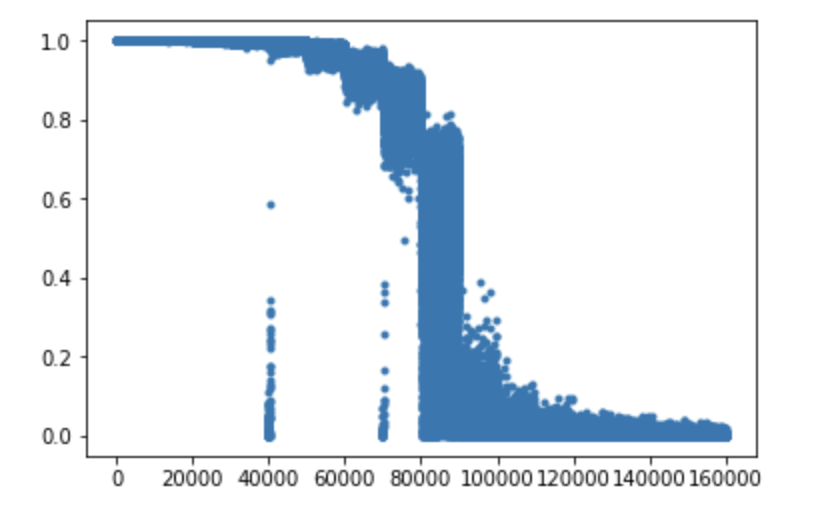
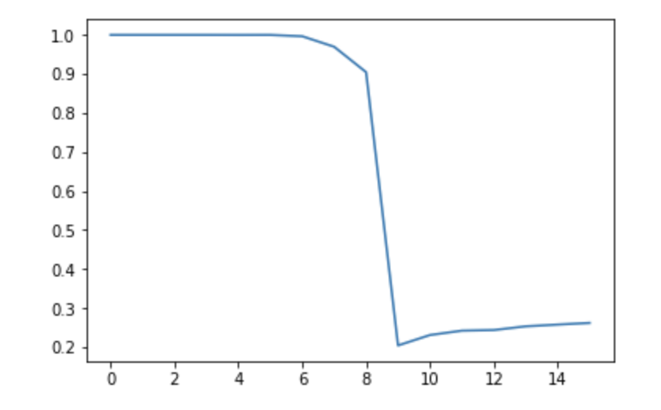
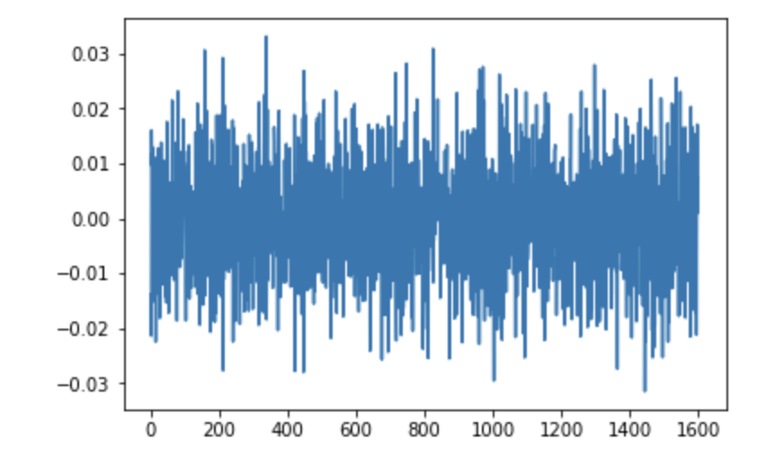
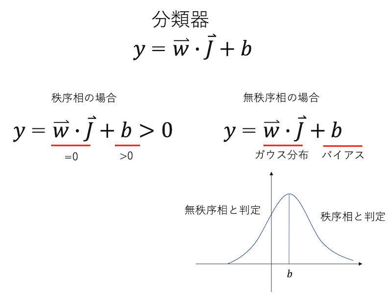

# 無茶振りされた機械の気持ち　〜　イジング模型の相をロジスティック回帰で判定する　〜

## はじめに

機械学習で分類器を作る時、「なんかそこそこうまくいっているけど、なんでうまくいったかわからない」ことや、「精度が明らかに高すぎ、何かがおかしいが何がおかしいかわからない」といったことがよく起きる。ライブラリが急速に充実しつつある機械学習では、どうしても作業がブラックボックスになりがちだ。そこで、今回は「ロジスティック回帰によるイジング模型の相の判定」という簡単なケースで「無茶振りをされた機械の気持ち」を調べてみる。


なお、この例題は[A high-bias, low-variance introduction to Machine Learning for physicists (arXiv:1803.08823)](https://arxiv.org/abs/1803.08823)のSec. VIIによる。

## イジング模型

磁石を熱するとどうなるかご存知だろうか？大雑把に言うと磁石は小さい磁石が集まってできている。小さい磁石の向きがそろっていると全体として大きな磁石になるが、温度が高くなると小さい磁石がバラバラの向きを向くため、磁石は磁力を失う。さて、いま磁石の温度を徐々に上げていくと、高温になるにつれて磁力は減っていくのだが、そのままダラダラとへたっていくのではなく、ある温度でぱったりと磁力がなくなってしまう。このように、温度のような外部パラメータを変えていくと、ある点で物質の性質が変わることを **相転移(Phase Transition)** と呼ぶ[^1]。氷が融けたり、水が沸騰したりするのも相転移である。

この磁性体の性質をもっとも簡単に表現したものがイジング模型(Ising Model)だ。そのハミルトニアンは以下のように表現される。

$$
H = -J \sum_{\left< i, j \right>} S_i S_j
$$

ここで$J>$は相互作用パラメータ、$S_i$はスピンと呼ばれる自由度で、$\pm 1$の値を取る。和は「隣合うスピン」について取る。イジング模型は、小さな磁石(スピン)が同じ向きを向いていたらエネルギーを得し、異なる向きを向いていたら損する、という性質を抜き出したものである。この模型は、温度が低いとスピンが同じ向きを揃いたがり、高いと異なる向きを向きたがる。なぜそうなるかは統計力学の教科書を読んでいただくとして、ここでは

* ある臨界温度よりも低温では、すべてのスピンは$+1$か$-1$にほぼ揃っている(秩序相)
* ある臨界温度よりも高温では、スピンは$\pm 1$でバラバラの値になっている(無秩序相)

ということだけ知っていれば良い。

さて、これを二値分類問題として考えよう。もともとスピンの状態には温度という連続パラメータがラベル付けされているが、これを「臨界温度未満なら1」「臨界温度以上なら0」という二値化する。すると、あるスピンの状態が与えられた時に、このスピンが秩序相か無秩序相かを判定する分類器を作れ、という問題となる。

## データセットの読み込み

実際に、[ここ](https://physics.bu.edu/~pankajm/ML-Review-Datasets/isingMC/)で、それぞれの温度で平衡化されたスピン状態がデータセットとして公開されているのでそれを利用しよう。

とりあえず必要なライブラリをまとめてインポートしておく。

```py
import matplotlib.pyplot as plt
from urllib.request import urlopen
from sklearn.model_selection import train_test_split
import pickle, os
import numpy as np
from sklearn import linear_model
from sklearn.neural_network import MLPClassifier
import random
```

データセットはpickleでシリアライズされており、こんな感じに読める。

```py
## データURL
url_main = 'https://physics.bu.edu/~pankajm/ML-Review-Datasets/isingMC/'

## スピンのデータ
data_file_name = "Ising2DFM_reSample_L40_T=All.pkl"
## ラベルデータ
label_file_name = "Ising2DFM_reSample_L40_T=All_labels.pkl"

## スピンのデータの読み込み
data = pickle.load(urlopen(url_main + data_file_name))
data = np.unpackbits(data).reshape(-1, 1600)
data=data.astype('int')
data[np.where(data==0)]=-1 # スピンを1,0ではなく1,-1にする

## ラベルデータの読み込み
labels = pickle.load(urlopen(url_main + label_file_name))
```

温度は16点で、そのうち9点が秩序相(ラベル1)、7点が無秩序相(ラベル0)である。それぞれに10000サンプル含まれており、合計16000点ある。ラベルをプロットするとこんな感じ。


最初の90000点がラベル1、残りの70000点が0になっていることがわかる。

さて、データ、つまりスピンだが、40x40の二次元系なので1600個のスピンを含む。しかし、後で回帰に食わすために1600次元のベクトルになっている。最初と最後を表示するとこんな感じ。

```py
print(data[0]) #=> [-1 -1 -1 ... -1 -1 -1]
print(data[-1]) => [ 1  1  1 ...  1 -1 -1]
```

最初の方が秩序相で、ベクトルは1か-1にそろっている。後ろの方が無秩序相で、ベクトルは1と-1がばらばらである。
このベクトルを$\textbf{J}$と表現しよう。これは1600次元の縦ベクトルである。

## ロジスティック回帰

さて、相をロジスティック回帰により分類しよう。1600次元の横ベクトル$\textbf{w}$と、あるスカラー量$b$を用意して、

$$
y = \textbf{w} \cdot \textbf{J} + b
$$

という量を考える。$\textbf{w} \cdot \textbf{J}$は同じ次元の縦ベクトルと横ベクトルの内積なのでスカラー量になる。$b$はバイアスである。ロジスティック回帰とは、秩序相の$\textbf{J}$が与えられたら$y>0$に、無秩序相が与えられたら$y < 0$になるように$\textbf{w}$と$b$を決めなさい、という問題になる。しかし、**この問題設定は無茶振りになっている**。

これまで秩序相とか難しい言葉を使って来たが、やるべきことは要するに「与えられたベクトルの中身が揃ってるか、バラバラか」を判定することである。最も簡単な判定方法は、「ベクトルの中身の総和の絶対値」を調べることだ。例えば以下のような量を考えれば良い。

$$
m^2 = \left( \sum_i^N S_i \right)^2 /N^2
$$

この量は磁化(magnetization)と呼ばれ、秩序相で非ゼロ、無秩序相でゼロとなる。ここではわかりやすさのためにスピン$S_i$で書いたが、適宜ベクトルの要素$J_i$と読み替えて欲しい。この量をプロットしてみよう。

```py
mag = [np.average(d)**2 for d in data]
plt.plot(mag,'.')
```



秩序相(左側)では非ゼロ、無秩序相(右側)ではゼロで、臨界点近傍(90000)くらいでガクっと下がっているのがわかると思う。系のサイズが大きいほど、相転移点でこの量はシャープに消えるのだが、いまは系のサイズが小さいためダラッとしている。

さて、この量を使えば相を判定するのは簡単で、この量が適当なスレッショルドより大きいかどうかを判定してやれば良い。ナイーブに書くとこんな感じである。

```py
## Predict a phase via magnetization
acc = 0
for i, d in enumerate(data):
  m2 = np.average(d)**2
  pred = 0
  if m2 > 0.4:
    pred = 1
  if pred == labels[i]:
    acc += 1
  
acc /= len(data)
print(acc) # => 0.9839875
```

単純に、これだけで正答率98%を超えることができる。

しかし、先程の回帰には線形演算しか含まれておらず、この磁化を表現することができない。問題は「秩序相」が「+1」か「-1」にそろっていることだ。もし秩序相が「+1」しかなければ、スピンの総和が0かそうでないかを見ればよいので、それは線形演算の範囲で表現可能だ。しかし、秩序相が「+1」か「-1」の二通りあるため、総和の自乗、もしくは絶対値を取る必要があり、それは非線形演算なので、先程の線形演算では表現できない。

線形演算しか使うことを許されず、それでも「本質的に非線形なものの分類器を作れ」と厳命された機械君、彼はどうすればよいか？

もっともナイーブには、「データの偏りを利用する」という方法がある。いま、16点のうち、9点が秩序相、7点が無秩序相である。したがって、入力に無関係に「秩序相」と言えば、9/16、すなわち56%の正解率は得ることができる。$\textbf{w}$の要素をすべて0にして、$b$を適当な正の数にすれば、そんな分類器(とは呼べないが)ができる。

実際に回帰させてどうなるかやってみよう。

```py
## ロジスティック回帰
logreg=linear_model.LogisticRegression(C=1.0,random_state=1,verbose=0,max_iter=1E3,tol=1E-5,solver='liblinear')
logreg.fit(data, labels)

## 正答率のチェック
acc = logreg.score(data,labels)
print('accuracy: %0.4f '% acc) #=> accuracy: 0.6604
```

正答率66%、つまり56%を超えてきた。線形演算しかできないにもかかわらず、ナイーブな方法よりも良い精度を出してきた。死ぬほど前振りが長くなったが、彼がどうやったかを考えてみよう、というのが本稿の目的である。

## 分類器の詳細

機械君が作ってきた分類器は`logreg`という名前で保存されている。こいつがどういうものか調べてみよう。まず、全体として66%の精度を出してきたが、それは秩序相で稼いでいるのか、無秩序相で稼いでいるのかを調べてみる。温度が16点あり、それぞれ10000サンプルあるので、それぞれの温度での正答率をプロットしてやる。

```py
ds = np.split(data, 16)
ls = np.split(labels, 16)
acc = []
for i in range(16):
    acc.append(logreg.score(ds[i],ls[i]))
plt.plot(acc)
```



これを見ると、左側、つまり秩序相側はほぼ100%正解しており、無秩序相側では20%〜30%と低い値になっていることがわかる。まずこれでわかることは、「分類器が秩序相側に倒されている」ということである。こいつは無秩序相を食わせても70%くらいの確率で「秩序相」と判定する。先に考えたように、これはデータの偏りを利用していると思われる。

問題は、「どうして無秩序相でも正解を稼げるか」である。それを見るために、$\textbf{w}$と$b$の値を見てみよう。それぞれ`logreg.coref_[0]`と、`logreg.intercept_[0]`に入っているので、それを見てやる。

```py
logreg.intercept_[0] #=> 0.2738668768118068
```

```py
plt.plot(logreg.coef_[0])
```



これを見ると、$b = 0.274$という正のバイアスがかかっており、$\textbf{w}$は正負含むランダムな値が入っているように見える。ついでに$\textbf{w}$の要素の平均も見てみよう。

```py
np.average(logreg.coef_[0]) #=> 9.447853262779457e-07
```

ほぼゼロである。すなわち、無茶振りされた機械君が作ってきた分類器は、

* 係数$\textbf{w}$は、平均ゼロでランダムな値を含むベクトル
* バイアス$b$は正の値

というものだった。これがどういう働きをするか見てみよう。

秩序相は、$\textbf{J}$はすべて1か-1である。それと$\textbf{w}$の内積を取ると、これは(符号を除けば)$\textbf{w}$の総和になる。$\textbf{w}$の要素の平均はゼロなのだから、$\textbf{w} \cdot \textbf{J} = 0$である。今、$b > 0$だから、$y = \textbf{w} \cdot \textbf{J} + b > 0$、つまり秩序相と判定させる。

次に、無秩序相を考える。無秩序相のベクトルは、各要素が$\pm 1$のバラバラの値を取る。これと$\textbf{w}$との内積を取ると、平均ゼロで、ある分散をもったガウス分布に従う確率変数になる。それにバイアスを足すと、右にずれたガウス分布になる。これにより、無秩序相でもある程度の確率で「無秩序相」という判定をすることができ、精度を稼ぐことができた。



## まとめ

「ちゃんと判定するなら非線形演算が必要な分類問題」を、無理やり線形演算のみを使ったロジスティック回帰で分類させて見た。無茶振りだろうがなんだろうが、機械君は与えられた条件で最も精度の良い条件を探さなくてはならない。そこで彼は「秩序相はちゃんと判定し、無秩序相でもそれなりにポイントを稼ぐ」ような分類器を作ってきた。

もともと、

* 線形演算だけなのに、なぜもともとあるデータの偏りの56%を超える精度を出してきたのか
* スピンは$\pm 1$で対称だから、対称性から$b=0$になって欲しい気がするが、なぜ$b>0$にしたのか (**追記**： 対称性からバイアスゼロになるかと思ってこう書きましたが、$\textbf{J}$と$\textbf{-J}$で同じ重みを返すことを要請すると$b=0$ではなく$\textbf{w}=0$が結論されますね)

という疑問で調べ始めたのだが、意外に機械君は賢かった(少なくとも僕はこういう方法は思いつかなかった)。

しかし、この分類器が「イジング模型の本質を捉えたか」については疑問が残る。もともと分類器をつくる時、もちろん「単に分類できればそれで良い」場合も多いのだろうが、我々は「できた分類器は、なにか分類に本質的な特徴を捉えた」と思いたくなる。しかし、よく挙げられる「ハスキーと狼の判定に背景の雪を使っていた」例のように、機械は「ズル」をする[^2]。個人的な経験でも、ラベルが半分ずつ含まれた(つまり偏っていない)二値分類器を作った時、片方はちゃんと判定するが、もう片方は50%の確率で適当なことを言う分類器ができたことが結構ある。これだけで75%の精度は出せる。こういった分類器が何かの特徴をちゃんと捉えたかどうかは、慎重に判断すべきであろう。

[^1]: ちなみに、磁石が磁力を失う点を「キュリー点」と呼ぶ。この「キュリー」は「ピエール・キュリー」にちなむ。ピエール・キュリーは「キュリー夫人」の旦那さんである。「キュリー夫人の旦那さん」というのは激しく自己言及的だが、日本ではキュリー夫人の方が有名なのでこっちの方が通りが良い。ピエール・キュリーも極めて優秀な物理学者なのだが・・・。

[^2]: 研究室の学生さんがは「彼らはかわいいズルをする」と表現していた。

## 参考文献

* [A high-bias, low-variance introduction to Machine Learning for physicists (arXiv:1803.08823)](https://arxiv.org/abs/1803.08823) 物理屋さん向けの機械学習のテキスト。機械学習ガチ勢には物足りないかもしれないが、物理の素養がある人にはわかりやすく、いろいろ学びがあって面白い。
* [Python notebooks](https://physics.bu.edu/~pankajm/MLnotebooks.html) 上記のテキストで取り上げられているサンプルコード。
