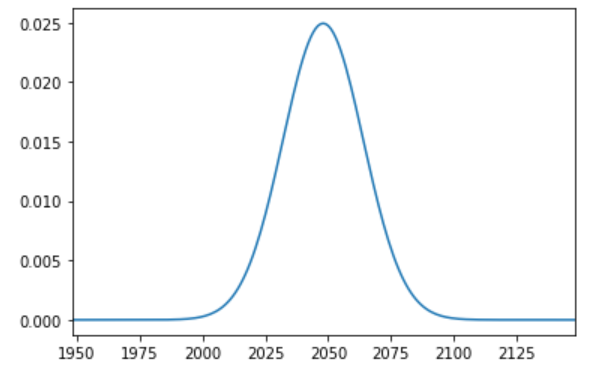

# Pythonでフーリエ変換

## はじめに

何かデータをフーリエ変換したくなることがある。例えば先生から「そのデータ、フーリエ変換してみたら？」と言われた時とか。なんとなくフーリエ変換がどういうものかは知っていて、PythonとかのライブラリにFFTがあるからデータを食わせればすぐ変換できるということも知っているが、なんとなく定義に自信が無い、そんな時もあるだろう。

そういう場合は、厳密にフーリエ変換がわかるような単純な系について実際にデータを食わせてみて、理論値と一致することを確認するのが望ましい。しかし、実際にやってみると「アレ？」と思うことが結構ある。以下ではPythonでFFTをする時の注意点等を紹介する。


## ガウス分布

### ガウス分布のフーリエ変換

まずはフーリエ変換の定義から確認しておこう。ある関数$f(x)$のフーリエ変換$\hat{f}(k)$は

$$
\hat{f}(k) = \int_{-\infty}^\infty f(x) e^{-ikx} dx
$$

で与えられる。逆変換と対称にするために$\sqrt{2\pi}$で割る流儀もあるが、工学で使うフーリエ変換では、フーリエ変換はそのまま、逆フーリエ変換に$2\pi$をつける流儀が多いと思われる。

簡単にフーリエ変換できて、かつそれなりに非自明な例としてガウス分布が挙げられる。こんな分布を考えよう。

$$
f(x) = \frac{1}{\sqrt{2 \pi \sigma^2}} \exp\left(- \frac{x^2}{2\sigma^2} \right)
$$

これは平均0、標準偏差$\sigma$であるようなガウス分布である。これをフーリエ変換しよう。定義につっこんで計算するだけだ。

$$
\begin{aligned}
\hat{f}(k) &= \int_{-\infty}^\infty f(x) e^{-ikx} \\
&=  \frac{1}{\sqrt{2 \pi \sigma^2}}  \int_{-\infty}^\infty\exp\left(- \frac{x^2}{2\sigma^2} \right) e^{-ikx} dx
\end{aligned}
$$

この計算にはちょっとした工夫が必要だ。まず指数関数の中身を平方完成する。

$$
- \frac{x^2}{2\sigma^2} - ikx = -\frac{1}{2\sigma^2}
(x + i\sigma k)^2 - \frac{\sigma^2 k^2}{2}
$$

上式の右辺第一項を指数の肩に乗せたものはガウス積分であり、$1/\sqrt{2\pi \sigma^2}$とキャンセルする。したがって最終的に

$$
\hat{f}(k) = \exp\left(- \frac{\sigma^2 k^2}{2}\right)
$$

つまり、ガウス分布をフーリエ変換したものは、規格化されておらず、かつ標準偏差が逆数になったようなガウス分布になる。つまり、実空間で「幅の広い」ガウス分布は、波数空間では「幅の狭い」ガウス分布になる(逆もまた然り)。

上記をPythonで確認してみよう。

### ガウス分布のFFT

Pythonでデータをフーリエ変換するのは簡単で、配列を`numpy.fft.ftt`に渡すだけで良い。まずはガウス分布を作ってみよう。

```py
import numpy as np
from math import sqrt, pi, exp
import matplotlib.pyplot as plt

N = 4096            # サンプル数
s = N/256           # 標準偏差

y = []
for i in range(N):
  x = i - N/2
  v = exp(-x**2/(2.0*s**2))/(sqrt(2*pi)*s)
  y.append(v)

plt.plot(y)
plt.xlim([N/2-100,N/2+100])
plt.show()
```

これは、データ点をN=4096とし、N/2を中心に、N/256=16を標準偏差とするガウス分布で、プロットするとこんな感じになる。



さて、配列`y`にデータが入っているので、フーリエ変換をするにはそれを`numpy.fft.fft`に突っ込めば良い。突っ込んだものを`fk`としてsその絶対値プロットしてみよう。

```py
fk = np.fft.fft(y)
plt.plot(fk)
```

するとこうなる。


なんか変なデータになっていますね。これがどうなっているかを理解して、ちゃんと理論値と比較できるようになりましょう、というのが本稿の目的だ。

まず、`numpy.fft.fft`が行うのは離散フーリエ変換(DFT)である。離散フーリエ変換では、配列のどのインデックスがどの座標に対応しているかを気を付けなければならない。

`fft`に一次元配列を渡すと、デフォルト(オプション無し)では、インデックス`i`と、座標`x`が等しいものとして計算される。したがって`x=i`である。

さて、N個のデータのDFTのデータは、やはりN個になるため、結果は要素N個の一次元配列となる。その順番と`k`の対応は`numpy.fft.fftfreq`にデータ点数を与えることで得られる。取得してプロットしてみよう。

```py
freq = np.fft.fftfreq(N)
plt.plot(freq)
```

すると、こんな感じになる。


波数kの取り得る値は-1/2から1/2まで1/N刻みであり、それが

$$
0, 1/N, 2/N, \cdots, 1/2, -N/2, -N/2 +1, \cdots, -1/N
$$

といった順番で並んでいることがわかる。一般にフーリエ変換はk=0付近にピークがあり、そこから離れると急激に振幅が小さくなる場合が多く、またkの正負で対称なので、最初の半分しかデータが必要がない。なので、フーリエ変換したデータの最初の半分だけを見ればよいことになる。

さて、フーリエ変換した配列のインデックスとkの関係がわかったので、それをx軸、y軸としてプロットすれば、ガウス分布になるはずだ。やってみよう。

```py
plt.xlim([-0.05,0.05])
plt.scatter(freq,fk,s=1)
```


ガウス分布っぽいものは出てきたが、まだおかしい。実は、計算の都合上、フーリエ変換$\hat{f}(k)$と、離散フーリエ変換の係数$A_k$の間には

$$
\hat{f}(k) = (-1)^n A_k
$$

と、$(-1)^k$がかかってしまう。今回のケースでは、絶対値をとってしまうのが楽だ。

```py
plt.xlim([-0.05,0.05])
plt.scatter(freq,np.abs(fk),s=1)
```


期待されるガウス分布になった。では、これが理論曲線に一致するか確認してみよう。理論曲線は以下の通りだった。

$$
\hat{f}(k) = \exp\left(- \frac{\sigma^2 k^2}{2}\right)
$$

これを重ねて表示してみよう。

```py
theory = [exp(-k**2*s**2/2.0) for k in freq]    # 理論曲線
fig, ax = plt.subplots()
ax.scatter(freq, np.abs(fk), s = 1, c = "red")  # DFTの結果
ax.scatter(freq,theory, s = 1, c="blue")        # 理論曲線
plt.xlim([-0.1,0.1])
plt.show()
```

結果はこうなる。


赤がフーリエ変換の結果、青が理論曲線だ。高さとピーク位置はあってそうだが、分散がおかしいことがわかる。

こういう場合は変にがんばって検索するより、公式ドキュメントにあたった方が早い。[NumPy公式ドキュメントのFFTの説明](https://numpy.org/doc/stable/reference/routines.fft.html#module-numpy.fft)を読むと、DFTの定義は以下のようになっている(少しnotationを変えている)。

$$
A_k = \sum_{m=0}^{N-1} a_m
\exp\left(- 2 \pi i \frac{mk}{N} \right)
$$

これと連続版におけるフーリエ変換の定義を見比べよう。

$$
\hat{f}(k) = \int_{-\infty}^\infty f(x) \exp(-ikx) dx
$$

すると、連続版の$x$がDFTの$m$に、連続版の$k$は、DFTにおける$2\pi k/N$に対応することがわかる。先ほどの例では、単に$k/N$としてしまっていたため、波数空間の縮尺が$2 \pi$だけずれている。これを修正してみよう。

```py
theory = [exp(-(2*pi*k)**2*s**2/2.0) for k in freq] # kに2piをかける
fig, ax = plt.subplots()
ax.scatter(freq, np.abs(fk), s = 1, c = "red")
ax.scatter(freq,theory, s = 1, c="blue")
plt.xlim([-0.1,0.1])
plt.show()
```


めでたく一致した。

## 時系列(指数減衰)

次に、時系列の解析をしてみよう。以下のような力学系を考える。

$$
\dot{v} = - \gamma v
$$

速度に比例する抵抗をうけて運動する物体の速度の時間発展を表すものだ。オイラー法で時間発展させて、時系列を作るにはこんな感じのコードになるだろう。

```py
import numpy as np
from math import sqrt, pi,
import matplotlib.pyplot as plt

N = 4096            # サンプル数
h = 0.1          # 時間刻み
gamma = 0.2
v0 = 2.0

v = v0
f = []
for _ in range(N):
  v = v -gamma * v * h
  f.append(v)
```

できた時系列をプロットしてみよう。

```py
plt.plot(f)
plt.show()
```


さて、今回は刻み幅が1ではなく$h$なので、周波数空間が変わる。それを見ておこう。

```py
freq = np.fft.fftfreq(N, d=h)
plt.plot(freq)
```


先ほどと異なり、$-1/(2h)$から$1/(2h)$になっていることに注意。

フーリエ変換して、絶対値を表示してみよう。

```py
fw = np.fft.fft(f)
plt.scatter(freq, np.abs(fw),s=1)
```


この理論曲線をもとめてみよう。まずは、離散フーリエ変換の定義式に戻る。

$$
A_k = \sum_{m=0}^{N-1} a_m
\exp\left(- 2 \pi i \frac{mk}{N} \right)
$$

$A_k$が係数、$a_m$が入力の時系列だ。時間刻みを$h$としているので、時系列$a_m$と入力信号$f(t)$の関係は、

$$
a_m = f(mh)
$$

である。また、時系列の時間は0から$Nh$までなので、$T=Nh$として$N$を$T$を用いて書き直そう。

$$
A_k = \sum_{m=0}^{N-1} f(mh)
\exp\left(- 2 \pi i \frac{mhk}{T} \right)
$$

これを積分で近似すると、

$$
A_k = \frac{1}{h} \int_0^T f(t) 
\exp\left(- \frac{2 \pi i tk}{T} \right) dt
$$

さて、今回のケースでは

$$
f(t) = v_0 e^{-\gamma t}
$$

なので、突っ込んで計算し、$T$が大きいと思って「おつり」を無視すると、

$$
A_k = \frac{1}{h} \frac{v_0}{\gamma + 2 \pi i k /T}
$$

さて、これを`numpy.fft.fftfreq`で得たx座標とともにプロットするのだが、それが$1/(Nh)$刻みなので、$w = kh/T$とすると、

$$
A(w)  = \frac{1}{h} \frac{v_0}{\gamma + 2 \pi i w}
$$

となる。こいつの絶対値をとったものが、

```py
plt.scatter(freq, np.abs(fw),s=1)
```

でプロットされるものに一致するはずだ。見てみよう。

```py
fig, ax = plt.subplots()
theory = [v0/sqrt((w*2*pi)**2 + gamma**2)/h for w in freq] # 理論値
ax.set_xscale("log")
ax.set_yscale("log")
plt.xlim([1,0.5/h])
plt.scatter(freq, np.abs(fw), s = 1)
plt.scatter(freq, theory, s=1)
```


概ね一致した。なお、グラフの右の方でずれてくるのはDFTの周期境界条件のためだ。

## 時系列(ランジュバン方程式)

最後にランジュバン方程式を考えてみよう。こんな運動方程式を考える。

$$
\dot{v} = - \gamma v + R
$$

これは揺動力を受けながら運動する物体の速度の時間発展を表している。ここで、$R(t)$は、以下を満たす白色雑音である。

$$
\left< R(t)\right> = 0
$$

$$
\left< R(t) R(t')\right> = \delta(t-t') 
$$

時系列を作るには、白色雑音を離散化しなくてはならない。確率微分方程式はいろいろ面倒くさいのだが、ここでは一番簡単なEuler-Maruyama方を採用しよう。時間刻みを$h$とした時、$R(t)$を時間$h$だけ積分したら、平均0、分散$h$となるようなガウス分布に従う乱数になるとする。これにより、以下のようなコードに落とすことができる。

```py
import numpy as np
from math import sqrt, pi, cos
import matplotlib.pyplot as plt

N = 4096         # サンプル数
h = 0.1          # 時間刻み
gamma = 0.2      # 減衰係数
v0 = 0.0         # 初速

v = v0
f = []
for _ in range(N):
  v = v -gamma * v * h + np.random.normal(0, sqrt(h))
  f.append(v)
```

後の便利のために初速を0にしてある。また、`numpy.random.normal`は、分散ではなく標準偏差を与える方式のため、$\sqrt{h}$を与えている。

さて、まずは時系列をプロットしてみよう。

```py
plt.plot(f)
plt.show()
```


なんかランダムウォークっぽいですね。

フーリエ変換して係数の絶対値をプロットしてみよう。

```py
fw = np.fft.fft(f)
freq = np.fft.fftfreq(N, d=h)
plt.scatter(freq, np.abs(fw),s=1)
```


このグラフを係数も含めて求めましょう、というのが目的だ。

まず、先ほどの運動方程式をラプラス変換で解いてしまおう。

$$
s \tilde{v} = -\gamma \tilde{v} +\tilde{R}
$$

より、

$$
\tilde{v} = \frac{\tilde{R}}{s+ \gamma}
$$

となる(ここでゴミがでないように初速を0にしておいた)。ここから、

$$
v(t) = \int_0^t e^{-\gamma t'} R(t') dt
$$

となる。これは畳み込み積分であるから、フーリエ変換すれば、それぞれのフーリエ変換の積に分解できる。指数関数のフーリエ変換は先ほど求めた通りなので、問題は揺動力$R(t)$の変換だ。

定義に突っ込んで計算してみよう。$R(t)$を時間刻み$h$で離散化したものを$r_m$としよう。ただし$r_m = R(mh)$である。こいつのDFT係数は

$$
A_k = \sum_{m=0}^{N-1} r_m
\exp\left(- 2 \pi i \frac{mk}{N} \right)
$$

である。さて、ここでパワースペクトル

$$
|A_k|^2 = A_k A_k^*
$$

を考える。ただし$A_k^*$は$A_k$の複素共役である。式を素直に書き下すと、

$$
A_k A_k^* = \sum_{m=0}^{N-1}\sum_{n=0}^{N-1} r_m r_n
\exp\left(- 2 \pi i \frac{(m-n)k}{N} \right)
$$

となる。ここで、両辺を乱数についてアンサンブル平均をとる。

$$
\left<A_k A_k^*\right> = \sum_{m=0}^{N-1}\sum_{n=0}^{N-1}
\left< r_m r_n \right>
\exp\left(- 2 \pi i \frac{(m-n)k}{N} \right)
$$

すると、異なる時刻の$r_m$は相関を持たず、平均はゼロなので、$m=n$の項しか残らない。したがって和が一つ消え、さらに後ろの指数関数が消えるので、

$$
\left<A_k A_k^*\right> = \sum_{m=0}^{N-1}
\left< r_m^2 \right>
$$

$r_m$は平均0、分散$h$に従う確率変数であったから、

$$
\left< r_m^2 \right> = h
$$

以上から、

$$
\left<A_k A_k^*\right> = Nh
$$

となる。以上から、$v(t)$のフーリエ変換$v(\omega)$の絶対値は

$$
\begin{aligned}
|\hat{v}(\omega)| &= \sqrt{\hat{v}(\omega)\hat{v}(\omega)^*} \\
&= \frac{1}{h} \left|\frac{1}{\gamma + 2 \pi i w} \right| \sqrt{Nh} \\
&= \frac{1}{h} \frac{\sqrt{Nh}}{\sqrt{\gamma^2+(2 \pi w)^2}}
\end{aligned}
$$

となる。プロットしてみよう。

```py
fig, ax = plt.subplots()
theory = [sqrt(N*h)/sqrt((2*pi*w)**2 + gamma**2)/h for w in freq] # 理論値
ax.set_xscale("log")
ax.set_yscale("log")
plt.xlim([1,0.5/h])
plt.scatter(freq, np.abs(fw), s = 1)
plt.scatter(freq, theory, s=1)
```


なんか正しそうな雰囲気ですね。

## まとめ

Pythonでフーリエ変換をしてみた。Python(に限らず多くのライブラリ)で実装されているのは離散フーリエ変換であり、しかも規格化定数その他に気を付けないと値が理論値と一致しなくて結構困ることになる。

離散フーリエ変換と連続フーリエ変換の関係は、ゆっくり考えるとちゃんとわかるのだが、いろいろ面倒だ。本稿がPythonでフーリエ変換してみようとしている人の役に立てば幸いである。