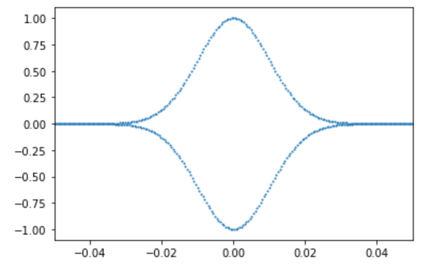

# Pythonでフーリエ変換

## はじめに

何かデータをフーリエ変換したくなることがある。例えば先生から「そのデータ、フーリエ変換してみたら？」と言われた時とか。なんとなくフーリエ変換がどういうものかは知っていて、PythonとかのライブラリにFFTがあるからデータを食わせればすぐ変換できるということも知っているが、なんとなく定義に自信が無い、そんな時もあるだろう。

そういう場合は、厳密にフーリエ変換がわかるような単純な系について実際にデータを食わせてみて、理論値と一致することを確認するのが望ましい。しかし、実際にやってみると「アレ？」と思うことが結構ある。以下ではPythonでFFTをする時の注意点等を紹介する。


## ガウス分布

### ガウス分布のフーリエ変換

まずはフーリエ変換の定義から確認しておこう。ある関数$f(x)$のフーリエ変換$\hat{f}(k)$は

$$
\hat{f}(k) = \int_{-\infty}^\infty f(x) e^{-ikx} dx
$$

で与えられる。逆変換と対称にするために$\sqrt{2\pi}$で割る流儀もあるが、工学で使うフーリエ変換では、フーリエ変換はそのまま、逆フーリエ変換に$2\pi$をつける流儀が多いと思われる。

簡単にフーリエ変換できて、かつそれなりに非自明な例としてガウス分布が挙げられる。こんな分布を考えよう。

$$
f(x) = \frac{1}{\sqrt{2 \pi \sigma^2}} \exp\left(- \frac{x^2}{2\sigma^2} \right)
$$

これは平均0、標準偏差$\sigma$であるようなガウス分布である。これをフーリエ変換しよう。定義につっこんで計算するだけだ。

$$
\begin{aligned}
\hat{f}(k) &= \int_{-\infty}^\infty f(x) e^{-ikx} \\
&=  \frac{1}{\sqrt{2 \pi \sigma^2}}  \int_{-\infty}^\infty\exp\left(- \frac{x^2}{2\sigma^2} \right) e^{-ikx} dx
\end{aligned}
$$

この計算にはちょっとした工夫が必要だ。まず指数関数の中身を平方完成する。

$$
- \frac{x^2}{2\sigma^2} - ikx = -\frac{1}{2\sigma^2}
(x + i\sigma k)^2 - \frac{\sigma^2 k^2}{2}
$$

上式の右辺第一項を指数の肩に乗せたものはガウス積分であり、$1/\sqrt{2\pi \sigma^2}$とキャンセルする。したがって最終的に

$$
\hat{f}(k) = \exp\left(- \frac{\sigma^2 k^2}{2}\right)
$$

つまり、ガウス分布をフーリエ変換したものは、規格化されておらず、かつ標準偏差が逆数になったようなガウス分布になる。つまり、実空間で「幅の広い」ガウス分布は、波数空間では「幅の狭い」ガウス分布になる(逆もまた然り)。

上記をPythonで確認してみよう。

### ガウス分布のFFT

Pythonでデータをフーリエ変換するのは簡単で、配列を`numpy.fft.ftt`に渡すだけで良い。まずはガウス分布を作ってみよう。

```py
import numpy as np
from math import sqrt, pi, exp
import matplotlib.pyplot as plt

N = 4096            # サンプル数
s = N/256           # 標準偏差

y = []
for i in range(N):
  x = i - N/2
  v = exp(-x**2/(2.0*s**2))/(sqrt(2*pi)*s)
  y.append(v)

plt.plot(y)
plt.xlim([N/2-100,N/2+100])
plt.show()
```

これは、データ点をN=4096とし、N/2を中心に、N/256=16を標準偏差とするガウス分布で、プロットするとこんな感じになる。


さて、配列`y`にデータが入っているので、フーリエ変換をするにはそれを`numpy.fft.fft`に突っ込めば良い。突っ込んだものを`fk`としてsその絶対値プロットしてみよう。

```py
fk = np.fft.fft(y)
plt.plot(np.abs(fk))
```

するとこうなる。


なんか変なデータになっていますね。これがどうなっているかを理解しちゃんと理論値と比較できるようになるのが本稿の目的だ。

まず、`numpy.fft.fft`が行うのは離散フーリエ変換(DFT)である。離散フーリエ変換では、配列のどのインデックスがどの座標に対応しているかを気を付けなければならない。

`fft`に一次元配列を渡すと、デフォルト(オプション無し)では、インデックス`i`と、座標`x`が等しいものとして計算される。したがって`x=i`である。

さて、N個のデータのDFTのデータは、やはりN個になるため、結果は要素N個の一次元配列となる。その順番と`k`の対応は`numpy.fft.fftfreq`にデータ点数を与えることで得られる。取得してプロットしてみよう。

```py
k = np.fft.fftfreq(N)
plt.plot(k)
```

すると、こんな感じになる。


kの取り得る値は-1/2から1/2まで1/N刻みであり、それが

$$
0, 1/N, 2/N, \cdots, 1/2, -N/2, -N/2 +1, \cdots, -1/N
$$

といった順番で並んでいることがわかる。一般にフーリエ変換はk=0付近にピークがあり、そこから離れると急激に振幅が小さくなる場合が多く、またkの正負で対称なので、最初の半分しかデータが必要がない。なので、フーリエ変換したデータの最初の半分だけを見ればよいことになる。

さて、フーリエ変換した配列のインデックスとkの関係がわかったので、それをx軸、y軸としてプロットすれば、ガウス分布になるはずだ。やってみよう。

```py
plt.xlim([-0.05,0.05])
plt.scatter(k,np.abs(fk),s=1)
```



ちゃんとガウス分布になった。

では、これが理論曲線に一致するか確認してみよう。理論曲線は以下の通りだった。

$$
\hat{f}(k) = \exp\left(- \frac{\sigma^2 k^2}{2}\right)
$$

これを重ねて表示してみよう。

```py
theory = [exp(-x**2*s**2/2.0) for x in k]  # 理論曲線
fig, ax = plt.subplots()
ax.scatter(k, np.abs(fk), s = 1, c = "red") # フーリエ変換
ax.scatter(k,theory, s = 1, c="blue")       # 理論曲線
plt.xlim([-0.1,0.1])
plt.show()
```

結果はこうなる。


赤がフーリエ変換の結果、青が理論曲線だ。高さとピーク位置はあってそうだが、分散がおかしいことがわかる。

こういう場合は変にがんばって検索するより、公式ドキュメントにあたった方が早い。[NumPy公式ドキュメントのFFTの説明](https://numpy.org/doc/stable/reference/routines.fft.html#module-numpy.fft)を読むと、DFTの定義は以下のようになっている(少しnotationを変えている)。

$$
A_k = \sum_{m=0}^{N-1} a_m
\exp\left(- 2 \pi i \frac{mk}{N} \right)
$$

これと連続版におけるフーリエ変換の定義を見比べよう。

$$
\hat{f}(k) = \int_{-\infty}^\infty f(x) \exp(-ikx) dx
$$

すると、連続版の$x$がDFTの$m$に、連続版の$k$は、DFTにおける$2\pi k/N$に対応することがわかる。先ほどの例では、単に$k/N$としてしまっていたため、波数空間の縮尺が$2 \pi$だけずれている。これを修正してみよう。

```py
theory = [exp(-(x*2*pi)**2*s**2/2.0) for x in k]  # xに2*piをかける　
fig, ax = plt.subplots()
ax.scatter(k, np.abs(fk), s = 1, c = "red") # フーリエ変換
ax.scatter(k,theory, s = 1, c="blue")       # 理論曲線
plt.xlim([-0.1,0.1])
plt.show()
```


めでたく一致した。