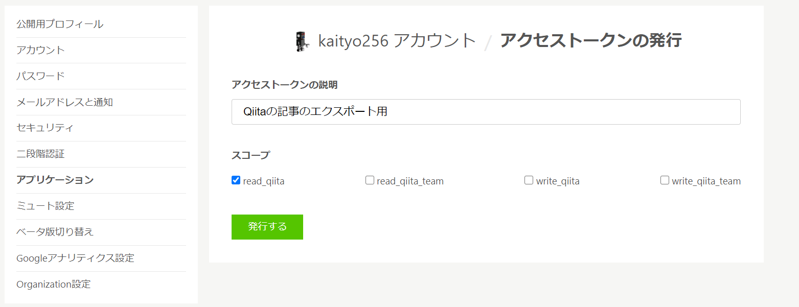

# Qiitaに投稿した記事をGitHub用にエクスポートする

## はじめに

Qiitaに投稿した自分の記事をエクスポートしたくなることって、たまにありますよね。~~Qiita運営が「ん？」と思うようなことをした時とか~~仕事が忙しい時とか。

で、せっかくならどこかに再アップしたいわけですが、どこにどうやって公開すべきかはちょっと悩ましい問題です。僕は、せっかくQiitaにはMarkdownで書いているのだから、そのままGitHubに上げてしまうことにして、そういうスクリプトを書きました。

コードはここに置いておきます。

[https://github.com/kaityo256/qiita_sync](https://github.com/kaityo256/qiita_sync)

また、このコードを使ってGitHubにアップロードした記事を以下に置いておきます。

[https://github.com/kaityo256/qiita](https://github.com/kaityo256/qiita)

## 思想

Qiitaの記事はAPIをたたけばすぐに落とせます。とりあえず記事一本にディレクトリ一つを対応させ、そこに記事と画像を保存したいわけですが、ディレクトリ名をどうするかを決めなくてはいけません。一つの方法はQiitaの記事のURLのハッシュ(`988bf94bf7b674b8bfdc`みたいな奴)を使うことですが、これだとどのディレクトリにどのファイルがあるか分かりづらく、特に続き物の記事(「その1」とか「その2」ついているやつ)がみづらいのがイヤです。かといって、ディレクトリ名を記事のタイトルにするのもちょっとなぁ、という感じです。結局「記事タイトル」と「ディレクトリ」の対応(ハッシュ)を人力で作ることにしました。

GitHubとQiitaの両方に記事がある場合、どちらを主にするかも考える必要があります。QiitaのAPIを通じて記事の投稿、修正もできるようなので、GitHubを主にして、更新分をQiitaに反映しても良いのですが、これだと

 * APIのトークンに書き込み権限をつけなきゃいけないのがなんかイヤ
 * Qiita側の「編集リクエスト」をどうするか考えないといけない

という理由から、「Qiitaを主、GitHubをバックアップ」とすることにしました。 

また、なるべく通信回数は減らしたいので、まずは必要なデータをごそっとローカルに取ってきて、それとローカルを比較して必要に応じて更新することにしました。

以上から、

* Qiitaから全記事データをごそっととってきてローカルに保存する (`qiita_get.rb`)
* 保存したデータとローカル状況を見て、更新が必要なところだけ更新する (`sync.rb`)

と、二つのスクリプトを作りました。

APIをたたくと、結果はJSONで返ってきます。そのまま使っても良いのですが、なんとなく必要なデータをYAMLにして保存し、そのYAMLデータを参照して更新することにします。

また、QiitaとGitHubはmakrdownの方言が違うので、Qiita→GitHubの方向で修正を入れます。

自分が書いたものだけを保存したかったので、コメントは保存しません。また、必要性を感じなかったのでタグも考慮していません。

## 使い方

まず、Qiitaのアクセストークンを取得します。[Qiitaの設定のアプリケーション](https://qiita.com/settings/applications)の「個人用アクセストークン」のところで「新しくトークンを発行する」をクリックします。読み込みしかしないので、スコープはread_qiitaだけで良いです。



発行したトークンは、発行時の一度しか閲覧できない(再閲覧できない)のでどこかに保存しておきましょう。

次に、環境変数を設定します。Qiitaのユーザ名と、先程取得したアクセストークンを、それぞれ`QIITA_USER`と`QIITA_TOKEN`という名前の環境変数に設定します。

```sh
export QIITA_USER=kaityo256
export QIITA_TOKEN=xxxxxxxxxxxxxxxxxxxxxxxxxxxxxxxxxxxxxxxx
```

2つの環境変数を設定した状態で、Qiitaのデータを取得したいディレクトリにて`qiita_get.rb`を実行します。

```sh
mkdir qiita
cd qiita
ruby qiita_get.rb
```

すると、Qiitaにある、QIITA_USERが投稿した全データが`qiita.yaml`というファイルに保存されます。なお、100本以上の記事がある場合は何回かにわけて保存します。QiitaのAPIにクエリを投げ、取得したJSONデータを`qiita?.json`というファイルに保存します。JSONには全データが保存されていますが、そのうち後で使う項目(title, body, created_at, updated_at, url)だけが`qiita.yaml`に保存されています。

次に、syncスクリプトを走らせます。

```sh
ruby sync.rb
```

このファイルは、`dirlist.yaml`というYAMLファイルを見て、記事のタイトルとディレクトリを関連付けます。もしファイルが無ければ初回実行時に作られます。中身はこんなファイルです。

```yaml
---
Pythonでフーリエ変換:
822823回マクロを展開するとGCCが死ぬ:
WindowsのVSCodeで__m256d型のインデックスアクセスにenumを使うと怒られる:
...
```

これはタイトルとディレクトリを結びつけるハッシュで、デフォルトではディレクトリが指定されていません。ここにディレクトリ名を指定すると、そのディレクトリに記事を展開します。例えば「Pythonでフーリエ変換」という記事を`python_fft`というディレクトリに保存したいなら、`dirlist.yaml`を修正し、

```yaml
---
Pythonでフーリエ変換: python_fft
822823回マクロを展開するとGCCが死ぬ:
WindowsのVSCodeで__m256d型のインデックスアクセスにenumを使うと怒られる:
```

と、記事のタイトルの値としてディレクトリ名を指定します。この状態でもう一度`sync.rb`を実行すると、「Pythonでフーリエ変換」の記事の内容を`python_fft`というディレクトリに保存してくれます。

```sh
$ ruby sync.rb
Create direcotry python_fft
https://qiita-image-store.s3.ap-northeast-1.amazonaws.com/0/79744/1551cc23-899c-089b-2335-1ab9700008f3.png
.png
(snip)
4-f517-bea7-4bba14ff5a37.png to python_fft/image13.png
Updated 1 article(s).
```

syncスクリプトは、記事タイトルとディレクトリ対応を見て、もしディレクトリが記述されていれば、更新の必要性をチェックします。

* ディレクトリが存在しない
* ディレクトリの中に`README.md`が存在しない
* ディレクトリが存在し、`README.md`も存在するが、`README.md`のタイムスタンプが記事の更新日時(updated_at)より古い

のいずれかの条件を満たした場合、更新の必要ありと判断します。そして、`qiita.yaml`に保存されている記事の中身(`body`)を`README.md`として保存します。また、その中で参照されている画像イメージは、「image?.拡張子」という連番の名前でダウンロードします。`dirlist.yaml`にディレクトリが指定されていない記事については無視されますので、一つ一つ指定しては`sync.rb`を走らせてみると良いと思います。

以後、Qiita側で更新があったら`qiita_get.rb`を実行してから`sync.rb`を実行すれば差分を更新してくれるはずです。実際にはGitで管理するでしょうから、`qiita_sync`はGitのsubmoduleとして使うと良いと思います。

## QiitaのMarkdownからの変換

MarkdownのQiita方言とGitHub方言(GitHub Flavored Markdown)はやや違います。それらを完全に吸収するわけではないのですが、少しだけ変換して保存します。

## 見出しの変換

Qiitaでは

```md
## 節1
...
## 節2
...
```

のように、レベル1の見出しを並べるのが一般的だと思います(多分)。しかしこのままでは、markdownlintが怒るのと、記事のタイトルを入れたいので、

```md
## タイトル
...
## 節1
...
## 節2
...
```

のように、レベル1でタイトル、残りは一個ずつレベルを下げます。

## コードブロック

Qiitaでは、コードブロックにファイル名を含めることができます。

```ruby
    puts "Hello"
    ```

しかし、GitHub Flavored Markdownではファイル名を入れられません。なので、以下の用にファイル名は削除しています。

    ```ruby
    puts "Hello"
    ```

## 画像の変換

Qiitaでは、アップロードされた画像は`amazonaws.com`に保存されますが、その際に

```md

```

のようにMarkdown形式で保存される場合と、

```html

```

のようにimgタグを使う場合があります。imgタグの場合にはサイズが指定されているので、それを保存するか迷ったのですが、ここではどちらもファイルをローカルにダウンロードしてMarkdown形式で保存しています。この際、`image1.png`のように、`image`+連番のファイル名で保存します。

## 数式の変換

数式は、`math`で指定されたものを`$$`に変換します。さらに`\begin{align}`を`\begin{aligned}`に変換します。GitHubでは、そのままでは数式は見えませんが、VSCodeのプレビューでは見えるので気にしないことにします(必要があればpandocとかで変換すれば良いし……)。

## ローカルデータの活用

ローカルに`qiita.yaml`という形で全データが入っているので、それを使っていろいろできます。例えば、[このリポジトリ](https://github.com/kaityo256/qiita)では、記事一覧を作るために以下のようなスクリプトを使っています。

```rb
## frozen_string_literal: true

require "yaml"
require "open-uri"
require "stringio"

def list_articles
  data = YAML.safe_load(File.open("qiita.yaml"))
  dirlist = YAML.safe_load(File.open("dirlist.yaml"))
  ss = StringIO.new
  # 作成日(created_at)でソート
  data.sort! { |a, b| b["created_at"] <=> a["created_at"] }
  data.each do |article|
    title = article["title"]
    next unless dirlist[title]

    dir = dirlist[title]
    created = Time.iso8601(article["created_at"])
    updated = Time.iso8601(article["updated_at"])
    url = article["url"]
    ss.puts "* [#{title}](#{dir}/README.md)"
    ss.puts "  * [Qiita](#{url})"
    ss.puts "  * 作成：#{created}"
    ss.puts "  * 更新：#{updated}"
  end
  ss.string
end

template = File.read("template.md")
articles = list_articles
template.gsub!("@articles", articles)
File.open("README.md", "w") do |f|
  f.puts template
end
```

単純に`qiita.yaml`と`dirlist.yaml`を読んで、記事を「作成日の降順」に並べるだけのスクリプトです。Qiitaの`created_at`や`updated_at`などの日時はISO 8601形式になっているので、Rubyなら`Time.iso8601`でパースすればTimeオブジェクトが得られます。別にISO 8601のまま表示してもよかったのですが、なんとなくRubyのTimeオブジェクトの`to_s`を使っています。

## まとめ

Qiitaの記事をGitHub用にエクスポートするスクリプトを作ってみました。自分で使ってる分には問題なさそうですが、凝ったMarkdownを書いたりしているとバグるかもしれません。ご利用は自己責任でどうぞ。

## 参考文献

RubyでQiita APIをたたくのに、以下の記事を参照しました。

* [Qiita API v2 で記事取得する (Ruby)](https://qiita.com/koshilife/items/0f50a6aaf4c87ca2021d)
