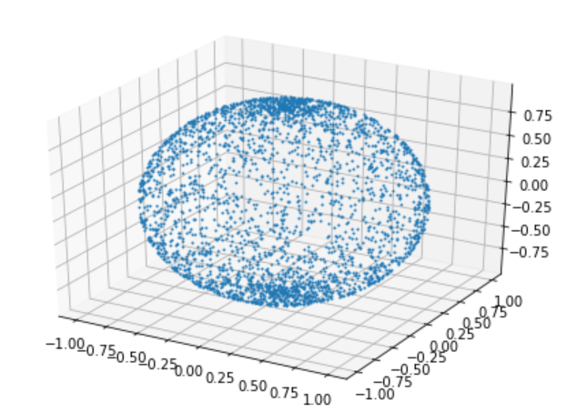
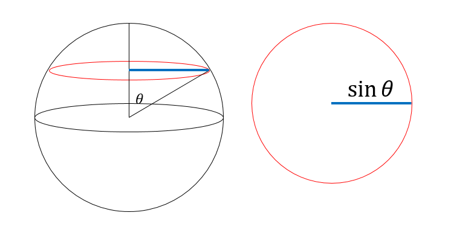
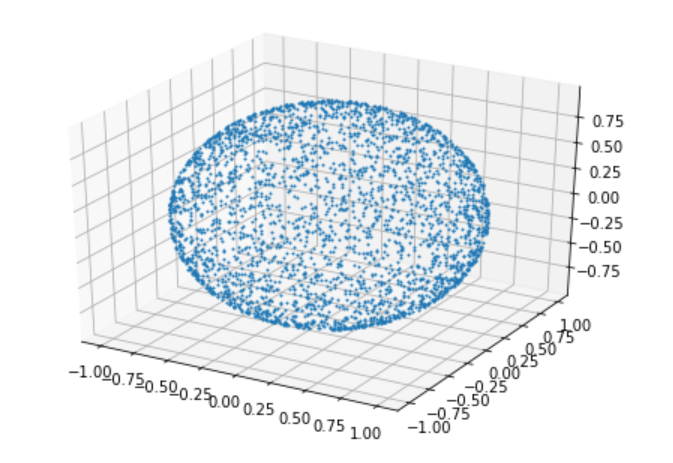
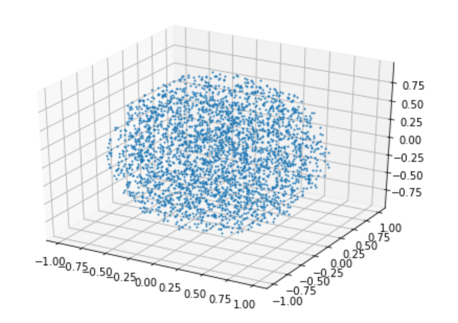

# 任意の確率密度を持つ乱数を作る

## TL;DR

確率密度$f(x)$に従う連続な確率変数$\hat{X}$を作るには、累積分布関数$F(x)$と$0 \leq \hat{R} < 1$の一様乱数$\hat{R}$を使って$\hat{X} = F^{-1}(\hat{R})$とすれば良い([逆関数法](https://ja.wikipedia.org/wiki/%E9%80%86%E9%96%A2%E6%95%B0%E6%B3%95))。

## はじめに

任意の確率密度分布を持つ確率変数を作りたい時があります。典型例が「球面上に一様に分布する点」を発生させる場合です。これは、例えば三次元空間上に速度の絶対値は同じだが向きをランダムに与えたい時なんかに必要です。

一般にプログラムで得られる(疑似)乱数は0から1の一様乱数です。本稿ではこれを使って任意の確率密度分布を持つ乱数を作る方法の説明と、いくつかの具体例を見てみましょう。

## 確率密度関数と累積分布関数

連続値を取る確率変数$\hat{X}$があるとします。この変数が$a$と$b$の間の値を取る確率が

$$
P(a \leq \hat{X} < b) = \int_a^b f(x) dx
$$

と書けるとき、$f(x)$を確率密度関数と呼びます。これは、範囲を狭めて

$$
P(x \leq \hat{X} < x+dx) \sim f(x)dx
$$

と書けば、「$\hat{X}$が値$x$付近の値を取る確率が$f(x)$に比例する」と読めます。そういう意味で、確率密度関数の意味はわかりやすいのですが、理論的、数値計算的には確率密度関数を積分した累積分布関数の方が使いやすいことが多いです。

累積分布関数の定義は以下の通りです。

$$
P(\hat{X} < x) = F(x)
$$

つまり、$F(x)$は確率変数$\hat{X}$が$x$より小さい値を取る確率です。確率密度関数を用いて書くと

$$
F(x) = \int_{-\infty}^x f(x) dx
$$

なので、累積分布関数は確率密度関数を積分したものになります。

たとえば、0から1までの一様乱数の確率密度関数と累積分布関数は、

$$
\begin{aligned}
f(x) &= 1 \\
F(x) &= x
\end{aligned}
$$

となります(ただし $0\leq x < 1$)。

## 証明

冒頭に書いたように確率密度$f(x)$を持つ確率変数$\hat{X}$を作るには、$0 \leq \hat{R} < 1$の一様乱数$\hat{R}$を累積分布関数の逆関数$F^{-1}(x)$を使って変換し

$$
\hat{X} = F^{-1}(\hat{R})
$$

としてやればOKです。これを証明するには、一様乱数から作った確率変数$\hat{X}$の累積分布関数が$F(x)$になることを示すか、逆に確率密度関数$f(x)$を持つ確率変数$\hat{X}$を、$\hat{R} = F(\hat{X})$と変換すると0から1までの一様乱数になることを示せばOKです。個人的には後者の事実の方が重要と考えますが、一応両方向で示しておきます。

## 証明(順方向)

0から1までの一様乱数$\hat{R}$を、累積分布関数$F(x)$の逆関数を使って変換し、新たな確率変数$\hat{X}$を

$$
\hat{X} = F^{-1}(\hat{R})
$$

によって作ります。この時、$\hat{X}$が、値$x$より小さい確率は[^3]

[^3]: ここで累積分布関数が一対一写像であることを仮定しています(要証明)。

$$
\begin{aligned}
P(\hat{X} < x) &= P(F^{-1}(\hat{R}) < x) \\
&= P(\hat{R} < F(x))
\end{aligned}
$$

一様乱数$\hat{R}$の累積分布関数$F_R(r)$は、

$$
F_R(r) \equiv P(\hat{R} < r) = r
$$

なので、

$$
P(\hat{R} < F(x)) = F(x)
$$

以上から、

$$
P(\hat{X} < x) = F(x)
$$

これは$\hat{X}$の累積分布関数が$F(x)$、つまり確率密度関数が$f(x)$になっていることを意味します。これが証明したいことでした。

## 証明(逆方向)

いま、確率密度$f_X(x)$を持つような確率変数$\hat{X}$が得られるとしましょう。この変数の累積分布関数は$F_X(x)$で、その定義は

$$
F_X(x) = P(\hat{X} < x)
$$

です。さて、この累積分布関数の逆関数$F_X(x)$を使ってこの確率変数を変換し、新しい確率変数$\hat{Y}$を作ってみましょう。

$$
\hat{Y} = F_X(\hat{X})
$$

累積分布関数の定義から $0 \leq \hat{Y} < 1$です。

この確率変数$\hat{Y}$が、$y$より小さい確率、つまり累積分布関数$F_Y(y)$は

$$
F_Y(y) = P(\hat{Y} < y)
$$

です。さて、$\hat{Y} = F_X(\hat{X})$だったので

$$
F_Y(y) = P(F_X(\hat{X}) < y)
$$

ここで、累積分布関数$F_X(x)$は単調増加関数なので、写像として可逆です[^2]。なので、$F_X(x) = y$なら、$x = F_X^{-1}(y)$が成り立ちます。なので、

[^2]: 厳密にはいろいろ言わないといけないけど面倒だから許して。

$$
P(F_X(\hat{X}) < y) = P(\hat{X} < F_X^{-1}(y))
$$

とできます。右辺は$\hat{X}$が$x=F_X^{-1}(y)$より小さい値を持つ確率なので、これは累積分布関数の定義そのものです。したがって

$$
P(\hat{X} < F_X^{-1}(y)) = F_X(F_X^{-1}(y)) = y
$$

以上から、

$$
F_Y(y) = y
$$

となりました。$0 \leq \hat{Y} < 1$でしたから、確率変数$\hat{Y}$は、0から1までの一様乱数になります。つまり、 **任意の確率密度を持つ確率変数を累積分布関数で変換してやると、0から1までの一様乱数になります**。

逆に0から1までの一様乱数を$F^{-1}(x)$で変換してやれば、確率密度関数$f(x)$を持つ確率変数を得ることができます。これが証明したいことでした。

## 例

## 球の表面に一様に分布する点

単位球の表面に一様に分布する点を作りたいとします。単位球の表面の座標は、二つの角度$\theta, \phi$を使って

$$
\begin{aligned}
x &= \sin{\theta} \cos{\phi}\\
y &= \sin{\theta} \sin{\phi}\\
z &= \cos{\theta}\\
\end{aligned}
$$

と書けます。よくある間違いは、$\theta$と$\phi$を、$0$から$2\pi$までの一様乱数に取ってしまうことです。やってみましょう。

```py
import numpy as np
import matplotlib.pyplot as plt
import random
from math import pi, sin, cos, sqrt
from mpl_toolkits.mplot3d import Axes3D

X = []
Y = []
Z = []
for i in range(3000):
  phi = random.uniform(0, 2*pi)
  theta = random.uniform(0, pi)
  X.append(sin(theta)*cos(phi))
  Y.append(sin(theta)*sin(phi))
  Z.append(cos(theta))

fig = plt.figure()
ax = Axes3D(fig)
ax.plot(X,Y,Z,marker="o",markersize=1,linestyle='None')
plt.show()
```

結果はこうなります。



北極と南極に点が多く、赤道付近に少ないことがわかります。

座標の変数を$\phi$と$\theta$に取った時、まず$\phi$は一様乱数にとってかまいませんが、$\theta$は違います。ある角度$\theta$を決めると、これは球面のうち半径$\sin{\theta}$の円になります。球面に一様に点を打つならば、この円周の長さに比例して点を打たなければなりません。



円周の長さは$\sin{\theta}$に比例するので、$\theta$の確率密度関数は

$$
f(\theta) = \frac{1}{2}\sin{\theta}
$$

です。ただし、規格化条件

$$
\int_0^\pi f(\theta) d\theta = 1
$$

を満たすように係数$1/2$を書けています。

累積分布関数は

$$
F(\theta) = -\frac{1}{2}\cos{\theta} + \frac{1}{2}
$$

となります。このような累積分布関数に従うように$\hat{\Theta}$を発生させるには、一様乱数$\hat{R}$を使って$\hat{\Theta} = F^{-1}(\hat{R})$とする必要があります。逆に、もし確率変数$\hat{\Theta}$が確率密度関数$f(\theta)$に従うならば、

$$
\hat{R} = -\frac{1}{2}\cos{\hat{\Theta}} + \frac{1}{2}
$$

として得られる新しい確率変数$\hat{R}$は0から1の一様乱数になります。

さて、もともと欲しかったのは$\theta$の値そのものではなく、例えば$z$座標である$\cos{\theta}$です。先ほどの式から、$\cos{\hat{\Theta}}$は-1から1までの一様乱数になることがわかります。つまり、-1から1までの一様乱数で$\hat{Z}$を作れば、$\hat{\Theta}=\cos^{-1}{\hat{Z}}$とした時、正しい確率密度で$\hat{\Theta}$を発生させたことになります。また、$\cos^2{\theta} + \sin^2{\theta} = 1$より、$\sin{\theta} = \sqrt{1-z^2}$として$\sin{\theta}$の値も求まります。

以上を実装するとこうなります。

```py
X = []
Y = []
Z = []
for i in range(3000):
  phi = random.uniform(0, 2*pi)
  z = random.uniform(-1,1)
  X.append(sqrt(1-z**2)*cos(phi))
  Y.append(sqrt(1-z**2)*sin(phi))
  Z.append(z)
```

実行結果はこんな感じです。



球面上に偏りなく点がばらけているように見えます。

## 単位球内に一様分布する点

単位球内に一様分布する点は、

* 半径$r (0<r<1)$を適切に決める
* 半径$r$の球面に一様に点を分布させる

という手順を踏めばOKです。半径$r$の球面に点を一様分布させるには、先ほどと同様に$\theta, \phi$を決めて、

$$
\begin{aligned}
x &= r \sin{\theta} \cos{\phi}\\
y &= r \sin{\theta} \sin{\phi}\\
z &= r \cos{\theta}\\
\end{aligned}
$$

として点の座標を決めればOKです。問題は$r$の分布です。一様分布させると、$r$の小さいところで点の密度が高くなってしまいます。

さて、半径$r$の球面の表面積は$r^2$に比例します。当然、点の数も$r^2$に比例して発生させる必要があります。なので、確率変数$r$の確率密度関数は規格化定数も含めると

$$
f(r) = 3 r^2
$$

となります。累積分布関数は

$$
F(r) = r^3
$$

です。これは、半径$r$以下の球には、点が$r^3$に比例して存在するよ、という意味なので、直観に合いますね。

逆関数は

$$
F^{-1}(r) = r^{1/3}
$$

です。したがって、0から1までの一様乱数$r$を使って、$r^{1/3}$を半径とすればOKです(半径のrと乱数のrが同じでややこしいですが、まぁ混乱しないでしょう)。

コードにするとこんな感じですかね。

```py
X = []
Y = []
Z = []
for i in range(3000):
  phi = random.uniform(0, 2*pi)
  z = random.uniform(-1,1)
  r = random.uniform(0,1)
  X.append(r**(1.0/3.0)*sqrt(1-z**2)*cos(phi))
  Y.append(r**(1.0/3.0)*sqrt(1-z**2)*sin(phi))
  Z.append(r**(1.0/3.0)*z)
```

実行結果はこんな感じです。



多分、単位球内に点が一様分布しています。

## 指数分布

単位時間あたり$\lambda$回発生する現象があるとします。いま、観測を始めてから、初めてその現象が起きるまでの時間の分布は、パラメタ$\lambda$に従う指数分布となります。指数分布の典型例は、放射性物質の崩壊確率です。他にも、一様に不純物がある媒体中で、光が散乱されずにどれだけ直進できるかといった分布も指数分布になります。

さて、指数分布に従うイベントをシミュレーションしたいとしましょう。指数分布$\lambda$に従うイベントが起きるまでの時間$\hat{T}$は確率変数となります。この時間が$t$より小さい確率が累積分布関数なので、指数分布の定義から

$$
P(\hat{T}< t) \equiv F(t) = 1 - \exp(-t/\lambda)
$$

となります。逆関数は

$$
F^{-1}(t) = -\lambda \log(1-t)
$$

なので、0から1までの一様乱数$\hat{R}$を用いて

$$
\hat{T} = -\lambda \log(1-\hat{R})
$$

とすれば、所望の確率変数が得られます。実用的には$1-\hat{R}$も$\hat{R}$も同じ分布なので、

$$
\hat{T} = -\lambda \log(\hat{R})
$$

とすることが多いです。

## まとめ

一様乱数から、任意の確率密度関数を持つ確率変数を作る方法を紹介しました。累積分布関数の逆関数を使うことから「逆関数法」という名前がついているようです。

球面に一様に分布する点を発生させる時、$z=\cos{\theta}$を一様乱数として作る方法はよく紹介されていますが、「なぜそれで良いか」の証明があまり見当たらなかったので書いてみました。「任意の確率変数を、その累積分布関数で変換すると0から1までの一様乱数になる」というのが本質です。

なお、確率変数が連続ではなく離散の場合は、[Walker's Alias法](https://qiita.com/kaityo256/items/1656597198cbfeb7328c)を使うのが簡単です。C++なら、`std::discrete_distribution`が(多分)Walker's Alias法で実装されているので、それを使うのが楽だと思います。
