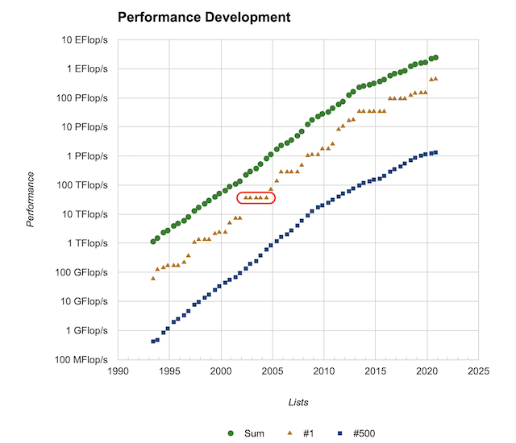

# スパコンの使いやすいさとは

どうも、ロボ太(kaityo256)です。趣味は他人のAdCを乗っ取ることです(乗っ取るとは言ってない)。これまでもスパコンポエムをいくつか書いてきましたが、せっかくスパコンポエムAdCがあるので一日お邪魔させてもらいます。

## スパコンランキング

スパコンにはTop500という有名なランキングがあります。HPLという、バカでかい連立一次方程式を解いて、その性能を競うものです。その名の通り、世界で上位500位までがランキングに入ります。6月と11月の年に二回開催され、ISCやSCという会議で発表されます。ずいぶん昔、「二位じゃダメなんでしょうか？」で有名になった事業仕分けにおいて、スパコンにおける一位とか二位というのは、狭義にはこのランキングでの順位を指しています。HPLがスパコンの性能評価として妥当かどうかについて、以前[ポエムを書いた](https://gist.github.com/kaityo256/ee7c29859591823d025fce18ccf461ef)のでそっちを参照してください。

さて、このランキングの良いところは、結構長い歴史があることです。Top500のサイトの[Performance Development](https://www.top500.org/statistics/perfdevel/)を見ると、性能の発展のグラフがあります。一番古いデータが1993年6月です。上から順番に、1位から500位までの合計の性能、1位の性能、500位の性能です。片対数グラフなので、概ね指数関数的に性能が向上していることが見て取れます。

さて、2002年6月から2004年6月にかけて、一位の変動がないところがあります。以下の赤で囲んだところです。



これは、あるシステムが5期連続で首位をキープしたことを意味します。また、直前のシステムからのギャップも大きいです。つまりこのシステムは、突然、それまで首位だったシステムに圧倒的大差をつけた性能でランキングに登場し、しばらく首位に君臨したことを意味します。このスパコンの名は「地球シミュレータ」。このシステムの登場は世界、特に米国に衝撃を与えました。昔、ソ連が人類初の人工衛星「スプートニク１号」の打ち上げに成功し、世界(特に米国)に与えた強い衝撃「スプートニクショック」になぞらえて、「Computonic shock」と呼ばれたほどでした。米国は、ハードウェアで優位にたった日本は、この性能を活かしてソフトウェアでも優位にたち、基礎研究から応用研究まで産業界に波及させることを狙うだろうと予測[^1]、急いで国立研究所のスパコンリソースを産官学に開放し、ハード・ソフトともにHPC技術の発展を目指すことになります。

[^1]: 米国のこの予測があたっていたのかどうかは、読者の判断におまかせします。

さて、地球シミュレータがランキングの首位から陥落したは2004年11月です。首位に立ったのはIBM のBlue Geneでした。これについてもいろいろ面白いことはありますが、それは誰かが書いてくれるでしょう。日本が次に首位を奪還するのは、2011年6月の「京」コンピュータです。前述の事業仕分けの他、いろいろドラマがあるのですが、それも誰かが書いてくれることでしょう。

さて、先程のグラフに戻りましょう。一位のグラフを見ると、地球シミュレータによる5期連続首位のフラットところが目立ちますが、他にもいくつかフラットなところがあります。これはしばらく同じスパコンが首位をキープしていることを示しています。特に、2013年6月から2015年11月までの6期の間、首位をキープしているマシンがあります。中国の天河二号です。天河二号に続いて神威・太湖之光が4期の間首位をキープし、2013年6月から２０１７年11月まで、実に10期5年の間、中国の計算機が首位をキープすることになります。

この天河二号に使われたのがIntel Xeon Phi (KNC)です。KNCは私も触ったことがありますが、使いこなすのがかなり難しい石で、なかなか性能が出せませんでした。これをもって、当時「中国は首位は取ったけれど、役に立たないスパコンを作った」という論調をわりと見かけました。

私自身、あるスパコンのイベントにおいて、中国のスパコンをどう思うかと聞かれ、KNCは使いこなすのが難しいと答えました。その時、「やはり中国のスパコンは使えない」という雰囲気になりそうだったので、「どうせスパコンは今後どんどん使いにくくなる。天河二号で鍛えられた研究者が、今後どんどん力をつけてくるだろう。そんななか、あまり『使いやすいスパコン』でプログラマを甘やかすのはどうだろうか？」と発言しました。この発言の意図についても、ここではさておきます。

さて、スパコン談義において、よく「使いやすさ」が話題になります。「使いやすさ」「使いにくさ」は、一般には主観的な指標ですが、「ピーク性能だけ(もしくはHPLの性能だけ)良いけど、一般のプログラムでは性能を出しづらい」というマシンを「使いにくい」と言うことが多いです。この「使いやすさ」についてちょっとだけ書いてみます。

## 使いやすさとB/Fと

スパコンは多くの要素から構成されています。CPU、GPUなどのアクセラレータ、メモリ、ネットワーク、ファイルシステム、冷却システムといったハードウェア面や、コンパイラ、ライブラリ、ジョブスケジューラなどのソフトウェア面まで様々です。ただ、狭義に「スパコンの使いやすさ」といった時、メモリバンド幅を指すことが多いです。

計算機とは、極限すれば「メモリからCPUにデータと命令を取ってきて、なんか計算して、結果をメモリに書き戻す」作業を繰り返すだけのデバイスです。したがって、CPUの計算が早いほど、メモリとCPUの間のデータ転送が早いほど計算が早くなります。しかし、CPUの計算能力の向上に比べて、メモリとCPUの間のデータ転送能力の向上はさほどでもなく、相対的にCPUから見てメモリが「だんだん遠く」なっていきました。

メモリバンド幅は、メモリとCPUのデータ転送能力(Bytes/s)をCPUの演算能力(FLOPS/s)で割った比、Bytes per FLOPS (B/F)で表すことが多いです。B/Fが大きいと、CPUの計算能力に比べてメモリバンド幅が大きいことになります。一般に、B/Fが大きいマシンが「使いやすいマシン」と呼ばれることが多いです。では、なぜB/Fが大きいマシンが「使いやすい」のでしょうか？

こんなコードを考えてみましょう。

```cpp
void func(double a[N], double b[N], double c[N])
for(int i=0;i<N;i++){
  c[i] = a[i] + b[i];
}
```

N次元のベクトルの足し算をするコードです。`double`型は8バイトなので、このコードではループ内で

* `a[i]`と`b[i]`を取ってくる(16 Byte load)
* `a[i] + b[i]`を計算する (1 FLOP)
* `c[i]`をメモリに書き戻す (8 Byte store)

を行うことになります。つまり、1回計算する間に24 Byteのメモリへの読み書きが発生するため、このループで計算機が忙しくする、つまり計算にメモリ転送が間に合うためには、B/Fが24なければいけません。一般のCPUのB/Fは0.5程度(いまはもっと少ない？)なので、このループを実行すると、CPUはほとんどメモリからのデータ待ちで遊んでしまうことになります。このように「素直に」書いたループは、高いB/F値を要求することが多く、低いB/F値のマシンでは全く性能が出ないことになります。

で、話は戻って「スパコンの使いやすさ」です。ここまで「メモリ」と言ってたのは主記憶と呼ばれるもので、一般にマザーボードに刺してるアレです。CPUからメモリが遠くなっていったので、CPUの近くに速いメモリを置く必要が出てきました。これが「キャッシュ」です。CPUコアから近い順にL1キャッシュ、L2キャッシュなどと呼ばれ、B/Fが高いほど容量が小さく、容量が大きくなるほどB/Fが小さくなる傾向にあります。それでも主記憶よりは圧倒的に速いので、主記憶のB/F値の低いマシンで性能を出そうとすると、B/F値が高い記憶領域であるキャッシュを有効活用するようにコードを書く必要があります。

さらに、近年はCPUコアが増えてきて、それぞれにキャッシュがついてたり、いくつかのコアでキャッシュを共有していたりと、CPU内部に構造や階層ができたりします。当然、それを意識してコードを書かなければ性能が出ません。要するに面倒くさいわけです。

B/F値が高いマシンは、低いマシンに比べてそのような苦労が減る「傾向」にあります。しかし、要求B/Fが4のコードを、B/Fが2のマシンで実行すると、どんなに頑張っても計算機のピーク性能の半分しか出ません。一般に高バンド幅のマシンといっても、世代を経るにつれてB/F値が下がっていく傾向にあるため、一度マシンのB/Fが要求B/Fを下回ってしまったら、後はもうメモリ律速になってしまうので、性能を出すためにはなんらかの「工夫」が必要になります。

結局のところ、今は高いB/Fで楽ができるとしても、将来素晴らしい技術革新がおきない限り、どこかで低B/F向けのコードないしスキームを開発する必要が出てくるわけで、結局それを今やるか、後回しにするかの違いなだけが気がします。

## 使いやすいスパコンを求めて

カタログスペックでスパコンの使いやすさを議論すると、どうしてもB/Fがどうとかこうとかいう話になりがちです。でも、実際に使ってみて思うのは、もちろん使いやすさはハードウェアの性能にも依存するけれど、それ以上に「情報の豊富さ」が重要だと言うことです。

例えばKNCは「使いにくいCPU」です。ですが、その「使いにくさ」が共有されています。ネットに、スレッドの同期が重いとか、FPUの性能が悪いとか、そういう情報が多数あります。なので、自分のコードの性能が悪い時に、自分が悪いのか、CPUが悪いのか、あとどれくらい頑張ればよいのかがそれなりに判断できました。より昔のマシンでは、Intel Itanium2という石がありました。これも賛否がわかれる(多くは否)石でしたが、やはり情報はかなりありました。特にIntelのSoftware Developer's Manualは非常に参考になりました。

一方、日本のスパコンはどうでしょうか？地球シミュレータは、稼働当初は鎖国政策を取りました。ネットワーク接続を許さず、オンサイトに行かなければジョブを投げることができない、そもそもコンパイルすらできない状況でした。そもそも地球シミュレータは、ユーザ数をかなり絞っており、アカウントを取得するのも大変でした。京コンピュータは情報がかなり制限されていた印象で、エラーメッセージで検索しても数件しかひっかからない、という状況でした。同じような悩みをかかえていた人がいたことが後でわかったこともありました。「情報がない」「ユーザが少ない」のは、プログラム開発において極めて厳しい制約となります。

そんななか、「地球シミュレータ」「京」に続いてTop500で首位を取った「富岳」は、開発当初から情報がかなり公開されている印象があります。アーキテクチャの詳細が[GitHub](https://github.com/fujitsu/A64FX)に公開されており、OSSである[XByak](https://github.com/herumi/xbyak)の[AArch64実装](https://github.com/fujitsu/xbyak_aarch64)を協力して開発するなど、[富士通のGitHubリポジトリ](https://github.com/fujitsu)からは、情報を公開しよう、オープンに開発しようという意思を感じます。

## まとめのようなもの

まったくまとまりのない文章となりましたが、とにかく言いたかったことは「開かれたスパコンこそ使いやすい」ということです。歴史を振り返ると、結局「使いやすいけど高い」マシンより、「安くて速い」マシンをがんばって使う傾向にあります。「安くて速い」マシンを「がんばって」使うためには、なによりも情報が重要です。

今後、富岳の話題がQiitaその他に投稿されたり、便利ツールやベンチマーク結果がどんどんGitHubに公開され、それを見て興味をもった若者が参入する、そんな未来が来ることを願っています。
