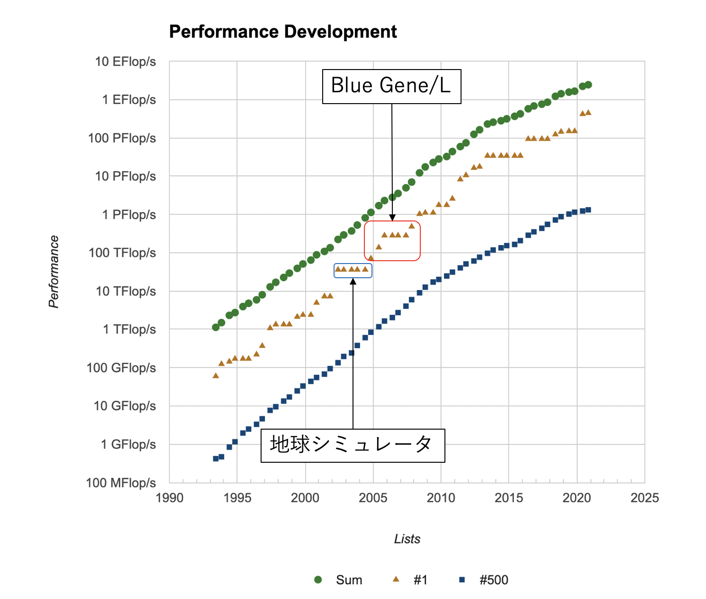

# スパコンポエムAdC2020 Day11 スパコンの信頼性について

どうも、ロボ太([kaityo256](https://qiita.com/kaityo256))です。趣味は他人のAdCを乗っ取ることです(乗っ取るとは言ってない)。おじさんが飲み会とかで昔話をするのはあまり好きではありませんが、こういう場で知っていることを書くのもおじさんの役目かな、と思って、京やBlue Gene/Lの信頼性についてつらつら書いてみます。

## スパコンの信頼性

言うまでもありませんが、スパコンは「スーパーコンピュータ」の略です。スーパーというからにはなんかすごいコンピュータなわけですが、昔はともかく、現代のスパコンの構成要素はほとんど普通のパソコンとかわりません。CPUがあり、メモリが刺さってて、ネットワークでつながっている、それだけです。では何が「スーパー」なのかと聞かれたら、僕は「ネットワークと信頼性」と答えます。

あるIT系の会社で、次のシステムに使う技術選定をしていた時にはすごくおとなしかった人が、予算の話になったとたんに俄然元気になって話に参加してきた、という話を聞いたことがあります。スパコンの技術に詳しくなくても、お金の話になるとわかりやすいのか、スパコンの予算についていろいろ議論したがる人は結構います。その人達がよくやるのが「計算ノード数」もしくは「性能」を「スパコンにかかった予算」で割って、性能あたりの値段を調べることです。そして通販サイトとかでXeonサーバの値段を比べて高いと感じることが多いようです。

開発費とかネットワークとかファイルシステムとか、スパコンが高くなる理由はいろいろあるのですが、わりと重要な性能に「信頼性」があります。例えば、京コンピュータがTop500で1位を取るにあたり、フルノード使ってHPLを30時間連続で計算しています。計算にはIOノードも含めて88128ノードが使われたため、ざっと300ノード年くらいの計算になります。この計算が完走するためには、ノードの平均故障確率が300年より十分長くなければいけません。京のCPUの年間平均故障率は0.06%だったそうで[^sc15]、京のCPUはおよそ1600年に一度壊れていた計算になります[^FIT]。これは他のスパコンに比べてもかなり信頼性の高いシステムです。京はこの信頼性のために様々な工夫がなされていますが、個人的に大きいと思ったのが冷却水の温度の低さです。京は水冷ですが、各筐体に供給される冷水の温度はかなり低めでした[^temp]。京の信頼性の高さはあまり話題になることが少ないのですが、こういうところにもコストはかかっている、ということはもう少し知られてもいいのかな、という気がします。

[^FIT]: 10億(10^9)時間における故障数(いわゆるFIT)が72だったそうです。10^9/72/24/365〜1585年となります。

[^sc15]: [理研のSC15のポスターより](https://www.r-ccs.riken.jp/en/topics/Long+term+failure+analysis.html)

[^temp]: 水温は知識としては知っているのですが、なんか温度を書いてる公開資料がすぐ見つからなかったのでぼかしています。

さて、スパコンの信頼性を語るにあたり、故障と並んでもう一つ欠かせない要素があります。宇宙線によるビットエラーです。本稿ではそのあたりの話をします。

## Blue Gene/L

スパコンの性能ランキングであるTop500のサイトの[Performance Development](https://www.top500.org/statistics/perfdevel/)を見ると、性能の発展のグラフがあります。上から上から順番に、1位から500位までの合計の性能、1位の性能、500位の性能で、横軸が年、縦軸が性能(対数)です。地球シミュレータが突然二位のマシンに大きな性能差をつけてトップに躍り出て、そのまま5期連続トップを維持したのは[以前の記事](https://qiita.com/kaityo256/items/a98cc311a504751b08a9)でも書きました。その後のグラフはフラットになっていませんが、実は7期連続で1位になっているマシンがあります。IBMのBlue Gene/L (以下BG/L)です。

BG/Lは米国ローレンス・リバモア国立研究所(Lawrence Livermore National Laboratory、LLNL)に設置され、2004年11月に70.72 TFを記録、地球シミュレータを抜いて1位となると、そこから徐々にラック数を増やしていき、最終的に2007年11月に478 TFに到達します。次の2008年6月にロスアラモス国立研究所(Los Alamos National Laboratory, LANL)に設置された、やはりIBMのRoadrunnerに抜かれるまで、7期連続で1位を堅持したことになります。ちなみにLLNLとLANLはHPC業界では有名な研究所で、それぞれ強力なチームを抱えていますね。

さて、このBG/Lですが、システムを見るといろいろ「割り切った」設計になっています。

* 「メモリが基盤に直付けになっている」 普通、基盤はDIMMスロットを用意し、DRAMをそこにさしてつかいます。メモリはよく壊れる部品なので、そうすれば壊れたメモリだけ交換できるというメリットがありますが、「そうやって抜き差しするような場所は故障しやすいから」という理由(多分)で、BG/Lはメモリが直接ハンダ付けされています。メモリが壊れたら基盤ごと交換になりますが、ノード数が多いBG/Lではそのほうが良いと判断されたのでしょう。
* 「計算ノードのOSがマルチユーザをサポートしない」非自明な並列計算をする時、必ず同期が必要になります。その際、各ノードで計算時間が揺らいでしまうと、同期のときに一番遅いプロセスをみんなで待たなければなりません。特にOSによる「ノイズ」をOSジッタと呼びます。BG/LではOSジッタをへらすため、OSの機能はかなり限定されていました。
* 「計算ノードのOSが仮想メモリをサポートしない」これもわりとびっくりします。普通のOSはユーザに直接メモリを見せず、論理メモリと物理メモリの空間を分けます。これにより、物理上では不連続なメモリを連続なメモリとして見せることができるなどのメリットがありますが、その分ページのキャッシュを扱ったりと面倒なことが増えます。BG/Lは仮想メモリをサポートしないので、生のメモリ空間がそのまま見えます。
* 「**CPUのL1キャッシュがECCを持たない**」 個人的に一番驚いたのがこれです。これについて詳述します。

## メモリのエラー訂正

スパコンの信頼性を語るにあたり、故障と並んでもう一つ欠かせない要素に計算ミスがあります。コンピュータはたまに計算ミスをします。原因は宇宙線です。宇宙線とは宇宙を飛び回る高エネルギーの粒子で、地球にも常時降り注いでいます。国立科学博物館には「霧箱」が常設展示されています。「霧箱」は文字通り霧が立ち込めた箱で、見ていると飛行機雲のような軌跡が「スッ」っと出現しては消えていきます。これが宇宙線の軌跡です。

宇宙線は大気その他にぶつかると大量の中性子を放出し、その中性子が半導体のビットを反転させることがあります。特にメモリにおいてビットエラーを起こすため、多くのメモリにはエラー訂正回路がついています。これをECC (Error-correcting code)と呼び、ECCがついているメモリをECCメモリと呼びます。ECCメモリでは、64ビットあたり1ビットのエラーは訂正し、2ビットのエラーは検出のみする、という仕組みを備えており、64ビットの記憶ビットに対して7ビット程度の検査ビットを使います。したがって、ECCをつけると、実際にメモリに搭載されているビット数の1割くらいが検査に使われることになるため、記憶容量においても、転送速度においてもかなりのコストがかかります。実際、宇宙線によるエラーの影響は小さいシステムなら大きくないこともあり、ECCをつけない、という選択肢もありえます。「スパコンの父」クレイがCDC 6600にECCを付けない理由を問われ、「パリティは農夫のためのものだ(Parity is for farmers)」と答えた(らしい)のは有名な話です[^cray]。また、GPUも、下位モデルはECCがついていません。ビットエラーが起きたとしても、一瞬だけ画面が乱れるだけなのでつけなくて良い、という判断です。もちろんGPGPUとして計算する場合は計算ミスが起きると困るので上位モデルにはECCがついており、その分高価になります。

[^cray]: クレイは次のシステムにはECCをつけたため、「多くの農夫がコンピュータを持ったのだろう(More farmers have computers now)」と皮肉られたという続きがありますが、こちらの出典は不明瞭であり、信憑性が低いように見えます。

BG/Lは、主記憶やL3にはECCをつけましたが、L1キャッシュにはECCをつけないという選択をしました。つけないといっても、全くチェックしないわけではなく、1ビットエラーを検出するだけになっています(通常は1ビットエラーは訂正、2ビットエラーは検出)。とにかく1ビットでも反転したら訂正できないのでそのままシステムはクラッシュです。当時、BlueGene/Lを導入したローレンス・リバモア国立研究所のマニュアル[^manual]によると、 フルノード(20万コア)で計算すると平均的に6時間に一度程度、宇宙線によるL1のビットエラーで計算がクラッシュする、と試算されています。 これに対してユーザは、3つの手段を取ることができました。

[^manual]: 昔は[ここ](https://asc.llnl.gov/computing_resources/bluegenel/basics/)にあったのだが、今見たらリンク切れてますね。

1. 諦める： フルノードで6時間程度なので、例えば1万コア使って計算しても、平均故障間隔は120時間程度。なので、そのまま計算して死んだら諦める、というのは現実的な選択でした。
2. メモリ保護モードを使う： BlueGene/Lには「write throughモード」が用意されていました。これはL1のビットエラーをL3を使って回復するモードだったようです。ユーザは何もしなくて良いですが、10%から40%程度の性能にペナルティがあったようです。ちなみにBG/LはL2が貧弱で、キャッシュというよりは、コヒーレンシの確保のために使われていたっぽいですね。
3. 例外を受け取ってユーザ側でなんとかする： L1がビットエラーの検出をした時、OSが例外を飛ばすモードです。例外を受け取ったらユーザ側がなんとかします。

通常は「諦める」か、性能劣化が許容範囲内であればwrite throughモードを使っていたようですが、BG/Lのフルノードで長時間計算し、 2007年のGordon Bell (BG)賞を受賞したリバモアのチームは「例外を受け取ってユーザ側でなんとかする」方法を選択しました。そもそも1か2しかなかったところ、LLNLのチームの要望により例外モードが追加された、という話を聞いたことがあります(真偽不明)。

具体的にはメモリの一部にチェックポイントデータを置いておき、例外を受け取ったら最寄りのチェックポイントから計算をリスタートする、というコードを書いたようです。このチームのメンバーの話を聞いたことがありますが、プログラムのどの場所で例外が来ても 大丈夫なように組むのが大変だったと言っていた記憶があります。GB賞の[受賞論文](https://dl.acm.org/doi/10.1145/1362622.1362700)によると、プロダクトランでは79回のパリティエラーを検出したが、ソフトウェア的に回避したそうです。

BG/LがL1にエラー訂正を意図的につけなかったのか、それとも、組み込み向けの石を流用したので付けられなかったのかはよくわかりませんが、後継機であるBG/PにはL1にもエラー訂正がついた(らしい)のを見ると、ユーザからは不評だったのかもしれません。

## まとめのようなもの

GB/Lは電力性能がよく、さらに全体の通信のバリア同期が高速であるなど、全体のシステムとしてはかなり高いレベルでバランスの取れたシステムになっていますが、それを実現するために随所に割り切りが見られます。特にCPUとして非力なPowerPCを使ったり、ノードあたりのメモリが小さかったり、OSの機能が限定されていたりと、一般にユーザから見れば「使いづらい」選択がなされています。

ユーザにスパコンへの要望を聞くと、「ノードあたりの計算性能が高く、メモリバンド幅が高く、メモリ搭載量が大きい」、一言でいうと「Fatなノード」を嗜好する傾向にあります。これは、なるべく分散メモリ並列なプログラムを書きたくない、もっといえばMPIを使いたくない、ということだと思います。ディレクティブでなんとななる(こともある)共有メモリ並列に比べて、MPIによる分散メモリ並列は、ほぼ「プログラム書き直し」といって良いくらいの手間がかかるため、その気持ちはよくわかります。

BG/Lは、計算機屋さん(特にハード屋さん)やOS屋さんから「素晴らしいシステムだ」という評価はわりと聞きました。しかし、ユーザサイドから「使いやすい」という評価は聞いたことがありません[^user]。OSの機能が貧弱であるために、普通にコードを移植すると動かないコードも結構あったようですし、IBMによるコンパイラの最適化能力も決して高いものではなかったようです[^IBM]。しかし、BG/Lは商業的には成功したと言って良いレベルで売れたようです。計算機屋さんが「俺たちは良いシステムを作った。あとはユーザの仕事だ」といった設計思想が見える気がします(実際どうだったかは知りません)。こういうのを見ると、コデザインとはどうあるべきか、いろいろ考えてしまいますね。

[^user]: 僕自身は使ったことはなく、聞いたユーザ数も少ないですが。

[^IBM]: 僕自身IBMのC++コンパイを使ったことがありますが、あまり賢くなかった印象があります。また、「IBMの対応は素晴らしかった」とフォローはいれつつ、コンパイラにぶちぶち文句を言ってる論文を読んだ記憶があります。
