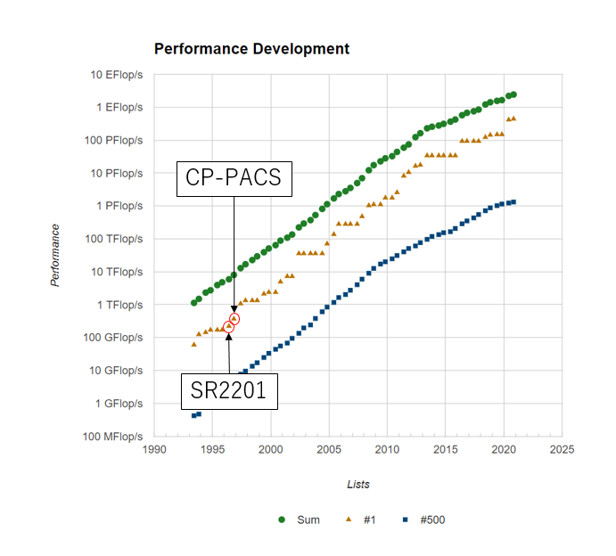

# スパコンポエムAdC2020 Day11 CP-PACS

どうも、ロボ太([kaityo256](https://qiita.com/kaityo256))です。趣味は他人のAdCを乗っ取ることです(乗っ取るとは言ってない)。スパコン昔話を聞きたい若人がいるようなので、CP-PACSの話をしようと思います。

## 私とCP-PACS

僕がスパコンを使い始めたのは2001年4月からで、マシンは物性研究所にあったSGI Origin 2000でした。当時僕はD1でしたが、博士論文を書くにあたり計算資源が足りなくなって来ました。そこでD2の時に筑波大学で稼働していたCP-PACSに利用を申請します。利用はすぐに認められたのですが、CP-PACSは使うのがかなり難しいマシンで、なかなかプロダクトランが走らず、まともに使えるようになったのはD3の頃でした。ちなみにD3の時に地球シミュレータを使うプロジェクトに参加させていただいたのですが、D論執筆で忙しく、あまり使えないままプロジェクトが終わってしまったのはとても残念でした[^es]。地球シミュレータは使いこなせませんでしたが、CP-PACSではプロダクトランが走るようになり、CP-PACSを使った[論文](https://doi.org/10.1103/PhysRevE.69.045103)も出版されました。本稿では、CP-PACSについて少し紹介することにします。

[^es]: この時のくやしさは長く尾を引き、後に「京」を使うために転職をすることになります。

## CP-PACS

CP-PACSは筑波大学と日立が共同で開発した計算機です。筑波大学の研究者と日立の技術者がかなり突っ込んだ議論をして開発したようで、その時の熱い思いが[CP-PACS記念冊子](https://www2.ccs.tsukuba.ac.jp/cppacs/kinenshi/)にまとめられています。また、ハードウェアの性能諸元は[ここ](https://www2.ccs.tsukuba.ac.jp/cppacs/cppacs-j.html)にまとまっています。いくつか抜粋します。

* プロセッサ：PA-RISC 1.1というスカラーチップを使いつつ、「疑似ベクトル化」を採用することで主記憶アクセスのレイテンシを隠蔽し、ベクトル機に近い使い勝手を実現していました。
* ネットワーク：CP-PACSはノードを3次元的に結合していましたが、現在良く使われるトーラス/メッシュ型ではなく、ハイパークロスバーネットワーク(後述)を組んでいました。
* ディスクシステム： 3次元的に組んだネットワークの端の面に、多数のディスクがぶら下がっていました。これも非常に特徴的なシステムでした(後述)。

プロセッサは一つあたり300 GFで、これが8x16x16の形に結合し、全体で2048プロセッサという、当時としてはかなり大きなシステムを組み、総理論演算性能は614 GFでした。

CP-PACS計画で開発されたシステムは日立からSR2201として商用化され、1996年6月のTOP500で一位となります。次いでCP-PACSがフル稼働し、同年11月のTOP500で一位となりました。そのあとはASCI Red、ASCI Whiteとアメリカのマシンが一位となり、2002年に6月に地球シミュレータが衝撃のデビューをするのは[以前書いた](https://qiita.com/kaityo256/items/a98cc311a504751b08a9)通りです。

さて、CP-PACSのプロセッサについての記事はわりと見つかるのですが、ネットワーク、特にディスク周りの記述が少ないので、本稿ではそのあたりを紹介します。

## クロスバースイッチとは

