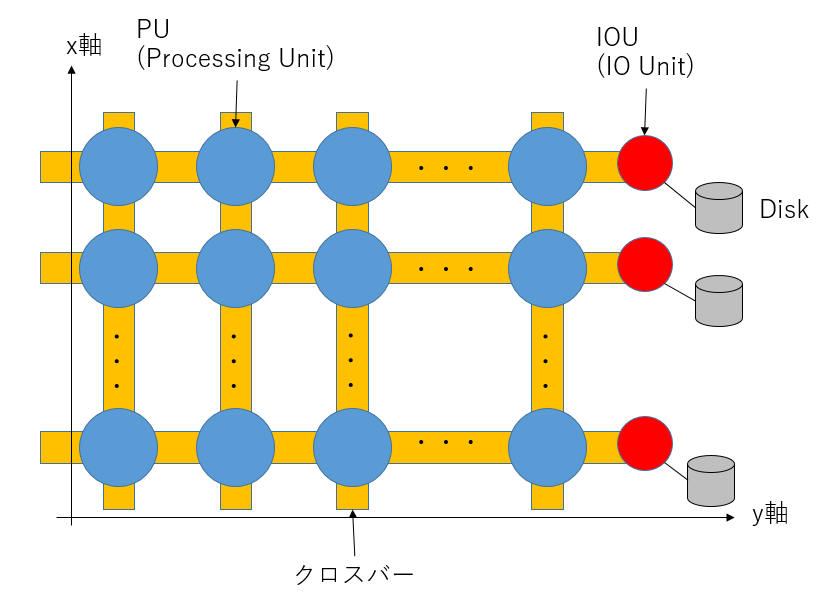

# スパコンポエムAdC2020 Day19 CP-PACS

どうも、ロボ太([kaityo256](https://qiita.com/kaityo256))です。趣味は他人のAdCを乗っ取ることです(乗っ取るとは言ってない)。スパコン昔話を聞きたい若人がいるようなので、CP-PACSの話をしようと思います。

## 私とCP-PACS

僕がスパコンを使い始めたのは2001年4月からで、マシンは物性研究所にあったSGI Origin 2000でした。当時僕はD1でしたが、博士論文を書くにあたり計算資源が足りなくなって来ました。そこでD2の時に筑波大学で稼働していたCP-PACSに利用を申請します。利用はすぐに認められたのですが、CP-PACSは使うのがかなり難しいマシンで、なかなかプロダクトランが走らず、まともに使えるようになったのはD3の頃でした。ちなみにD3の時に地球シミュレータを使うプロジェクトに参加させていただいたのですが、D論執筆で忙しく、あまり使えないままプロジェクトが終わってしまったのはとても残念でした[^es]。地球シミュレータは使いこなせませんでしたが、CP-PACSではプロダクトランが走るようになり、CP-PACSを使った[論文](https://doi.org/10.1103/PhysRevE.69.045103)も出版されました。本稿では、CP-PACSについて少し紹介することにします。

[^es]: この時のくやしさは長く尾を引き、後に「京」を使うために転職をすることになります。

## CP-PACS

CP-PACSは筑波大学と日立が共同で開発した計算機です。筑波大学の研究者と日立の技術者がかなり突っ込んだ議論をして開発したようで、その時の熱い思いが[CP-PACS記念冊子](https://www2.ccs.tsukuba.ac.jp/cppacs/kinenshi/)にまとめられています。また、ハードウェアの性能諸元は[ここ](https://www2.ccs.tsukuba.ac.jp/cppacs/cppacs-j.html)にまとまっています。いくつか抜粋します。

* プロセッサ：PA-RISC 1.1というスカラーチップを使いつつ、「疑似ベクトル化」を採用することで主記憶アクセスのレイテンシを隠蔽し、ベクトル機に近い使い勝手を実現していました。
* ネットワーク：CP-PACSはノードを3次元的に結合していましたが、現在良く使われるトーラス/メッシュ型ではなく、ハイパークロスバーネットワーク(後述)を組んでいました。
* ディスクシステム： 3次元的に組んだネットワークの端の面に、多数のディスクがぶら下がっていました。これも非常に特徴的なシステムでした(後述)。

プロセッサは一つあたり300 GFで、これが8x16x16の形に結合し、全体で2048プロセッサという、当時としてはかなり大きなシステムを組み、総理論演算性能は614 GFでした。

CP-PACS計画で開発されたシステムは日立からSR2201として商用化され、1996年6月のTOP500で一位となります。次いでCP-PACSがフル稼働し、同年11月のTOP500で一位となりました。そのあとはASCI Red、ASCI Whiteとアメリカのマシンが一位となり、2002年に6月に地球シミュレータが衝撃のデビューをするのは[以前書いた](https://qiita.com/kaityo256/items/a98cc311a504751b08a9)通りです。

さて、CP-PACSのプロセッサについての記事はわりと見つかるのですが、ネットワーク、特にディスク周りの記述が少ないので、本稿ではそのあたりを紹介します。

## クロスバー接続

CP-PACSはノード間通信にハイパークロスバーネットワークという特徴的なネットワークを採用しています。

## クロスバーとは

クロスバーネットワークとは、スイッチとしてクロスバースイッチを利用するものです。クロスバースイッチとは、もともと機械式の電話交換機のために考案されたもので、以下の図のように「バー」が交差(クロス)していることからクロスバーと呼ばれます。

クロスバースイッチの特徴は、ネットワークに属すどの二つの要素が同時に通信しても、(通信相手がかぶらない限り)通信経路が独立になることです。上図ではAと3、Bと2を同時につなぐ例を出していますが、入力のA, B, C, Dと、出力の1, 2, 3, 4をどのように組み合わせても、通信経路は干渉しません。

スパコンのノードを全て一つのクロスバースイッチで結合させると、システムの任意のノード間に専用線があるように見えます。グラフで言えば全結合ネットワークになります。このように、システムに所属する全てのノードが一つのクロスバースイッチで結合している状態を単段クロスバー、もしくはフルクロスバーと呼びます。

また、ノード数が増えてくると、一つのスイッチに全てのノードをぶら下げることができなくなります。この時、クロスバースイッチを多段にして、木構造を作るネットワークをFat Treeと呼びます。特に、スイッチの下流と上流のポート数が同じになるように組むと、ネットワークに所属する任意のノード間の通信バンド幅が同じになり、全結合ネットワークになります。

さて、並列計算において、「システムに所属するノードを二つのグループにわけて、お互いに通信する」という通信パターンが頻出します。典型的にはFFTや、領域分割による境界領域の通信などでこのパターンが出てきます。

フルクロスバー、もしくはFat Treeで繋がってるネットワークは、ノードをどのように分割しても通信路が干渉しません。また、ネットワークが全結合なので、スケジューラを組むのが容易になります。一般にネットワークはFat Treeで組めるならFat Treeで組んでおけば(お金はかかりますが)面倒事は少なくなります。

さて、フルクロスバーもしくはFat Treeによる接続は性能的には非常に素晴らしいのですが、配線がノード数の二乗に比例して必要になります。当然、通信ポートの数も多数必要になるため、ノードの数を増やしづらい(スケールしない)、ノード数が増えると高価になる、電力もすごく食う、といった問題点があります。そこで、Fat Treeよりも少ない配線でネットワークを組みたくなります。

一番単純な考え方は、ノードを格子状に配置し、隣接するノードのみを接続することです。ただ隣接するノードをつないだものをメッシュ、一番端と端もつないで全てループ状にしたネットワークをトーラスと呼びます。

上の図では一次元のメッシュとトーラスを表示していますが、二次元なら正方格子上に、三次元なら立方格子上にノードを配置することで、高次元のメッシュ/トーラスネットワークを構築できます。また、メッシュとトーラスは混在できます。「京」コンピュータは6次元の立方格子状にネットワーク組んでいますが、そのうち3次元がメッシュ(端と端がつながっていない)、3次元がトーラス(端と端がつながっている)構造になっています。

さて、メッシュやトーラスネットワークでは、クロスバーによる接続に比べて配線数が少なくて済むというメリットがありますが、通信パターンによっては同じ経路を複数のノードが同時に利用するため、回線が混むことがあります。

例えば4つノード(A, B, C, D)をこの順番で1次元トーラス状に接続した場合、(A, B)(C, D)という通信や、(A, D)(B, C)という通信では通信経路が重なりませんが、(A, C)(B, D)というパターンの通信では、別のノードを経由する必要があるため、通信経路に重なりが出てしまいます。これを輻輳と呼びます。

単純領域分割による並列計算ではノードの通信相手が固定しているため、ノードと計算領域をうまく対応させることで輻輳を減らす(無くす)ことができますが、FFTの場合は通信相手が変わるためにどうしても輻輳が発生し、通信効率が下がってしまいます。したがって、全系でFFTをしたい地球シミュレータなどではフルクロスバー接続を採用しました。

ネットワークをFat Tree以外で組むのは結構大変です。Fat Treeならネットワーク的には全結合なのでさほど面倒なことはおきません。しかし、それ以外のネットワークを組むと、どのようにルーティングするか、どこを太くしてどこを細くするかなどいろいろ考えなくてはなりません。そのあたりがHPCベンダーの腕の見せどころになります。

僕が知っている、Fat Tree以外のネットワークを組めるHPCベンダーは、

* SGI(現HPE)のエンハンストハイパーキューブネットワーク
* Cray(現HPE)のドラゴンフライネットワーク
* 富士通のTofu (3次元メッシュ+3次元トーラスの6次元ネットワーク)

くらいです。他にもあるのかもしれませんが、私は知りません。

## ハイパークロスバー

通信のことを考えるならフルクロスバーが良いですが、コストがかかり過ぎます。一方でトーラスで組めばコストは抑えられますが、通信パターンに強い制約がかかります。そこで、CP-PACSはハイパークロスバーという、トーラスとフルクロスバーの間のような接続方法を採用しました。

CP-PACSは、2048個のノード(CP-PACSではプロセッサーユニット、PUと呼ぶようですが、本稿ではノードと呼ぶことにします)を、8x16x16の3次元格子状に配置してあります。各ノードには(x, y, z)座標が付与されており、0≦x≦7、0≦y, z≦15です。y軸にはIOノードもあるので、全体としては8x17x16の形になっています。

さて、CP-PACSでは、「同じx座標を持つノード」「同じy座標を持つノード」「同じz座標を持つノード」については単段のクロスバーで接続し、そのグループそれぞれを別のクロスバーで接続する、という多段のネットワークを組みました。図示が非常に難しいのですが、とにかくあるノードから見て、自分とx, y, z座標のいずれかが同じノードに対しては必ず1ホップで接続でき、一番遠いノード間でも3段のクロスバーを経由して通信することができます。詳しいネットワークの様子は[筑波大公式サイト](https://www2.ccs.tsukuba.ac.jp/cppacs/architecture-j.html#anchor817540)の図を見てください。

このx, y, zのクロスバーは、それぞれ半分に切り離して運用することができました。これにより、システムを最大8分割して使うことができます。システムは2048 ノードですから、256 ノードがジョブの最小単位となります。

こうして、CP-PACSは高いネットワーク性能を低コストで実現しました。プロセッサの理論ピーク性300 MFに対して、メモリバンド幅は1200 MB/s、つまりB/F値は4でした。さらにリンクあたりの通信性能は300 MFあり、計算性能、メモリ転送性能、通信性能が 1:4:1という、[朴先生曰く](https://www2.ccs.tsukuba.ac.jp/cppacs/file/kinenshi/kinenshi-9.pdf)理想的なバランスを実現していました。

## ファイルシステム

CP-PACSは、ノードを8x16x16という三次元格子上に配置していましたが、実際のネットワークは8x17x16という形になっていました。y軸の17段目にあるのはIOをつかさどるユニットです。そして、y軸の端っこにはディスクがぶら下がっていました。

ここからはあまりネットに情報がなく、私のうろ覚えの記憶で書くので間違ってたらすみません。

CP-PACSのy軸の端の断面には、ディスクが8x16の形でぶら下がっており、同じx,z軸を持つノードからのみ見えるようになっていました[^heta]。

[^heta]: 図が下手ですみません。

(x, y, z)座標にあるnode_x_y_zというノードからは、(x, 17, z)座標にあるdisk_x_zというディスクが見える、というイメージです。

このディスクは、ステージングに使われるローカルディスクのような役割を果たしていました。ステージングに使われるストレージは、各ノードからそれぞれ独立に見えるようにするのが一般的ですが、CP-PACSでは、x, z座標を共有する16ノードが一つのディスクを共有しており、かつそれぞれのディスクがログインノードにマウントされているのが特徴的でした。

CP-PACSのログインノードのストレージ(つまり/home)の容量は極めて小さく、原則としてCP-PACSにぶら下がっているローカルディスクでファイルを読み書きする必要がありました。しかし、ステージングなんて機能はないため、プログラマはジョブスクリプトで環境変数を調べて、自分のジョブがどこにディスパッチされたかを確認し、それを自分のコードに教えてファイルを読み書きする必要がありました。要するにステージングを手で書いていた、ということです。

もう時効だと思うので懺悔しますが、当時その仕組みを知らなかった私は、256並列ジョブを流して全ノードから/homeに一気にファイルを書き込んで容量を使い切り、後続のジョブを流れなくしてCP-PACSを事実上しばらく止めてしまったことがありました(土下座)。

## まとめのようなもの

非常に特徴的なネットワークを持つマシン、CP-PACSの思い出話を書いてみました。

CP-PACSは、自分でステージングを書く必要があったり、そもそもデフォルトでコンパイラにパスも通ってないなど、「使いこなせる奴だけが使えれば良い」という「一見さんお断り」な雰囲気がありましたが、知れば知るほど「良く作ったな」という感じの、非常に特徴的なマシンでした。

僕がCP-PACSでプロダクトランを流し始めたのは2003年の頃で、CP-PACSがTOP500で一位を獲得した1996年から、既に7年の月日が流れていました。僕が当時やっていた計算は、ベクトル機が苦手とするイベントドリブン型の分子動力学シミュレーションであり、さらに自明並列を使っていたので、CP-PACSの「良いところ」はほとんど活用していません。しかし、それでも当時256並列のジョブがすいすい流れる環境というのはとても貴重で、おかげで無事にD論を書くことができた、思い出深いマシンです。
