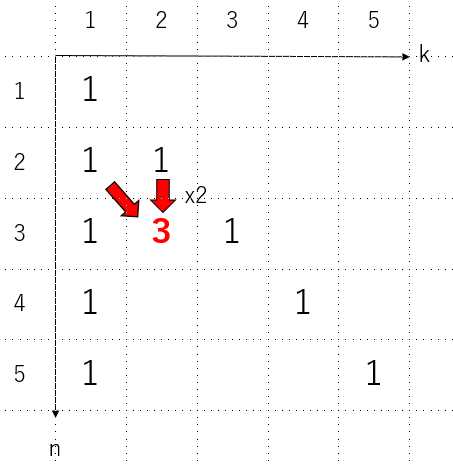
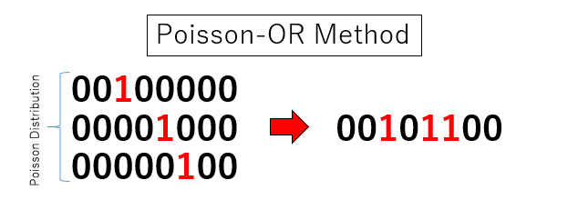

# 第二種スターリング数の指数型母関数表示とその応用

## はじめに

スターリング数(Stirling Number)というものをご存知でしょうか。組み合わせの問題なんかによく顔を出します。この記事では、第二種スターリング数の指数型母関数表示についての説明と、それを使った、ある証明について紹介します。

## 第二種スターリング数

$n$個の区別できる要素を、$k$個の区別できないグループにわけることを考え、そのやり方の数を$S(n,k)$とします。ただし、要素が含まれないグループを作ってはいけません。例えば、A,B,Cの三つの要素を二つのグループに分ける場合、要素が含まれないグループは作れないので2つと1つに分けることになりますが、要素は区別するので、「どれを仲間外れにするか」で三通りの分け方があります。具体的には[(A,B),(C)],[(B,C),(A)],[(C,A),(B)]となります。したがって、$S(3,2) = 3$です。この$S(n,k)$を **第二種スターリング数(Stirling number of the second kind)** と呼びます。

すぐわかる$S(n,k)$の性質として、$n=k$の時には、要素を一つずつばらすしかないので一通り、つまり$S(n,n)=1$です。また、グループが一つしかない場合にも、分け方は一通りしかないので$S(n,1)=1$が成り立ちます。要素を一つも含まないグループを作ってはいけないという制約から、グループの数は要素より多くてはいけません。つまり$n \geq k$です。

次に、漸化式を考えてみましょう。$n$個の要素を$k$のグループに分けるやり方$S(n,k)$を数えてみます。一つずつ要素をグループに分けていって、最後に$n$個目をわけたときにグループが$k$個できた状態を考えます。その$n$個目を入れる直前の状態は、グループが$k$個できているか、$k-1$個だったかのどちらかです。つまり、$S(n,k)$は

1. $n-1$個の要素が$k$個のグループに分かれている状態で、$n$個目がそのどれかに入るやりかた
2. $n-1$個の要素が$k-1$個のグループに分かれている状態で、$n$個目が$k$個目のグループに入るやりかた

の和でかけます。前者は$k$通りあるので、以下の漸化式を得ます。

$$
S(n,k) = S(n-1,k-1) + k S(n-1,k)
$$

これと、先ほどの条件$S(n,1)=1$、$S(n,n)=1$から、すべての$S(n,k)$が芋づる式に求まります。これらの条件を使って、$S(n,k)$の「表」を作ってみましょう。

まず、$S(n,1)=1$なので、$k=1$のところはすべて$1$です。さらに、$S(n,n)=1$なので、対角要素もすべて$1$です。こんな感じになります。

次に、漸化式を使います。$S(n,k)$は、$S(n-1,k)$つまり「上」の値と、$S(n-1,k-1)$つまり「左上」の値から求まります。例えば$S(3,2)$は、

$$
S(3,2) = S(2,1) + 2 S(2,2)
$$

です。この時、左上の数はそのまま足し、上からくる分は$k$がかかります。

あとは順番に表を埋めていけば、すべての$S(n,k)$の値を求めることができます。

## 第二種スターリング数の一般解と指数型母関数表示

さて、天下りですが、第二種スターリング数$S(n,k)$の一般解は

$$
S(n,k) = \frac{1}{k!}
\sum_{j=0}^n (-1)^{k-j}
\begin{pmatrix}
k\\
j
\end{pmatrix}
j^n
$$

で与えられます。ただし、${}^t (k,j)$は二項係数です。これを代入すれば、先の漸化式を満たすことを確認できます。構成法から$S(n,k)$は一意に決まるので、これが解であることが確認できます。

第二種スターリング数は、下降階乗冪というものの級数を使った表示で定義することができ、それが母関数となっているのですが、ここでは指数型母関数表示を求めてみましょう。指数型母関数$G(x)$とは、

$$
G(x) = \sum_{n=0}^\infty S(n,k) \frac{x^n}{n!}
$$

と書けるような関数です。これまた天下りですが、$(\mathrm{e}^x - 1)^k$を展開してみましょう。二項係数の公式から、

$$
(\mathrm{e}^x - 1)^k = \sum_{j=0}^k (-1)^{k-j}
\begin{pmatrix}
k\\
j
\end{pmatrix}
\mathrm{e}^{jx}
$$

となります。これを、両辺$x$で$n$回微分して、$x=0$を代入しましょう。

$$
\left.
\left(\frac{d}{dx}\right)^n
(\mathrm{e}^x - 1)^k
\right|_{x=0} =
\sum_{j=0}^k (-1)^{k-j}
\begin{pmatrix}
k\\
j
\end{pmatrix}
j^n
= k! S(n,k)
$$

ここから、第二種スターリング数の指数型母関数

$$
\frac{1}{k!} (\mathrm{e}^x-1)^k = \sum_{n=0}^\infty S(n,k) \frac{x^n}{n!}
$$

が求まりました。

## ポアソン分布＋論理和法の独立性の証明

何かの数列について証明したいことがある時、母関数表示を使うと証明がきれいに通ったりして気持ちがいいです。ここでは第二種スターリング数の指数型母関数表示を使って、ポアソン分布＋論理和法というアルゴリズムで作られたビット列の各ビットが1になる確率が独立であることを証明します。

まず、ポアソン分布＋論理和法というのは、それぞれのビットが確率$p$で1になるようなランダムなビット列を作るためのアルゴリズムです。具体的には、$N$ビットのうち、ランダムに1ビットだけ立っているビット列を$n$個、論理和をとります。ただし、論理和をとる個数$n$は、パラメータ$\lambda$のポアソン分布に従う確率変数とします。

こうして作られたビット列の、任意のビットが$1$になる確率が$p = 1-\exp(-\lambda/N)$であることを示すことができます。詳しくは[こちらの記事](https://qiita.com/kaityo256/items/99efbe7ae9786d0f4351)を参照してください。

しかし、我々が欲しかったのは、それぞれのビットが **独立に** 確率$p$で1となるようなビット列です。あるビットが$1$である、という事象が、別のビットが$1$となる確率に影響を与えてはいけません。例えば、各ビットだけを見ると$1$になる確率が$p$になるけれど、それぞれのビットが独立でないようなビット列の構成法を考えることができます。

具体例を挙げましょう。いま、それぞれのビットが独立に確率$0.5$で立っているような2ビットのビット列が欲しいとします。この時、二つのビット列$10$と$01$を確率1/2で返す関数を作ったとしましょう。各ビットだけを見ると、確率$0.5$で1となります。しかし、この方法では、片方のビットが1の時、必ず残りのビットが0になります。すなわち、それぞれのビット列は独立ではありません。

さて、ポアソン分布＋論理和法で作られたビット列の、各ビットが1になる事象が独立であることを証明しましょう。いま、あるビット列$s$を考えます。$s$はビットの並びが固定されている特定のビット列です。ポアソン分布＋論理和法で、このビット列$s$が得られる確率を$P(s)$としましょう。ビット列$s$のうち、立っているビットの数を$k$とします。ビット列$s$の、各ビットが確率$p$で **独立に** 1になる場合、$P(s)$は、

$$
P(s) = p^k (1-p)^{N-k}
$$

とならなければなりません。逆に、これが満たされていれば、各ビットが1もしくは0となる事象が独立であることがわかります。すなわち、この関係式が満たされることは、ビット列$s$の各ビットが確率$p$で独立に$1$となっていることの必要十分条件です。

さて、$N$ビットのうち、一つだけビットが立っているようなビット列$n$個について論理和をとった結果、このビット列$s$が得られるのは何通りでしょうか。これは、区別できる$n$個の要素を、**区別できる** $k$個のグループに分けるやり方なので、第二種スターリング数を用れば$k! S(n,k)$通りであることがわかります。また、$N$ビットのうち、一つだけビットが立っているようなビット列$n$個の作りかたは$N^n$個あります。以上から、$n$個のビット列の論理和をとった結果、特定のビット列$s$が得られる確率$P_n(s)$は

$$
P_n(s) = \frac{k!S(n,k)}{N^n}
$$

です。さて$n$は、パラメタ$\lambda$のポアソン分布に従う確率変数でした。従って、$n$という値をとる確率は$\lambda^n \mathrm{e}^{-\lambda}/n!$です。$P_n(s)$を、この重みをつけてすべて和をとったものが$P(s)$ですから、

$$
\begin{aligned}
P(s) &= \sum_{n=0}^{\infty} P_n(s) \frac{\lambda^n \mathrm{e}^{-\lambda}}{n!} \\
&= \mathrm{e}^{-\lambda}
k! \sum_{n=0}^{\infty} S(n,k) \frac{(\lambda/N)^n}{n!}
\end{aligned}
$$

ここで、指数型母関数表示から、

$$
\sum_{n=0}^{\infty} S(n,k) \frac{(\lambda/N)^n}{n!}
= \frac{1}{k!} \left(\mathrm{e}^{\lambda/N}-1\right)^k
$$

これを代入すると、

$$
P(s) = \mathrm{e}^{-\lambda}\left(\mathrm{e}^{\lambda/N}-1\right)^k
$$

ポアソン分布＋論理和法では、$\lambda = -N \log(1-p)$とするので、それを代入して整理すると、

$$
P(s) = p^k (1-p)^{N-k}
$$

これが求めたい式でした。

## まとめ

第二種スターリング数の指数型母関数を求め、それを使ってポアソン分布＋論理和法で得られるビット列の、各ビットが1になる事象が独立であることを証明しました。母関数表示を使うと証明がきれいに通るので気持ちがいいですね。なお、急いで書いたので計算ミスや記号ミスがあるかもしれませんので注意してください。

## 参考文献

以上の導出は以下の論文のAppendixにあります。ただし、論文の都合上、スターリング数を一般的な表記$S(n,k)$ではなく、$S(k,n)$としているので注意してください。ちなみにこの証明を考えたのは僕ではなくおおむね共著者さんです。

1. H. Watanabe, S. Morita, S. Todo, and N. Kawashima, [J. Phys. Soc. Jpn. 88, 024004 (2019)](https://doi.org/10.7566/JPSJ.88.024004)
