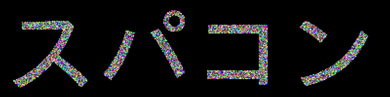
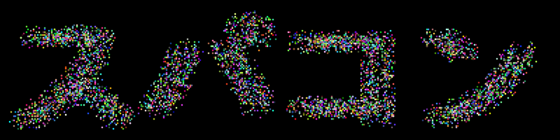
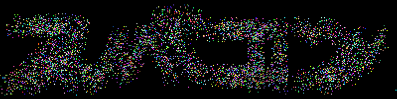
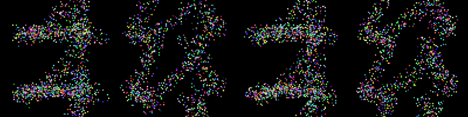
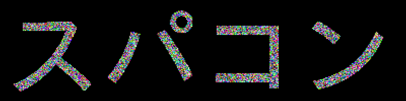
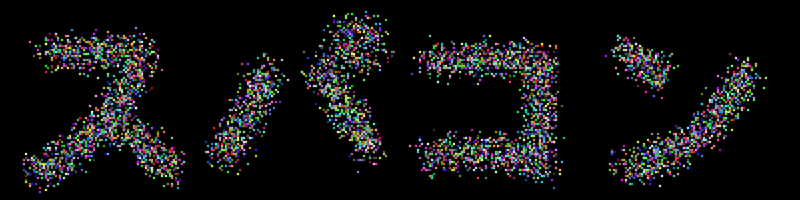
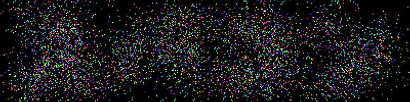

# 分子動力学法で一瞬文字が浮かび上がるアニメーションを作る

## はじめに

分子動力学法で粒子を動かして文字が一瞬浮かび上がるアニメーションを作ります。分子動力学法といっても粒子間の相互作用は考えません。

具体的には、こんなアニメーションを作ります。

Ballistic版


Diffusion版


ソースは以下に置いておきます。

[https://github.com/kaityo256/stringtext](https://github.com/kaityo256/stringtext)

## 方針

とりあえず文字を描きます。RubyならCairoを使うのが楽でしょう。やり方は「[スパコンの落とし方](https://qiita.com/kaityo256/items/5f2a05e07a13d8d067a8)」と同じです。もしCairoが入ってなければいれます。

```sh
 sudo gem install cairo
```

あとは適当な大きさのキャンバスに適当なフォントで文字を描画します。「スパコン」ならこんな感じでしょうか。

```rb
require 'rubygems'
require 'cairo'
format = Cairo::FORMAT_RGB24
width = 400
height = 100
surface = Cairo::ImageSurface.new(format, width, height)
context = Cairo::Context.new(surface)
context.set_source_rgb(0, 0, 0)
context.rectangle(0, 0, width, height)
context.fill
context.set_source_rgb(1, 1, 1)
context.select_font_face('Meiryo')
context.move_to(5,90)
context.font_size = 96 
context.show_text('スパコン')
```


さて、文字をラスタライズできたので、これを粒子の座標として取り出します。`surface = Cairo::ImageSurface.new`で取り出した`surface`の`surface.data`が0かどうかを見てやれば、そこに点があるかどうか調べることができます。

注意点としては、`surface.data`は`String`なので、整数と比較するためには`ord`を読んでやる必要があります。こんな感じです。

```rb
  height.times do |y|
    width.times do |x|
      i = x + y * width
      next if surface.data[i*4].ord ==0
      # 粒子の追加処理
    end
  end
```

これで粒子の座標を取り出してしまえば、あとは好き放題すれば良いと思います。

## 分子動力学シミュレーション

## Ballistic版

まずは単純に、全ての粒子に等速直線運動をさせてみましょう。アニメーションGIFにしたときに、ループさせたいので、適当なステップ後にもとの場所に戻ってきて欲しいですね。

高さ100、幅400ピクセルのイメージを考えましょう。アニメーションは200フレームとします。周期境界条件を考えると、200ステップで、x座標は400、y座標は100の整数倍進めば元の場所に戻ってくることになります。

というわけで、x方向の速度vxは、-4, -2, 2, 4の4種類からランダムに選ぶことにしましょう。また、y座標は -2, -1.5, -1.0, -0.5, 0.5, 1.0, 1.5, 2.0の8種類からランダムに選ぶことにします。いずれも200倍すると、x座標は400の、y座標は100の整数倍になるので、もとの場所に戻ってくることになります。ついでに色もランダムに変えておきましょう。`Particle`構造体でも作って、その配列を作ることにしましょう。

```rb
Particle = Struct.new(:x, :y, :vx, :vy, :r, :g, :b)
```

```rb
  height.times do |y|
    width.times do |x|
      i = x + y * width
      next if surface.data[i*4].ord ==0

      vx = [-1, 1, -2, 2].sample
      vy = [-1, 1, -0.5, 0.5, -0.25, 0.25, 0.75, -0.75].sample
      r = rand
      g = rand
      b = rand
      atoms.push Particle.new(x, y, vx, vy, r, g, b)
    end
  end
```

最初は「スパコン」の文字が表示されています。



これが徐々に崩れていきます。






あとは、最初から文字が見えるとつまらないので、少しインデックスをずらしてファイルを作成すれば完成です。

```sh
iter = 200
iter.times do |i|
  index = (i + 108) % iter
  filename = format("img%03d.png", index)
  puts filename
  step(atoms)
  save_png(filename, atoms)
end
```

さて、この方法は楽ちんですが、全ての粒子が等速直線運動をして、かつその速度ベクトルのバリエーションが少ないため、何度か変な模様が出現してしまいます。たとえばタイミングによってはこんな感じに「あ、文字が隠れてるな」ということがわかってしまいます。




これを防ぐため、違う方法も考えてみましょう。

## Diffusion版

先ほどは等速直線運動をさせましたが、次はランダムウォークをさせましょう。しかし、ループさせたいので、要素の和が0となるような配列を作り、それを各ステップの速度にしましょう。

なんでも良いのですが、単純に半分-2, 半分2となる配列を作ってシャッフルしましょうか。

```rb
steps = 200
$a = Array.new(steps) do |i|
  if i < steps/2
    2
  else
    -2
  end
end
```

この配列をそれぞれの粒子の`vx`、`vy`配列にシャッフルして渡します。

```rb
  height.times do |y|
    width.times do |x|
      i = x + y * width
      next if surface.data[i*4].ord ==0

      vx = $a.shuffle.dup
      vy = $a.shuffle.dup
      r = rand
      g = rand
      b = rand
      atoms.push Particle.new(x, y, vx, vy, r, g, b)
    end
  end
```

あとは毎ステップ、`x, y`に`vx[i], vy[i]`を足してやるだけです。`vx`、`vy`の和はゼロなので、必ず戻ってきます。

最初は「スパコン」の文字が表示され、それが徐々に崩れていくのは同じです。



これが徐々に崩れていきます。




崩れ方は等速直線運動よりゆっくりです。また、拡散で広がっていくので、もっとも広がった状態でも、まだにじんだ文字が見えてしまっています。



## まとめ

分子動力学法により、一瞬文字が浮かび上がるアニメーションGIFを作ってみました。なぜこんなものを作ろうと思ったかは内緒です。

工夫すれば、次々と文字が浮かび上がってメッセージになったりとかできるのでいろいろ遊んでみてください。
