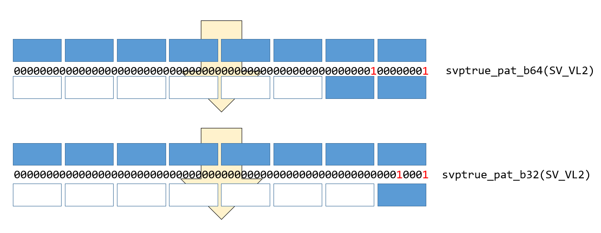

# ARM SVEの組み込み関数を使う（その２）


みなさん、山に登っていますか？＞直喩

ARM SVEの組み込み関数の使い方の解説を続けます。

* [その１：プレディケートレジスタ](https://qiita.com/kaityo256/items/71d4d3f6b2b77fd04cbb)
* [その２：レジスタへのロード](https://qiita.com/kaityo256/items/ac1e84f1c79fdf478630)←イマココ
* [その３：gather/scatter](https://qiita.com/kaityo256/items/7ced2749875e2bab89e6)
* [その４：水平演算](https://qiita.com/kaityo256/items/3d9767ed41fa450a4fe8)

コードを以下に置いておきます。まだ開発中なので、記事を書きながら修正していくと思います。

[https://github.com/kaityo256/sve_intrinsic_samples](https://github.com/kaityo256/sve_intrinsic_samples)

コンパイルコマンドが長いので`ag++`という名前でaliasを張っています。詳細は「その１」を見てください。

## メモリからレジスタへのロード

SIMDを使うためには、メモリからSIMDレジスタにデータを複数もってこないといけません。その際、あちこちからいっきに持ってきたり、持ってくるデータをマスクで選んだりといろいろありますが、とりあえずもっとも単純に、メモリ上に連続で並んでいるデータをごそっとレジスタに載せるコードを書いてみます。

x86なんかでは、SIMDレジスタに載せるための型として`__m256d`などとビット数があらわにが用意されていましたが、SVEではSIMD幅が規定されないため、`svfloat64_t`のように、boostの`float64_t`みたいな型に`sv`という接頭辞がついた形で表現されます。ちなみにC++に`int32_t`みたいに`float64_t`のような型を入れる話があったようなのですが、まだ入っていないようです。`arm_sve.h`をインクルードすると`float64_t`等が使えるようになります。

`double`に対する一番簡単なロード(LD1, unextended load)は、こんな形で書けます。

```cpp
svfloat64_t svld1_f64(svbool_t pg, const float64_t *base);
```

上記のようにSVEの組み込み関数は、sv + アセンブリ + ＿型名という形を取ります。最後の「＿型名」はdisambiguatorと呼ばれ、なくても動作するのですが、型が確定しているならつけておいた方が無難です。

上記の`svld1_f64`は、

* `base`の指すメモリから
* `svncntd()`が返す数だけ(A64fxは512ビットなので8個)
* `float64_t`型のデータを
* プレディケータ`pg`でマスクした上で

取ってきて、`svfloat64_t`型の変数として返してくれます。ストア(ST1, unextended store)も全く同様です。これを使って、`svfloat64_t`型変数の中身を表示する関数を作っておきましょう。

```cpp
void svshow(svfloat64_t va){
  int n = svcntd();
  std::vector<double> a(n);
  svbool_t tp = svptrue_b64();
  svst1_f64(tp, a.data(), va);
  for(int i=0;i<n;i++){
    printf("%+.7f ", a[n-i-1]);
  }
  printf("\n");
}
```

この関数は、`svfloat64_t`型の変数を受け取り、その中身をダンプする関数です。`std::vector<double> a`に`svst1_f64`でストアすることでダンプしています。ベースとなるポインタは、`a.data()`で取れます。本当は`vector`の型として`double`ではなく`float64_t`を使うべきなのかもしれませんが、`arm_sve.h`をインクルードしていないところでは`float64_t`が使えないので、とりあえず`double`を使うことにします。

## 単純ロード

まずはすごく単純に、8個ならんだ`double`をSIMDレジスタに読み込んでみましょう。「1,2,3,4,5,6,7,8」と並んだデータを持つ`std::vector<double>`を作り、それを全部trueのプレディケータを使って`svfloat64_t`型の変数`va`にロードしています。それを先ほど作った`svshow`関数に食わせてみます。

```cpp
void load(){
  int n = svcntd();
  std::vector<double> a(n);
  for(int i=0;i<n;i++){
    a[i] = (i+1);
  }
  svbool_t tp = svptrue_b64();
  svfloat64_t va = svld1_f64(tp, a.data());
  std::cout << "va = " << std::endl;
  svshow(va);
}
```

これをmain関数から呼ぶコードを書いて、実行してやるとこんな感じになります。

```sh
$ ag++ test.cpp
$ qemu-aarch64 ./a.out
va =
+8.0000000 +7.0000000 +6.0000000 +5.0000000 +4.0000000 +3.0000000 +2.0000000 +1.0000000
```

確かに「1,2,3,4,5,6,7,8」というデータを読み込むことができました。

## マスク付きロード

次に、プレディケータでマスクをかけてみます。分かりやすくするために、1,2,3,4,5,6,7,8というデータを、一つは全部trueのプレディケータで、もう一つは`SV_VL2`を指定したマスクをかけてロードし、それぞれ表示してみましょう。

```cpp
void load_pat(){
  int n = svcntd();
  std::vector<double> a(n);
  for(int i=0;i<n;i++){
    a[i] = (i+1);
  }
  svbool_t tp = svptrue_b64();
  svfloat64_t va = svld1_f64(tp, a.data());
  svbool_t tp2 = svptrue_pat_b64(SV_VL2);
  svfloat64_t vb = svld1_f64(tp2, a.data());
  std::cout << "va = " << std::endl;
  svshow(va);
  std::cout << "vb = " << std::endl;
  svshow(vb);
}
```

`va`は全部trueのプレディケータを使って、`vb`は下位から2つだけビットが立っているプレディケータを使ってロードしたものです。実行結果はこうなります。

```txt
va =
+8.0000000 +7.0000000 +6.0000000 +5.0000000 +4.0000000 +3.0000000 +2.0000000 +1.0000000
vb =
+0.0000000 +0.0000000 +0.0000000 +0.0000000 +0.0000000 +0.0000000 +2.0000000 +1.0000000
```

`va`は8つの要素がロードされましたが、`vb`は下位から2つだけ要素がロードされたのがわかると思います。

## マスク付きロード(失敗)

SIMDレジスタ型は`_f64`といった型の指定がありますが、プレディケータを表す型は`svboot_t`であり、型の指定がありません。その代わり、`svptrue`に`_b8`とか`_b64`といった接尾辞がついています。「その１」で説明したように、これは「何ビットごとに1を立てるか」を表しています。なので、ロードする型と対応しないプレディケータを使うと動作がおかしくなります。

先ほどと同様、下位から二つ要素を持ってくるために、`SV_VL2`を指定したプレディケータを作ったとしましょう。しかし、持ってくるデータは`double`(`float64_t`)なのに、`svptrue_pat_b32`と、対応しないビット数のプレディケータを作ってしまったとします。`float64_t`型のデータをマスクする時は、プレディケータのLSBから1ビット目、9ビット目、17ビット目……と、8ビットごとのビットしかチェックしないため、`_b32`で作った場合は二つ目のビットが無視され、1つしかロードされません。



この動作を確認するコードを書いてみましょう。

```cpp
void load_pat_fail(){
  int n = svcntd();
  std::vector<double> a(n);
  for(int i=0;i<n;i++){
    a[i] = (i+1);
  }
  svbool_t tp = svptrue_b64();
  svfloat64_t va = svld1_f64(tp, a.data());

  svbool_t tp2_b32 = svptrue_pat_b32(SV_VL2);
  svbool_t tp2_b64 = svptrue_pat_b64(SV_VL2);
  std::cout << "tp2_b32 = " << std::endl;
  show_ppr(tp2_b32);
  std::cout << "tp2_b64 = " << std::endl;
  show_ppr(tp2_b64);

  svfloat64_t vb = svld1_f64(tp2_b32, a.data());
  std::cout << "va = " << std::endl;
  svshow(va);
  std::cout << "vb = " << std::endl;
  svshow(vb);
}
```

実行するとこんな感じになります。

```txt
tp2_b32 =
0000000000000000000000000000000000000000000000000000000000010001
tp2_b64 =
0000000000000000000000000000000000000000000000000000000100000001
va =
+8.0000000 +7.0000000 +6.0000000 +5.0000000 +4.0000000 +3.0000000 +2.0000000 +1.0000000
vb =
+0.0000000 +0.0000000 +0.0000000 +0.0000000 +0.0000000 +0.0000000 +0.0000000 +1.0000000
```

プレディケータのビットはそれぞれ2つ立っていますが、正しい場所に立っていないビットは無視されていることがわかります。

## whileltを使ったマスク

SIMDでループを回す時、面倒なのが端数処理です。例えばループが45回転の時、ループを8倍展開してSIMDで8個ずつ処理することを考えます。すると、5回は普通に回せますが、6回転目に処理すべきデータは5個しかありません。この時、最後は5個だけデータを取ってくるようにマスク処理をしなければいけません。ARM SVEはそういう目的のために`whilelt` (While incrementing variable is less than)という命令があります。例えば`svwhilelt_b64(j, N)`は `j+8<=N`なら全てビットが立ったプレディケータを、`j< N < j+8`なら、`N-j`だけ下位ビットが立ったプレディケータを作ってくれます。

とりあえず13回転のループを8個ずつ処理して、2回転目の状況を考えましょう。`N=13`で、`j=8`です。プレディケータは

```cpp
svbool_t tp2 = svwhilelt_b64(j, N);
```

として作ることができます。比較のため、全部ビットが立ったプレディケータでロードした場合と比較するコードを書いてみましょう。

```cpp
void load_whilelt(){
  int n = svcntd();
  std::vector<double> a(n);
  for(int i=0;i<n;i++){
    a[i] = (i+1);
  }
  svbool_t tp = svptrue_b64();
  svfloat64_t va = svld1_f64(tp, a.data());
  const uint64_t j = n;
  const uint64_t N = n+5;
  svbool_t tp2 = svwhilelt_b64(j, N);
  svfloat64_t vb = svld1_f64(tp2, a.data());
  std::cout << "va = " << std::endl;
  svshow(va);
  std::cout << "vb = " << std::endl;
  svshow(vb);
}
```

`va`が全部trueのプレディケータ、`vb`が`whilelt`で作ったプレディケータでマスクしてロードしたものです。結果はこうなります。

```txt
va =
+8.0000000 +7.0000000 +6.0000000 +5.0000000 +4.0000000 +3.0000000 +2.0000000 +1.0000000
vb =
+0.0000000 +0.0000000 +0.0000000 +5.0000000 +4.0000000 +3.0000000 +2.0000000 +1.0000000
```

8個のうち、下位5個だけロードされていることがわかります。これで他の回転の時と同様に計算し、同じプレディケータでストアしてやれば、面倒なループ端数処理をほとんど考えなくて良いことになります。

## まとめ

SVEをつかった最も単純なunextended loadとマスク処理、特に`whilelt`を使ったループの端数処理について説明しました。個人的にはプレディケータの接尾辞を間違えると、エラーは出ないけれど処理がおかしくなるのが分かりにくかったです。

[つづく](https://qiita.com/kaityo256/items/7ced2749875e2bab89e6)

## 参考文献

ほぼ公式マニュアルしかないのつらい。

* [Arm® A64 Instruction Set Architecture: Armv8, for Armv8-A architecture profile](https://developer.arm.com/docs/ddi0596/h/a64-sve-instructions-alphabetic-order)
* [ARM C Language Extensions for SVE](https://developer.arm.com/documentation/100987/0000/)
* [A64FX® Microarchitecture Manual 日本語](https://github.com/fujitsu/A64FX/blob/master/doc/A64FX_Microarchitecture_Manual_jp_1.3.pdf)
* [Arm SIMD intrinsic C++](https://qiita.com/NatsukiLab/items/ad6e9967f7eccadd9c99)
