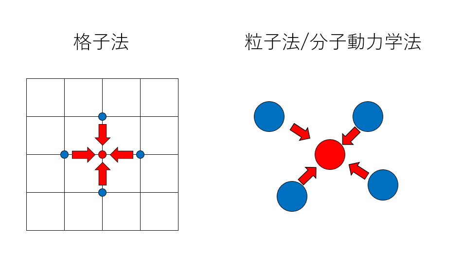
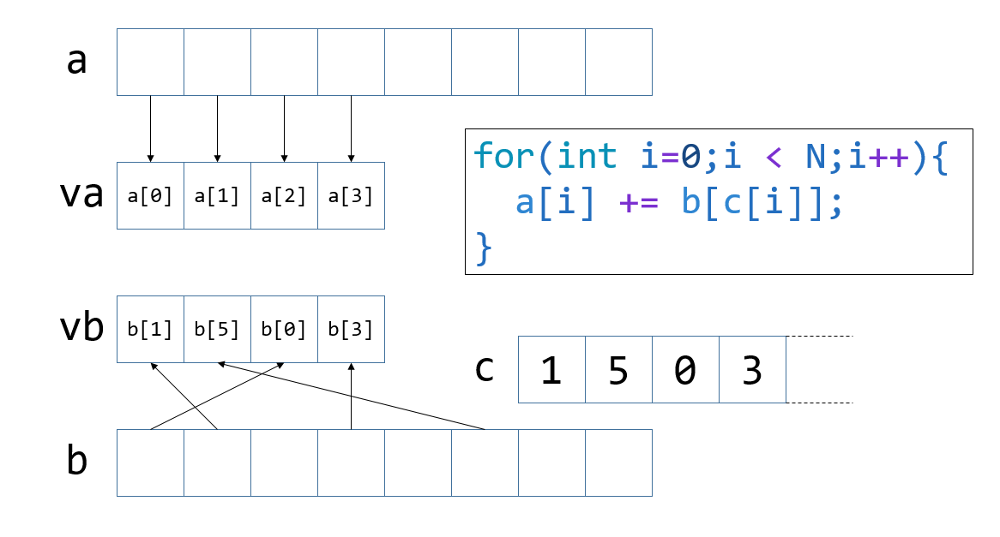
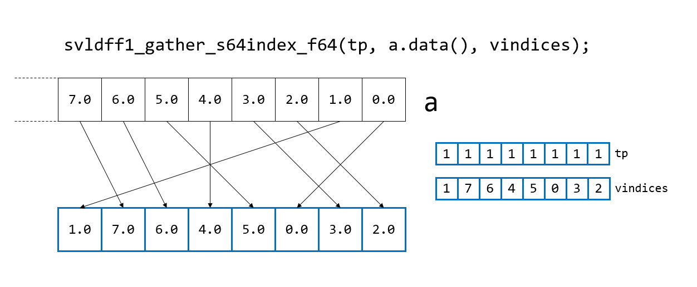

# ARM SVEの組み込み関数を使う（その３）

みなさん、山に登っていますか？＞直喩
僕はあまり登れていません。

ARM SVEの組み込み関数の使い方の解説を続けます。

* [その１：プレディケートレジスタ](https://qiita.com/kaityo256/items/71d4d3f6b2b77fd04cbb)
* [その２：レジスタへのロード](https://qiita.com/kaityo256/items/ac1e84f1c79fdf478630)
* [その３：gather/scatter] ← イマココ

コードを以下に置いておきます。まだ開発中なので、記事を書きながら修正していくと思います。

[https://github.com/kaityo256/sve_intrinsic_samples](https://github.com/kaityo256/sve_intrinsic_samples)

コンパイルコマンドが長いので`ag++`という名前でaliasを張っています。詳細は「[その１(https://qiita.com/kaityo256/items/71d4d3f6b2b77fd04cbb)]」を見てください。

## 間接参照

何か系を時間発展させる数値計算には、「格子法」と「粒子法」という二つのパターンがあります。格子法は系をオイラー描像で見る手法で、系を格子に区切って、その点、線、面上に物理量を定義し、計算する方法です。例えば単純差分法でラプラシアンを計算するのに、自分の周りの上下左右の格子点の値を使います。

一方、粒子法は系をラグランジュ描像で見る手法です。Smoothed Particle Hydrodynamics (SPH)なんかが代表例で、系の流れに沿って運動する「粒子」に物理量を乗せて支配方程式を差分化します。ちなみに粒子法と分子動力学法(Molecular Dynamics Method, MD)はよく混同されるのですが、解いている支配方程式が異なります。しかし、どちらも計算に必要な「お隣さん」が時間発展により変化します。そこが格子を切り直したりしなければ「お隣さん」がずっと固定している格子法と大きく異なるところです。



さて、粒子法や分子動力学法では、相互作用する「お隣さん」を毎回探すと大きなコストがかかるため、「お隣さんリスト」を構築し、以後はそれを使って計算します。これをペアリストと呼んだりします。ペアリストは、i番目の粒子が相互作用する粒子の番号が入っています。二重ループのインデックスを取って、i番目の粒子をi粒子、i粒子と相互作用する粒子をj粒子と呼ぶことが多いです。

さて、粒子法一般の話をしても良いのですが、簡単のために二体相互作用を持つ粒子系を分子動力学法で時間発展させることを考えます。コードのイメージとしては、まずi粒子についてループを回し、次にi粒子と相互作用するj粒子についてループを回します。こんな感じでしょうか。

```cpp
for(int i=0;i<N;i++){
    for(int j=0;j<num_pair[j];j++){
        v = pair_list[i];
        double dx = x[i] - x[v[j]];
        double dy = y[i] - y[v[j]];
        double dz = z[i] - z[v[j]];
        // 力の計算
    }
}
```

ここで、i粒子と相互作用するj粒子のリストを`v`とすると、i粒子とj粒子の相対ベクトルの計算に`x[v[j]]`みたいな、「リストをインデックスに持つリスト」みたいな形が出てきます。これを間接参照と呼びます。一般に、間接参照があると最適化、特にSIMDベクトル化が難しくなります。そんな時に使うのがgather/scatterです。

## Gather

gatherは、配列の指定の場所(base)から、インデックス配列で指定された場所にあるデータをまとめて取ってきてくれる命令です。

```cpp
for (int i=0;i<N;i++){
    a[i] += b[c[i]];
}
```

のようなコードを自然にベクトル化できるようになります。



この図ではベクトルレジスタが256ビットの場合(64ビット倍精度実数を4つ格納出来る)場合を図示していますが、実際には512ビットなので8つ取り込むことになります。

配列aは連続アクセスなので、メモリからそのままレジスタvaに取ってくればOKです。しかし、配列bは、インデックス配列cを経由した間接参照になっているため、

1. 配列cのインデックスをレジスタに取ってくる(これは連続アクセス)
2. 配列bへのポインタと、インデックスを格納したレジスタを使ってbにgatherをかけ、レジスタvbに格納する。

とする必要があります。こうしてvaとvbに欲しい値が格納されたため、その和を計算してから配列aに書き戻せばよいことになります。

この動作を確認するコードを書いてみます。「[その２](https://qiita.com/kaityo256/items/ac1e84f1c79fdf478630)」で`svfloat64_t`の中身をダンプする関数を書きましたが、gatherにはインデックスをレジスタに入れる必要があるため、`svint64_t`の中身をダンプするコードも書いておきましょう。

```cpp
void svshow(svint64_t va) {
  int n = svcntd();
  std::vector<int64_t> a(n);
  svbool_t tp = svptrue_b8();
  svst1_s64(tp, a.data(), va);
  for (int i = 0; i < n; i++) {
    printf("%d ", a[n - i - 1]);
  }
  printf("\n");
}
```

レジスタでインデックスを指定して`double`をgatherする関数はこんな形になります。

```cpp
svldff1_gather_s64index_f64(svboolt_t pg, const float64_t *base, svint64_t indices);
```

これは、`base`が指すアドレスから、レジスタ`indices`が保持するインデックスを使って、プレディケータ`pg`でマスクしてgatherをする命令です。対応するアセンブリは`LDFF1`です。`s64`はインデックスとして`int64_t`を使うことを、`f64`は、`float64_t`をgatherすることを意味しており、別の型を使う場合には対応するdisambiguatorを指定する必要があります。ARM SVEにはロード命令が死ぬほどあるのですが、分子動力学法で使うのはとりあえずこれでいいんじゃないですかね。

サンプルコードはこんな感じになります。

```cpp
void gather() {
  int n = svcntd();
  const int N = 128;
  std::vector<double> a(N);
  std::vector<int64_t> indices(n);
  for (int i = 0; i < N; i++) {
    a[i] = i;
  }
  for (int i = 0; i < n; i++) {
    indices[i] = i;
  }
  std::shuffle(indices.begin(), indices.end(), std::mt19937());
  svbool_t tp = svptrue_b8();
  svint64_t vindices = svld1_s64(tp, indices.data());
  printf("vindices=\n");
  svshow(vindices);
  svfloat64_t va = svldff1_gather_s64index_f64(tp, a.data(), vindices);
  printf("va=\n");
  svshow(va);
}
```

コードを見ればわかると思いますが、こんな処理をしています。

* 配列`a`を連番で初期化しておく(NumPyでいうところのarange)。
* インデックス配列`indices`をやはり連番で作って、ランダムにシャッフルする。
* プレディケータ`tp`のビットを全て立てておく
* インデックス配列の情報を`vindices`にロードする
* 配列`a`の先頭アドレスから、`vindices`の持つ情報をインデックスとしてgatherをかける

結果として`vindices`と`va`の中身を表示しています。実行するとこんな感じになります。

```txt
vindices=
1 7 6 4 5 0 3 2
va=
+1.0000000 +7.0000000 +6.0000000 +4.0000000 +5.0000000 +0.0000000 +3.0000000 +2.0000000
```



インデックスが「2,3,0,5,4,6,7,1」の順番になっており、配列`a`から対応したインデックスの値をレジスタに一度に持ってこられたことがわかると思います。

# Scatter

分子動力学法では、ほとんどの場合gatherで持ってきたインデックスとscatterで返すインデックスは同じです。なのでscatterもgatherと同様に使えば良いのですが、先ほどのサンプルではインデックスをレジスタの長さ(8)の中でしかシャッフルしてなかったので、今回はもっとバラバラにデータをscatterできることが見えるコードを書いてみましょう。

```cpp
void scatter() {
  int n = svcntd();
  const int N = 128;
  std::vector<double> a(n), b(N);
  std::vector<int64_t> indices(n);
  for (int i = 0; i < n; i++) {
    a[i] = i;
  }
  std::fill(b.begin(), b.end(), 0.0);
  std::mt19937 mt;
  std::uniform_int_distribution<> ud(0, N);
  for (int i = 0; i < n; i++) {
    indices[i] = ud(mt);
  }
  svbool_t tp = svptrue_b8();
  svint64_t vindices = svld1_s64(tp, indices.data());
  printf("vindices=\n");
  svshow(vindices);
  svfloat64_t va = svld1_f64(tp, a.data());
  svst1_scatter_s64index_f64(tp, b.data(), vindices, va);
  for (int i = 0; i < n; i++) {
    printf("b[%d] = %f\n", indices[i], b[indices[i]]);
  }
}
```

これも見ればわかると思いますが、

* 長さ128の配列a, bを用意して、aは連番、bは0で初期かしておく
* `a`の値をそのままベクトルレジスタ`va`にロード
* 0から127までの乱数を振ったインデックス`indices`を用意して、ベクトルレジスタ`vindices`にロード
* `va`の値を`vindices`をインデックスとして配列`b`にばらまく

という処理になっています。これにより`b[indices[i]]`の値が`(double)(i)`になります。見てみましょう。

```txxt
vindices=
28 117 124 16 107 116 17 105
b[105] = 0.000000
b[17] = 1.000000
b[116] = 2.000000
b[107] = 3.000000
b[16] = 4.000000
b[124] = 5.000000
b[117] = 6.000000
b[28] = 7.000000
```

インデックスは「105,17,116,107, 16,124,117,28」とバラバラですが、`b[indices[i]]`が連番の値になっており、正しくscatterできたのがわかると思います。

## まとめ

分子動力学法ででてくる間接参照に対応するためのgather/scatterの動作を確認しました。これとプレディケータを組み合わせれば、ナイーブなSIMD化はできるはずです。ARM SVEのロード/ストア命令は死ぬほどたくさんあり、触ってはいけないところを触った時の処理とかいろいろあるらしいのですが、まだちゃんと理解できていません。識者による解説を待ちます。

## 参考文献

ほぼ公式マニュアルしかないのつらい。

* [Arm® A64 Instruction Set Architecture: Armv8, for Armv8-A architecture profile](https://developer.arm.com/docs/ddi0596/h/a64-sve-instructions-alphabetic-order)
* [ARM C Language Extensions for SVE](https://developer.arm.com/documentation/100987/0000/)
* [A64FX® Microarchitecture Manual 日本語](https://github.com/fujitsu/A64FX/blob/master/doc/A64FX_Microarchitecture_Manual_jp_1.3.pdf)
* [Arm SIMD intrinsic C++](https://qiita.com/NatsukiLab/items/ad6e9967f7eccadd9c99)
