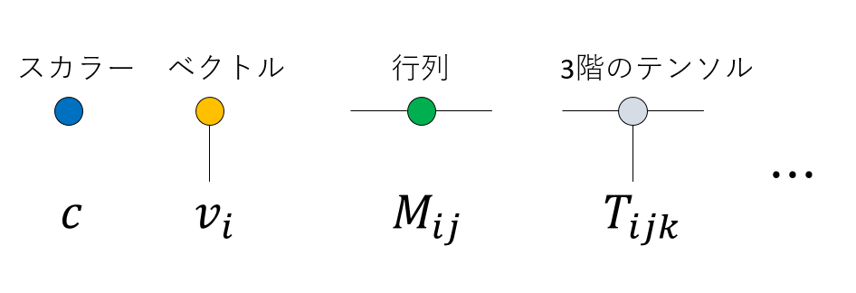
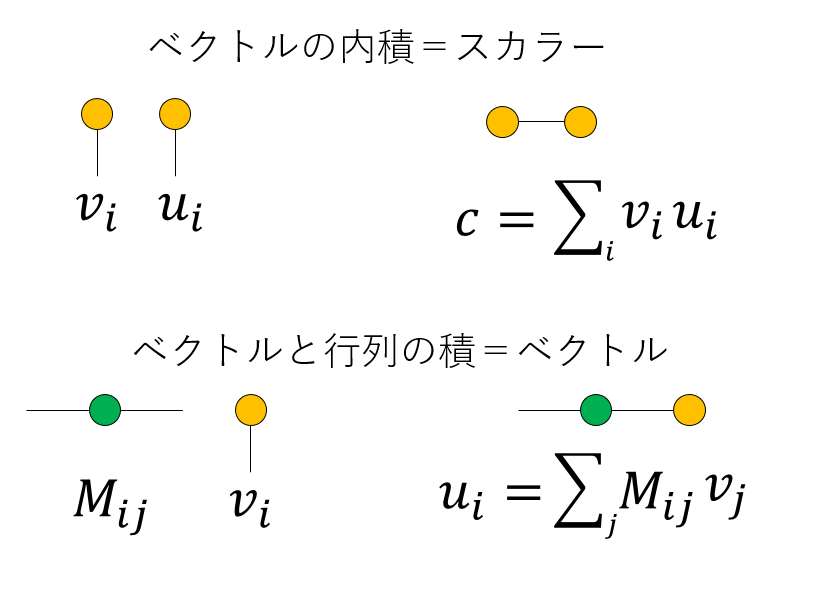
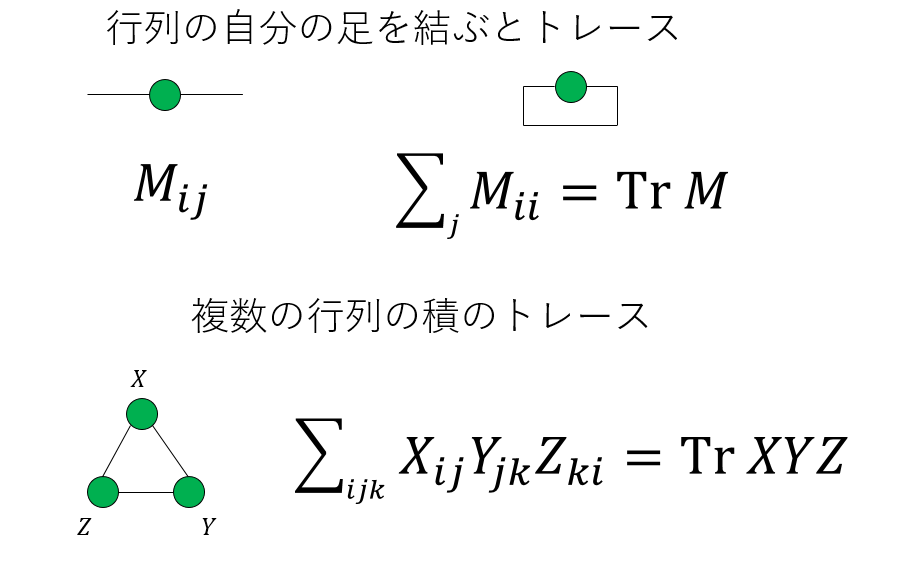
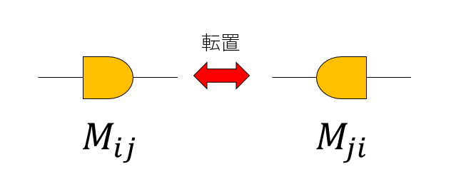
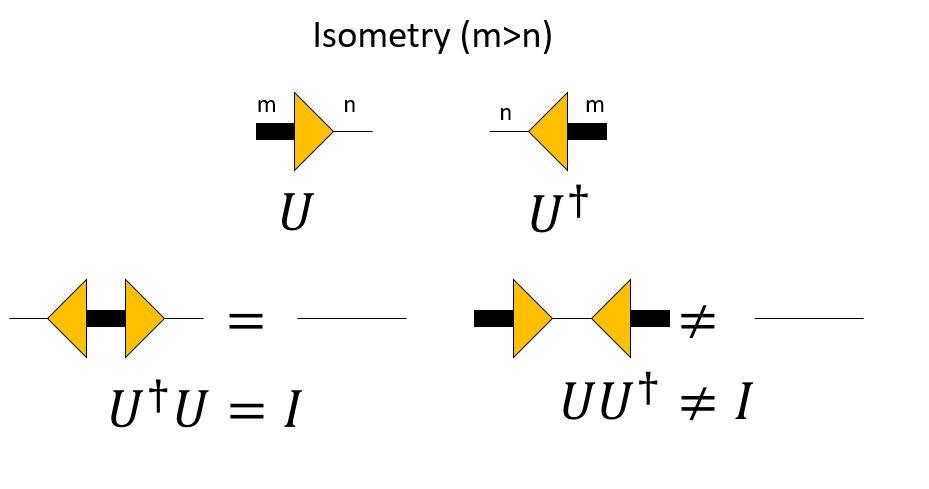
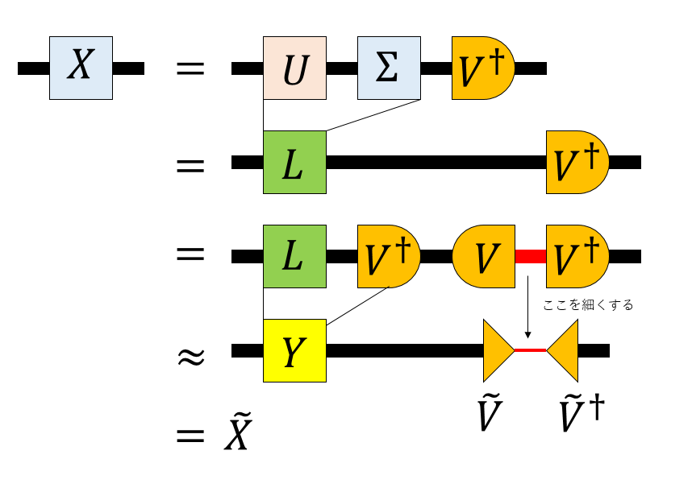

# 行列やテンソルのグラフ表現

## はじめに

テンソルネットワークなどで、テンソルをグラフで表現することがよくあります。慣れるまでは見ても良く分からないのですが、慣れると人に説明する時とかに便利なので、ここで表記についてまとめておきます[^vidal]。

[^vidal]: 私がこの表記方法を初めて見たのはG. Vidalのセミナーでしたが、誰がこの表記を考案したか私は知りません。

## 表記法

### シンボルと足の数

テンソルのグラフ表現では、テンソルをシンボル(四角や丸など)、テンソルの足をシンボルから出る線で表現します。線の数がテンソルの階数(Order)です。まず、全く足がないものは0階のテンソル、すなわちスカラーです。足が1本のものはベクトル、2本のものは行列、3本なら3階のテンソル、n本ならn階のテンソルです。

### 縮約

グラフ表現でもっとも重要なのは足の縮約です。グラフの線を結んだら、対応する足について和を取ったことに対応します。結んだ足は(和をとるので)消えます。例えば、ベクトルの足を結んだら足が0本、つまりスカラーになりますが、これはベクトルの内積を表現しています。また、行列の足のうちの一本と、ベクトルの足を結ぶと、全体として足が一本になるのでベクトルになります。これは行列とベクトルの積を表しています。

同様に、行列の足を結んだら、やはり行列ができます。これは通常の行列積です。当然の事ながら、同じ次元を持つ足同士しか結べません。

逆に、同じ次元を持つ足であれば、自由に結ぶことができます。例えば、正方行列の二本の足を結ぶと、これは対角和(トレース)を表します。二つ以上の行列の積のトレースも同様です。

ちなみに、グラフ表現すると、行列の積の対角和が巡回置換に対して不変であること、つまり

$$
\mathrm{Tr}(XYZ)=
\mathrm{Tr}(YZX)=
\mathrm{Tr}(ZXY)
$$

であることがわかりやすいですね。

### 特異値分解とIsometry

行列は、非対称であることを強調したければ、非対称のシンボルを使います。シンボルを反転させると、転置をとったことになります。

さて、特に特異値分解において、等長変換を引き起こす行列が重要な役割を果たします。これは、例えば直交行列の上からいくつかの行を取って作った行列や、左からいくつかの列をとって作った行列なんかが該当します(SVDの低ランク近似で出てきます)。このような行列をisometryといいます。m行n列(m>n)のisometryである$U$は、右向きの三角形で表現します。これは、左から右に情報が「つぶれる」ことを表しています。逆に、それを転置したn行m列のisometryである$U^\dagger$は左向きの三角形で表現します。これは左から右に情報が増えることを意味します。

m行n列(m>n)のisometoryの各列ベクトルは正規直交基底になっているため、$U^\dagger$と$U$をこの順番でかけると$n$次元の単位行列になります。

$$
U^\dagger U = I_{n}
$$

逆向きにかける、つまり$U U^\dagger$は$m$行$m$列の正方行列になりますが、これは$m$次元の単位行列にはならず、なんらかの情報欠落を引き起こします。

$$
U U^\dagger  \neq I_{m}
$$

ちなみに、足の次元を線の太さで表現するのは僕の工夫なので、あまり一般的ではないかもしれません。

特異値分解は、行列を$X = U \Sigma V^\dagger$と分解しますが、この$U$と$V^\dagger$はユニタリ行列、つまり実ならば直交行列です。この行列の列の一部や、行の一部をとってくるとIsometryになります。以下、特異値分解においてIsometryが情報圧縮をする様子を見てみます。

$X = U \Sigma V^\dagger$という特異値分解が得られた時、$U\Sigma = L$とまとめましょう。

$V^\dagger$はユニタリ行列なのでどちらの順番で積をとっても単位行列になります[^isometry]。

[^isometry]: ユニタリ行列は等長変換を引き起こすのでIsometryの一種です。正方行列のIsometryはどの順番で積をとっても単位行列になります。

$$
V^\dagger V = V V^\dagger = I
$$

なので、$L$と$V^\dagger$の間に$V^\dagger V$を挿入します。

$$
X = L V^\dagger V V^\dagger
$$

$L V^\dagger$をまとめて$Y$と表記しましょう。

$$
X = Y V V^\dagger
$$

さて、いま$V$がm行m列の行列だったとして、上から$n (<m)$行とった行列を$\tilde{V}$としましょう。このエルミート共役(実行列なら転置)は$V^\dagger$の左から$n$列とった行列$\tilde{V}^\dagger$となります。$\tilde{V}$、$\tilde{V}^\dagger$はIsometryになります。

そして、$\tilde{V} \tilde{V}^\dagger$の順番で積を取ると、これは単位行列にはならず、線を細く絞った形になります。これにより情報が圧縮され、全体として元の行列$X$を低ランク近似した行列$\tilde{X}$になります。

以上の手続きをグラフ表現するとこんな感じです。

## まとめ

テンソルネットワークの分野で良く使われるテンソルのグラフ表現をまとめてみました。こういうグラフ表現をすると、特に高次元のテンソルに対するアルゴリズムなどがきれいに表現できたりするので、覚えておくと良いことがあるかもしれません。

## 参考文献

* [Matrices as Tensor Network Diagrams](https://www.math3ma.com/blog/matrices-as-tensor-network-diagrams) 英語だがわかりやすかった。
* [Tensor Network Renormalization, G. Evenbly and G. Vidal, Phys. Rev. Lett. 115, 180405 (2015)](https://journals.aps.org/prl/abstract/10.1103/PhysRevLett.115.180405) テンソルネットワーク繰り込み群の有名な論文。テンソルのグラフ表現については、ここから参考文献をたどればいいんじゃないかと。
