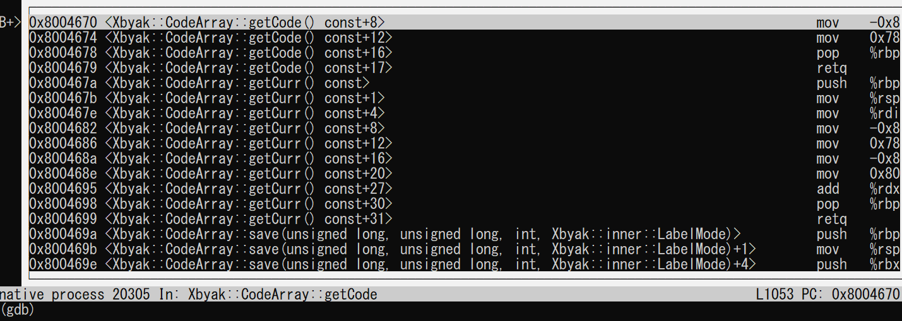
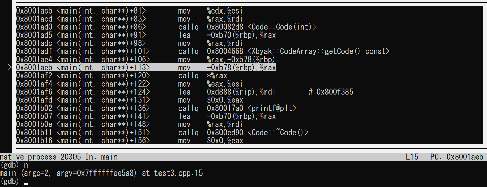
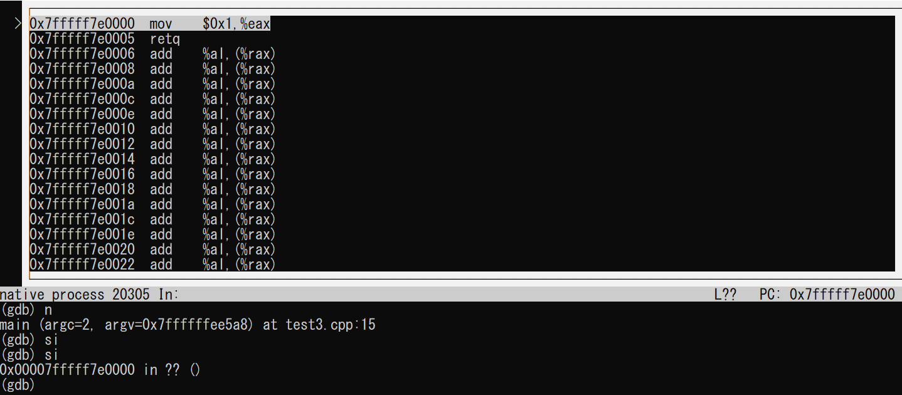
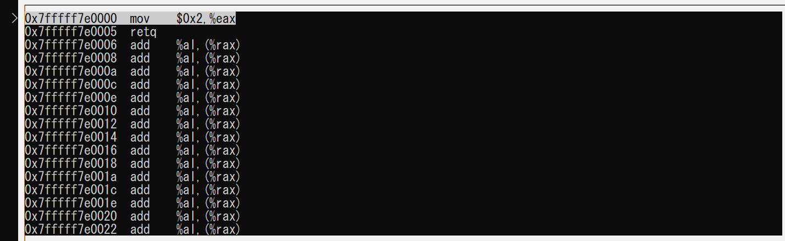

# JITアセンブラXbyakを使ってみる（その１）

## はじめに

[Xbyak](https://github.com/herumi/xbyak)(カイビャック)は、[光成滋生](https://github.com/herumi)さんによるJITアセンブラです。Intelによる深層学習ライブラリ[oneDNN](https://github.com/oneapi-src/oneDNN)のエンジン部分の実装に使われたり、AArch64版のXbyakである[Xbyak_aarch64](https://github.com/fujitsu/xbyak_aarch64)が富士通のリポジトリとして公開されたりと、ベンダーによる公式採用が増えています。なんかすごそうなので使ってみましょう、という記事です。

## Xbyakの準備

Xbyakは、JITアセンブラです。C++ヘッダオンリーなので、インクルードするだけで使えます。git submoduleとして使うのが良いと思います。

まずは適当なリポジトリ`xbyak_test`を作りましょう。

```sh
mkdir xbyak_test
cd xbyak_test
git init
```

次に、xbyakをsubmodule addしましょう。

```sh
git submodule add https://github.com/herumi/xbyak.git
```

ついでに、インクルードパスにXbyakを追加しておきましょう。

```sh
export CPLUS_INCLUDE_PATH=xbyak
```

これでXbyakが使えるようになります。

## Xbyakを使ってみる

Xbyakを使うには、Xbyakをインクルードした上で、`Xbyak::CodeGenerator`を継承したクラスを作ります。そのコンストラクタで「自分が作りたい関数」を作ります。とりあえず`eax`レジスタに1を入れて`ret`するだけの関数を作りましょう。Xbyakでは、アセンブリをほぼそのまま関数として使えます。

```cpp
#include <cstdio>
#include <xbyak/xbyak.h>

struct Code : Xbyak::CodeGenerator {
  Code() {
    mov(eax, 1);
    ret();
  }
};

int main() {
  Code c;
  int (*f)() = c.getCode<int (*)()>();
  printf("%d\n", f());
}
```

ここで、XbyakがIntel記法を採用していることには注意が必要です。Linuxでアセンブリを見る人はgasが採用しているAT&T記法に慣れていることが多いと思いますが、それとはmovの代入が逆になります。

Xbyakが作る関数にアクセスするには、`CodeGenerator::getCode()`を適切な関数ポインタの型を持つテンプレートとして呼び出し、その返り値を関数ポインタとして受け取ります。

`int`を返す関数は、返り値を`eax`に入れますので、これは1を返す関数になります。コンパイル、実行してみましょう。

```sh
$ g++ test1.cpp
$ ./a.out
1
```

1が返ってきました。

コンストラクタに引数を与え、その引数を使ってコードを作ることもできます。

```cpp
#include <cstdio>
#include <xbyak/xbyak.h>

struct Code : Xbyak::CodeGenerator {
  Code(int i) {
    mov(eax, i);
    ret();
  }
};

int main() {
  Code c(12345);
  int (*f)() = (int (*)())c.getCode();
  printf("%d\n", f());
}
```

コンストラクタで`int i`を受け取り、それを`eax`に与えるだけの関数を作りました。`main`関数内で

```cpp
Code c(12345);
```

として関数の実体を作っている(実際に作られるのは`getCode`が呼ばれた時ですが)ので、これで12345を返す関数になります。

```sh
$ g++ test2.cpp
$ ./a.out
12345
```

## JITアセンブラであることを確認する

さて、XbyakはJITアセンブラであり、コードを動的に生成します。したがって、コンパイル時には確定していない値でも、実行時には定数になっている値を即値にすることができます。その様子を見てみましょう。先ほど作った関数の返り値を、実行時引数として与えるコードを書いてみます。

```cpp
#include <cstdio>
#include <xbyak/xbyak.h>

struct Code : Xbyak::CodeGenerator {
  Code(int i) {
    mov(eax, i);
    ret();
  }
};

int main(int argc, char **argv) {
  int i = atoi(argv[1]);
  Code c(i);
  int (*f)() = (int (*)())c.getCode();
  printf("%d\n", f());
}
```

gdbで見るために、-gオプションをつけてコンパイルしましょう.

```sh
g++ -g test3.cpp
```

まずは動作を確認します。1を食わすと1を、2を食わすと2を表示します。

```sh
$ ./a.out 1
1
$ ./a.out 2
2
```

さて、これがアセンブリでは即値になっていることをgdbを使って確認しましょう。

```sh
$ gdb ./a.out
```

`Code::getCode`にブレークポイントを置きましょう。

```gdb
(gdb) b Code::getCode
Breakpoint 1 at 0x4670: file xbyak/xbyak/xbyak.h, line 1053....
```

その状態で実行時引数「1」を与えて実行してみます。

```gdb
(gdb) r 1
Starting program: /home/watanabe/temp/xbyak_test/a.out 1

Breakpoint 1, Xbyak::CodeArray::getCode (this=0x7ffffffed950) at xbyak/xbyak/xbyak.h:1053
1053            const uint8 *getCode() const { return top_; }
```

止まりました。ここでアセンブリを表示してみましょう[^1]。

[^1]: 僕はgdbのtuiモード好きなんですが、あんまり周りに使ってる人がいない印象ですね・・・

```gdb
(gdb) layout asm
```



getCodeのアセンブリが表示されました。ここで`n`で次に進みます。



現在の行が`>`で表示されていますが、次の`call q *%rax`がXbyakが作った関数呼び出しです。`si`二回で進んでみましょう。



これを見てわかるように、

```nasm
mov $0x1, %eax
retq
```

と、`eax`に即値が入っていることがわかります。`r 2`として再実行し、同様にXbyakの作った関数を見てみましょう。



```nasm
mov $0x2, %eax
retq
```

と、即値が入っています。「コンパイル時には決まらないが、実行時には定数であることがわかっている数を、あたかもコンパイル時定数として扱うことができる」のがJITアセンブラの強みの一つです。

## 作成されたコードの確認

Xbyakがどんなコードを吐いたかは、`Xbyak::CodeGenerator::dump`で確認が可能です。先ほどのコードに`c.dump()`を追加してみましょう。

```cpp
#include <cstdio>
#include <xbyak/xbyak.h>

struct Code : Xbyak::CodeGenerator {
  Code(int i) {
    mov(eax, i);
    ret();
  }
};

int main(int argc, char **argv) {
  int i = atoi(argv[1]);
  Code c(i);
  int (*f)() = (int (*)())c.getCode();
  c.dump(); // この行を追加
  printf("%d\n", f());
}
```

実行してみましょう。

```sh
$ g++ -g test3.cpp
$ ./a.out 1
B801000000C3
1
$ ./a.out 2
B802000000C3
2
```

関数`f`が、`B801000000C3`や`B802000000C3`といった6バイトのマシン語になったことがわかります。gdbで確認してみましょう。まずは`c.dump();`の直後にブレークポイントを入れます。

```sh
$ gdb ./a.out
(gdb) b 16
Breakpoint 1 at 0x1b4a: file test3.cpp, line 16.
```

実行時引数1を与えて実行しましょう。

```sh
(gdb) r 1
Starting program: /home/watanabe/temp/xbyak_test/a.out 1
B801000000C3

Breakpoint 1, main (argc=2, argv=0x7ffffffee5a8) at test3.cpp:16
16        printf("%d\n", f());
```

`c.dump()`が呼ばれた直後の段階で止まりました。ここで、関数`f`のアドレスを確認しましょう。

```sh
(gdb) p f
$1 = (int (*)(void)) 0x7fffff7e0000
```

`f`は関数のポインタであり、`0x7fffff7e0000`を指していることがわかります。このアドレスから6バイトを表示してみましょう。

```sh
(gdb) x/6bx f
0x7fffff7e0000: 0xb8    0x01    0x00    0x00    0x00    0xc3
```

確かにバイト列がb8,01,00,00,00,c3になっていますね。

## まとめ

簡単にXbyakの使い方を説明してみました。Xbyakではアセンブリと一対一対応した関数を呼び出すことで関数を「作る」ことができます。なので、インラインアセンブリや組み込み関数でコードを書いたことがある人はすぐに使えるようになりますが、XbyakはJITアセンブラなので、インラインアセンブリや組み込み関数とはかなり異なるコーディング感覚になります。

(続く？)
