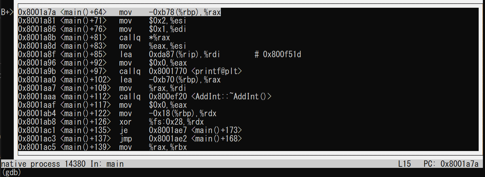
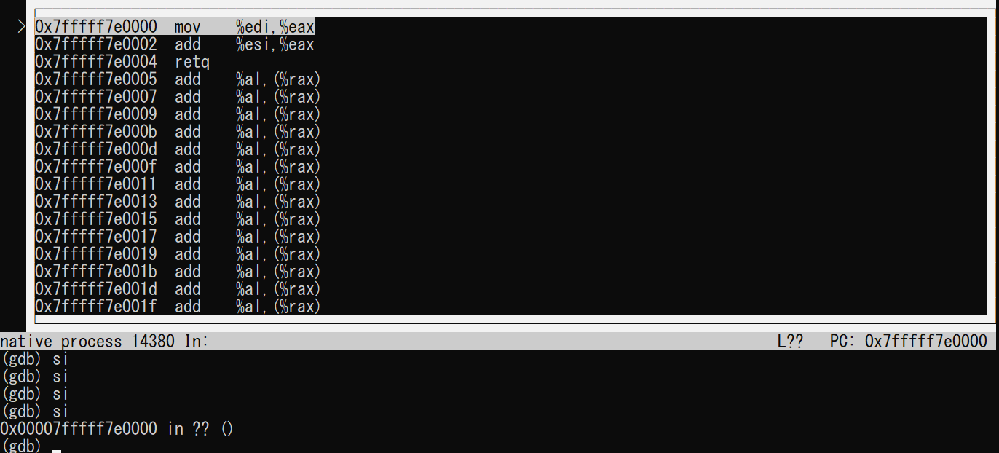

# JITアセンブラXbyakを使ってみる（その２）

* [その１：Xbyakの概要](https://qiita.com/kaityo256/items/a9e6d32f20096d791817)
* その２：数値計算屋のハマりどころ←イマココ

## はじめに

JITアセンブラ[Xbyak](https://github.com/herumi/xbyak)に興味を持つような人は、プログラムの高速化に興味があり、かつアセンブリを知っているような人であろう。

さて、数値計算屋[^1]もプログラムの高速化には興味があることが多い。特に昨今はSIMDレジスタの有効活用が性能に直結することもあって、アセンブリを確認したりインラインアセンブラや組み込み関数を使った高速化をする人も多いだろう。

[^1]: 以下、「数値計算屋」という大きな主語を多用するが、本稿では単に僕のことを指し、数値計算屋全体がこうだ、と言いいたいわけではない。

Xbyakは、関数一つがニーモニック一つに対応しているという点で組み込み関数と似たような使い勝手が期待できる。しかし、組み込み関数を使ったプログラムがコンパイル時に決定されるのに対して、XbyakはJITアセンブラなので、プログラムが決定されるのは実行時である。これが結構「使用感」の違いを生む。

以下、数値計算屋がXbyakを使ってみてハマったポイントを紹介したい。

## 関数の引数と返り値

インラインアセンブリを使う場合、関数の引数と返り値についてはコンパイラがよしなにやってくれるので気にしなくて良い。例えば引数として整数が与えられ、それをincしてから返す関数をインラインアセンブラで書くならこんな感じで書ける。

```cpp
int func(int a) {
  int r;
  __asm__(
      "mov %1, %%eax\n\t"
      "inc %%eax\n\t"
      "mov %%eax, %0\n\t"
      : "=m"(r)
      : "m"(a));
  return r;
}
```

しかし、Xbyakで引数を扱う場合には、どの引数がどのように渡されるか、返り値はどのように返されるかを知らないとコードが組めない。

とりあえず返り値は簡単だ。C/C++の関数は返り値を一つしか返せず、数値計算屋が返すのは整数か実数かどちらかだろう。整数は`eax`、実数は`xmm0`を返すと覚えておけばとりあえず問題ない。問題は引数だ。

関数呼び出しにおいて、関数の引数がどのような形で渡されるかはABI (Application Binary Interface)の「呼び出し規約」で決まっている。

例えばx86_64において、

```cpp
int func(int , int , int , int );
```

なんて関数があった時、Linuxでは引数が`edi`,`esi`,`edx`, `ecx`という順番に値が入ってくる。しかし、[Windowsでは違ったりする](https://github.com/herumi/blog/blob/master/x64/xbyak.md#windows%E3%81%A8linux%E3%81%AE%E5%91%BC%E3%81%B3%E5%87%BA%E3%81%97%E8%A6%8F%E7%B4%84%E3%82%92%E6%89%B1%E3%81%86)。インラインアセンブラや組み込み関数を使っている時にはそんなことを知らなくても良かったが、Xbyakを使うなら意識しなければならない。Xbyakにはこのような差異を吸収する`Xbyak::util::StackFrame`などの仕組みが用意されているが、とりあえず数値計算屋の主戦場はLinuxであろうし、WindowsでもWSLで開発すればABIはSystem V ABIに従うので、当面はWindowsは忘れて良いだろう。

しかし、いずれにせよLinuxのSystem V ABIは覚えなくてはならない。

整数を二つ引数にとって整数を一つ返す関数なら、`edi`と`esi`に値が入ってきて、`eax`に結果を入れて`ret`すれば良いので、例えば二つの整数の和を返す関数はXbyakで以下のように書ける。

```cpp
#include <cstdio>
#include <xbyak/xbyak.h>

struct AddInt : Xbyak::CodeGenerator {
  AddInt() {
    mov(eax, edi);
    add(eax, esi);
    ret();
  }
};

int main() {
  AddInt a;
  auto f = a.getCode<int (*)(int, int)>();
  printf("%d\n", f(1, 2));
}
```

ここで注意したいのは、コードを生成する関数(コンストラクタ)と、生成する関数のシグネチャは全く関係がないことだ。あくまで生成する関数のシグネチャは、`getCode`のテンプレート引数で決まる。

一応gdbで動作確認をしておこう。`-g`つきでコンパイルして、gdbで実行し、`printf`のところにブレークポイントを置く。

```sh
$ g++ -g add_int.cpp
$ gdb ./a.out
(gdb) b 15
Breakpoint 1 at 0x1a7a: file add_int.cpp, line 15.
(gdb) r
Starting program: /mnt/c/Users/watanabe/Desktop/github/qiita/xbyak2/a.out

Breakpoint 1, main () at add_int.cpp:15
15        printf("%d\n", f(1, 2));
```

この状態で`layout asm`してアセンブリを見る。



`callq *%rax`がXbyakが作った関数の呼び出しだ。その直前で、`edi`に1が、`esi`に2が入っていることがわかる。これが`f(1, 2)`の部分だ。ここから`si`を何度か入力して、Xbyakの作った関数に入ろう。



```nasm
mov %edi, %eax
add %esi, %eax
retq
```

と、そのままのアセンブリになっており、`eax`に`edi`と`esi`の和が入っていることがわかる。`eax`が関数`f`の返り値として扱われるので、その後の`printf`では「3」と表示される。

一応実数の和も試しておこう。こんな関数を作りたいとする。

```cpp
double f(double a, double b){
  return a + b;
}
```

引数は順番に`xmm0`, `xmm1`に入れられて来て、返り値は`xmm0`を使うので、単に`xmm0`と`xmm1`の和を`xmm0`に入れて`ret`すれば良い。こんなコードになるだろう。

```cpp
#include <cstdio>
#include <xbyak/xbyak.h>

struct AddDouble : Xbyak::CodeGenerator {
  AddDouble() {
    addsd(xmm0, xmm1);
    ret();
  }
};

int main() {
  AddDouble a;
  auto f = a.getCode<double (*)(double, double)>();
  printf("%f\n", f(1.2, 3.4));
}
```

実行すると、結果は期待通り`4.6`になる。

```sh
$ g++ add_double.cpp
$ ./a.out
4.600000
```

配列を渡したり、整数と浮動小数を混ぜて渡したり、たくさんの引数を渡したりした場合、ABIの呼び出し規約を見てどの引数がどのレジスタに入ってくるかを確認する必要がある。また、レジスタが足りなければスタックに入れられてくるので、それも対応しなければならない。

## 定数の代入

レジスタに値を代入したい時、整数なら`mov`に即値を渡すことができる。`eax`に1を代入したければ

```cpp
mov(eax, 1)
```

とすればOKだ。これはインラインアセンブラでも手間は変わらない。しかし、実数の代入は面倒だ。x86では実数は`xmm`レジスタで扱うが、`xmm`への即値代入命令は無いので、一度メモリに展開して、メモリからコピーしなければならない。

例えば、こんな関数を作りたいとする。

```cpp
double pi(void){
  return 3.141592;
}
```

これを実現するには、単に`xmm0`に`3.141592`を代入してやれば良い。ちょっと面倒だが、インラインアセンブラを使えばこんな感じになるだろう。

```cpp
#include <cstdio>
#include <x86intrin.h>

double pi(void) {
  __m128d xmm = {3.141592, 0.0};
  __asm__(
      "movups %0, %%xmm0\n\t"
      :
      : "m"(xmm));
}

int main() {
  printf("%f\n", pi());
}
```

歴史的な理由でx86には64bitのネイティブな浮動小数点レジスタが無く、128bitのxmmレジスタを使うため、代入も`__m128d`などの型を持った変数を使う必要があるが、そんなに面倒ではない。

また、このような拡張命令を使わずとも、グローバル変数からコピーしてやるという手もある。

```cpp
#include <cstdio>
#include <x86intrin.h>

double my_pi = 3.141592;

double pi(void) {
  __asm__("movupd my_pi(%rip), %xmm0");
}

int main() {
  printf("%f\n", pi());
}
```

こういうことができるのは、コンパイラがコンパイル時にグローバル変数のアドレスがわかるからだが、Xbyakは純粋にC++の関数として実装されているため、こういう「ズル」はできない。したがって、xmmレジスタに値を代入したければ、スタック上にデータを作ってから`movsd`するしかない。スタックをいじるからには、スタックポインタだのベースポインタだのを考える必要がある。あまり自信がないが、こんな感じになるだろうか。

```cpp
#include <cstdio>
#include <xbyak/xbyak.h>

struct Code : Xbyak::CodeGenerator {
  Code() {
    push(rbp);
    mov(rbp, rsp);
    sub(rsp, 0x8);
    mov(rax, 0x400921fafc8b007a);
    mov(ptr[rsp], rax);
    movsd(xmm0, ptr[rsp]);
    mov(rsp, rbp);
    pop(rbp);
    ret();
  }
};

int main() {
  Code c;
  auto f = c.getCode<double (*)()>();
  printf("%f\n", f());
}
```

倍精度実数の`3.141592`は、バイト列で表すと`0x400921fafc8b007a`だ。これを`rax`に突っ込んで、それをスタックにコピー、そのアドレスを`xmm0`にコピーすることで`xmm0 = 3.141592`を実現している。

さすがに実数のバイト列をいちいち計算するのは面倒なので、こんな補助関数を作るんですかね？

```cpp
uint64_t double_byte(double x) {
  unsigned char *b = (unsigned char *)(&x);
  uint64_t v = 0;
  for (int i = 0; i < 8; i++) {
    v <<= 8;
    v += b[7 - i];
  }
  return v;
}
```

これを使うと、さっきのコードはこんな感じになります。

```cpp
#include <cstdint>
#include <cstdio>
#include <xbyak/xbyak.h>

struct Code : Xbyak::CodeGenerator {
  uint64_t double_byte(double x) {
    unsigned char *b = (unsigned char *)(&x);
    uint64_t v = 0;
    for (int i = 0; i < 8; i++) {
      v <<= 8;
      v += b[7 - i];
    }
    return v;
  }
  Code() {
    push(rbp);
    mov(rbp, rsp);
    sub(rsp, 0x8);
    //mov(rax, 0x400921fafc8b007a);
    mov(rax, double_byte(3.141592));
    mov(ptr[rsp], rax);
    movsd(xmm0, ptr[rsp]);
    mov(rsp, rbp);
    pop(rbp);
    ret();
  }
};

int main() {
  Code c;
  auto f = c.getCode<double (*)()>();
  printf("%f\n", f());
}
```


## 関数のシグネチャについて